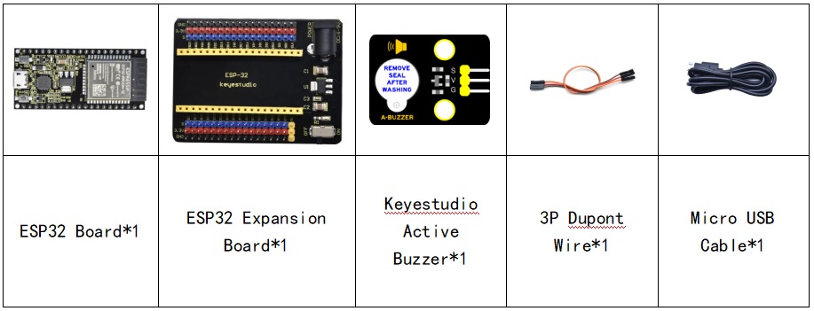

### Project 11: Active Buzzer


**Overview**

In this kit, it contains an active buzzer module and a power amplifier module (the principle is equivalent to a passive buzzer). In this experiment, we control the active buzzer to emit sounds. Since it has its own oscillating circuit, the buzzer will automatically sound if given large voltage.

**Working Principle**

From the schematic diagram, the pin of buzzer is connected to a resistor R2 and another port is linked with a NPN triode Q1. So, if this triode Q1 is powered, the buzzer will sound.

If the base electrode of the triode connected to the R1 resistor is a high level, the triode Q1 will be connected.If the base electrode is pulled down by the resistor R3, the triode is disconnected.

When we output a high level from the IO port to the triode, the buzzer will emit sounds; if outputting low levels, the buzzer won’t emit sounds.


**Components**



**Connection Diagram**


**Test Code**


```c
//*************************************************************************************
/*
 * Filename    : Active buzzer
 * Description : An active buzzer produces sound
 * Auther      : http://www.keyestudio.com
*/
int buzzer = 15; //Define buzzer receiver pin GPIO15
void setup() {
  pinMode(buzzer, OUTPUT);//Set the output mode
}

void loop() {
  digitalWrite(buzzer, HIGH); //sound production
  delay(1000);
  digitalWrite(buzzer, LOW); //Stop the sound
  delay(1000);
}
//*************************************************************************************
```


**Code Explanation**

In the experiment, we set the pin to GPIO15. When setting to high, the active buzzer will beep; when setting to low, the active buzzer will stop emitting sounds.

**Test Result**

Connect the wires according to the experimental wiring diagram, compile and upload the code to the ESP32. After uploading successfully，we will use a USB cable to power on. The active buzzer will emit sound for 1 second, and stop for 1 second.