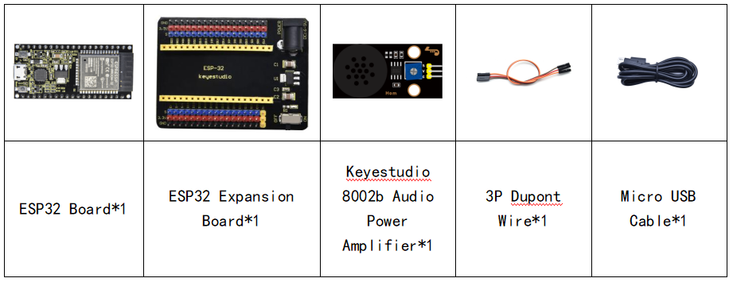
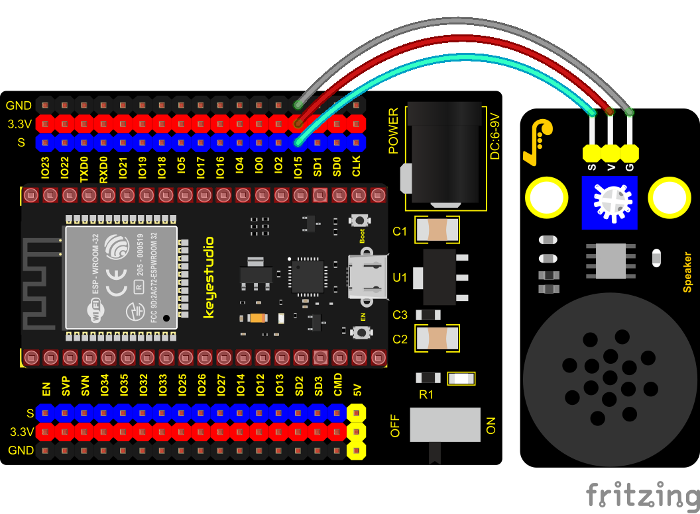

### Project 12: 8002b Audio Power Amplifier


**Overview**

In this kit, there is a Keyestudio 8002b power amplifier. The main components of this module are an adjustable potentiometer, a speaker, and an audio amplifier chip;

The main function of this module is: it can amplify the output audio signal, with a magnification of 8.5 times, and play sound or music through the built-in low-power speaker, as an external amplifying device for some music playing equipment.

In the experiment, we used the 8002b power amplifier speaker module to emit sounds of various frequencies.

**Working Principle**

In fact, it is similar to a passive buzzer. The active buzzer has its own oscillation source. Yet, the passive buzzer does not have internal oscillation. When controlling the circuit, we need to input square waves of different frequencies to the positive pole of the component and ground the negative pole to control the buzzer to chime sounds of different frequencies.


**Components**




**Connection Diagram**



**Test Code**


```c
//**********************************************************************
/*
 * Filename    : Passive Buzzer
 * Description : Passive Buzzer sounds the alarm.
 * Auther      : http//www.keyestudio.com
*/
#define LEDC_CHANNEL_0 0

// LEDC timer uses 13 bit accuracy

#define LEDC_TIMER_13_BIT  13

// Define tool I/O ports

#define BUZZER_PIN  15

//Create a musical melody list, Super Mario

int melody[] = {330, 330, 330, 262, 330, 392, 196, 262, 196, 165, 220, 247, 233, 220, 196, 330, 392, 440, 349, 392, 330, 262, 294, 247, 262, 196, 165, 220, 247, 233, 220, 196, 330, 392,440, 349, 392, 330, 262, 294, 247, 392, 370, 330, 311, 330, 208, 220, 262, 220, 262,

294, 392, 370, 330, 311, 330, 523, 523, 523, 392, 370, 330, 311, 330, 208, 220, 262,220, 262, 294, 311, 294, 262, 262, 262, 262, 262, 294, 330, 262, 220, 196, 262, 262,262, 262, 294, 330, 262, 262, 262, 262, 294, 330, 262, 220, 196};

//Create a list of tone durations

int noteDurations[] = {8,4,4,8,4,2,2,3,3,3,4,4,8,4,8,8,8,4,8,4,3,8,8,3,3,3,3,4,4,8,4,8,8,8,4,8,4,3,8,8,2,8,8,8,4,4,8,8,4,8,8,3,8,8,8,4,4,4,8,2,8,8,8,4,4,8,8,4,8,8,3,3,3,1,8,4,4,8,4,8,4,8,2,8,4,4,8,4,1,8,4,4,8,4,8,4,8,2};
void setup() {
pinMode(BUZZER_PIN, OUTPUT); // Set the buzzer to output mode
}

void loop() {

  int noteDuration; //Create a variable of noteDuration

  for (int i = 0; i < sizeof(noteDurations); ++i)

  {
      noteDuration = 800/noteDurations[i];

      ledcSetup(LEDC_CHANNEL_0, melody[i]*2, LEDC_TIMER_13_BIT);

      ledcAttachPin(BUZZER_PIN, LEDC_CHANNEL_0);

      ledcWrite(LEDC_CHANNEL_0, 50);

      delay(noteDuration * 1.30); //delay
  }
}
//**********************************************************************
```


**Test Result**

Connect the wires according to the experimental wiring diagram, compile and upload the code to the ESP32. After uploading successfully，we will use a USB cable to power on，then the power amplifier module will emit the sound on a loop.

