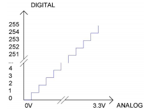
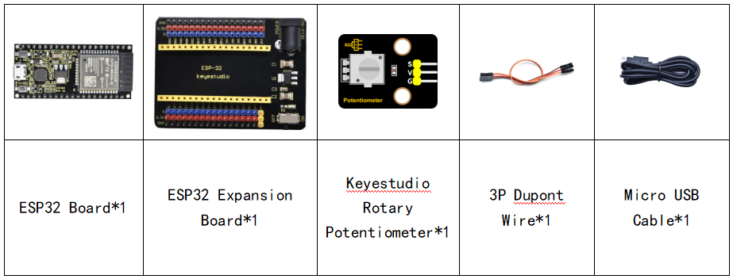
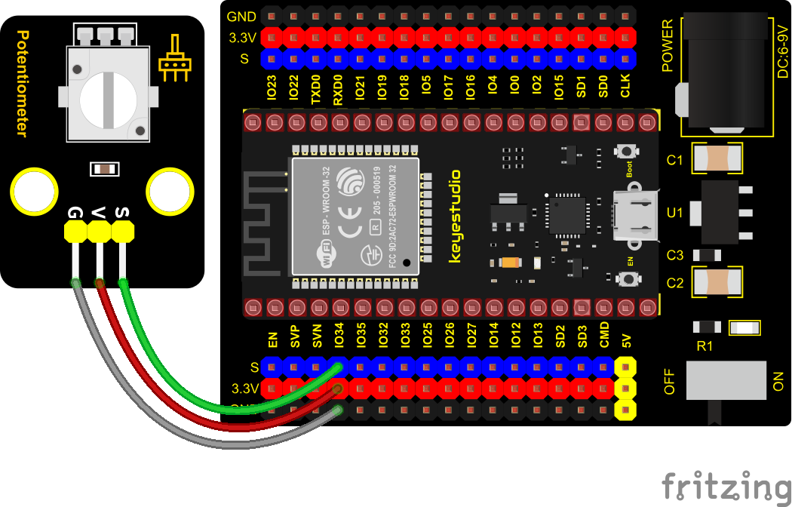
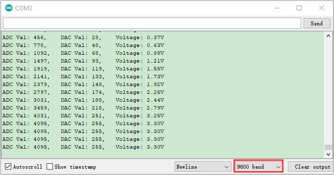

### Project 13: Potentiometer


**Overview**

The following we will introduce is the Keyestudio rotary potentiometer which is an analog sensor.

The digital IO ports can read the voltage value between 0 and 3.3V and the module only outputs high levels. However, the analog sensor can read the voltage value through 16 ADC analog ports on the ESP32 board. In the experiment, we will display the test results on the Shell.

**Working Principle**


It uses a 10K adjustable resistor. We can change the resistance by rotating the potentiometer. The signal S can detect the voltage
changes(0-3.3V) which are analog quantity.

**ADC：**The more bits an ADC has, the denser the partitioning of the simulation, the higher the accuracy of the final conversion.



The conversion formula is as follows:

**DAC：**The higher the precision of DAC, the higher the precision of the output voltage value.  

The conversion formula is as follows:  

**ADC on ESP32：**

The ESP32 has 16 pins that can be used to measure analog signals. GPIO pin serial numbers and analog pin definitions are shown below:  

<table class="colwidths-auto docutils align-default">
<tbody>
<tr class="odd">
<td>ADC number in ESP32</td>
<td>ESP32 GPIO number</td>
</tr>
<tr class="even">
<td>ADC0</td>
<td>GPIO 36</td>
</tr>
<tr class="odd">
<td>ADC3</td>
<td>GPIO 39</td>
</tr>
<tr class="even">
<td>ADC4</td>
<td>GPIO 32</td>
</tr>
<tr class="odd">
<td>ADC5</td>
<td>GPIO33</td>
</tr>
<tr class="even">
<td>ADC6</td>
<td>GPIO34</td>
</tr>
<tr class="odd">
<td>ADC7</td>
<td>GPIO 35</td>
</tr>
<tr class="even">
<td>ADC10</td>
<td>GPIO 4</td>
</tr>
<tr class="odd">
<td>ADC11</td>
<td>GPIO0</td>
</tr>
<tr class="even">
<td>ADC12</td>
<td>GPIO2</td>
</tr>
<tr class="odd">
<td>ADC13</td>
<td>GPIO15</td>
</tr>
<tr class="even">
<td>ADC14</td>
<td>GPIO13</td>
</tr>
<tr class="odd">
<td>ADC15</td>
<td>GPIO 12</td>
</tr>
<tr class="even">
<td>ADC16</td>
<td>GPIO 14</td>
</tr>
<tr class="odd">
<td>ADC17</td>
<td>GPIO27</td>
</tr>
<tr class="even">
<td>ADC18</td>
<td>GPIO25</td>
</tr>
<tr class="odd">
<td>ADC19</td>
<td>GPIO26</td>
</tr>
</tbody>
</table>


**DAC on ESP32：**

The ESP32 has two 8-bit digital-to-analog converters connected to GPIO25 and GPIO26 pins, which are immutable, as shown below :

<table class="colwidths-auto docutils align-default">
<tbody>
<tr class="odd">
<td>Simulate pin number</td>
<td>GPIO number</td>
</tr>
<tr class="even">
<td>DAC1</td>
<td>GPIO25</td>
</tr>
<tr class="odd">
<td>DAC2</td>
<td>GPIO26</td>
</tr>
</tbody>
</table>

**Components**




**Connection Diagram**



**Test Code**


```c
//**********************************************************************************
/*  
 * Filename    : Rotary_potentiometer
 * Description : Read the basic usage of ADC，DAC and Voltage
 * Auther      : http//www.keyestudio.com
*/
#define PIN_ANALOG_IN  34  //the pin of the Potentiometer

void setup() {
  Serial.begin(9600);
}

//In loop()，the analogRead() function is used to obtain the ADC value, 
//and then the map() function is used to convert the value into an 8-bit precision DAC value. 
//The input and output voltage are calculated according to the previous formula, 
//and the information is finally printed out.
void loop() {
  int adcVal = analogRead(PIN_ANALOG_IN);
  int dacVal = map(adcVal, 0, 4095, 0, 255);
  double voltage = adcVal / 4095.0 * 3.3;
  Serial.printf("ADC Val: %d, \t DAC Val: %d, \t Voltage: %.2fV\n", adcVal, dacVal, voltage);
  delay(200);
}
//**********************************************************************************
```

**Code Explanation**

1\. analogVal means analog value. The rotary potentiometer outputs analog values(0\~4095), therefore, we set pins to analog ports. For example, we connect to GPIO34.

2\. analogRead(pin): read the value of the specified analog pin. The ESP32 contains a multi-channel, 12-bit converter. This means that it will map the input voltage between 0 and the working voltage (5V or 3.3V) to an integer value between 0 and 4095. For example, this will produce a resolution among readings: 3.3V/4096 stands for 0.0008V per unit.

3\. The map() function converts this 12-bit DAC value to an 8-bit DAC value.  

4\. Pin: the name of analog input pin.

5\. The serial monitor displays the values of adcVal, dacVal, voltage, the baud rate must be set before display (we default to 9600, which can be changed).  

**Test Result**

Connect the wires according to the experimental wiring diagram, compile and upload the code to the ESP32. After uploading successfully，we will use a USB cable to power on, open the serial monitor and set the baud rate to 9600. The serial monitor will display the potentiometer's ADC value, DAC value and voltage value. Rotate the potentiometer handle, the analog values will change.

