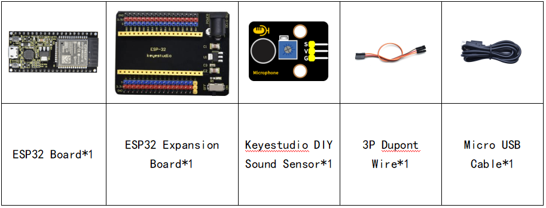
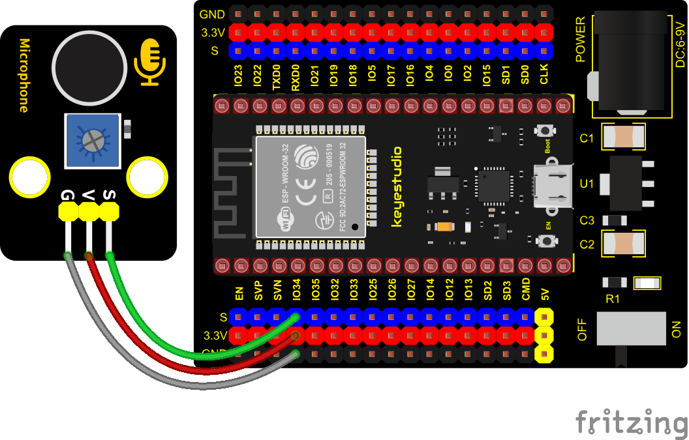
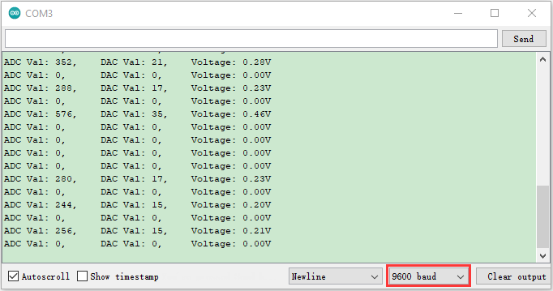

### Project 14: Sound Sensor


**Overview**

In this kit, there is a Keyestudio DIY electronic block and a sound sensor. In the experiment, we test the analog value corresponding to the sound level in the current environment with it. The louder the sound, the larger the ADC, DAC and the voltage value, and the “shell” window will display the test results.

**Working Principle**

It uses a high-sensitive microphone component and an LM386 chip. We build the circuit with the LM386 chip and amplify the sound through the high-sensitive microphone. In addition, we can adjust the sound volume by the potentiometer. Rotate it clockwise, the sound will get louder.


**Components**




**Connection Diagram**



**Test Code**


```c
//**********************************************************************************
/*  
 * Filename    : Photoresistance
 * Description : Read the basic usage of ADC，DAC and Voltage
 * Auther      : http//www.keyestudio.com
*/
#define PIN_ANALOG_IN  34  //the pin of the Photoresistance

void setup() {
  Serial.begin(9600);
}

//In loop()，the analogRead() function is used to obtain the ADC value, 
//and then the map() function is used to convert the value into an 8-bit precision DAC value. 
//The input and output voltage are calculated according to the previous formula, 
//and the information is finally printed out.
void loop() {
  int adcVal = analogRead(PIN_ANALOG_IN);
  int dacVal = map(adcVal, 0, 4095, 0, 255);
  double voltage = adcVal / 4095.0 * 3.3;
  Serial.printf("ADC Val: %d, \t DAC Val: %d, \t Voltage: %.2fV\n", adcVal, dacVal, voltage);
  delay(200);
}
//**********************************************************************************
```

**Test Result**

Connect the wires according to the experimental wiring diagram, compile and upload the code to the ESP32. After uploading successfully，we will use a USB cable to power on, open the serial monitor and set the baud rate to 9600. The serial monitor will display the sound sensor’s ADC value, DAC value and voltage value. Rotate the potentiometer clockwise and speak at the MIC. Then you can see the analog value get larger, as shown below:

