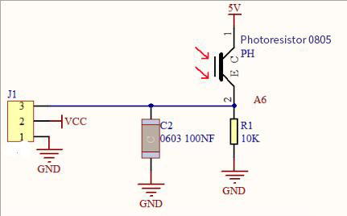
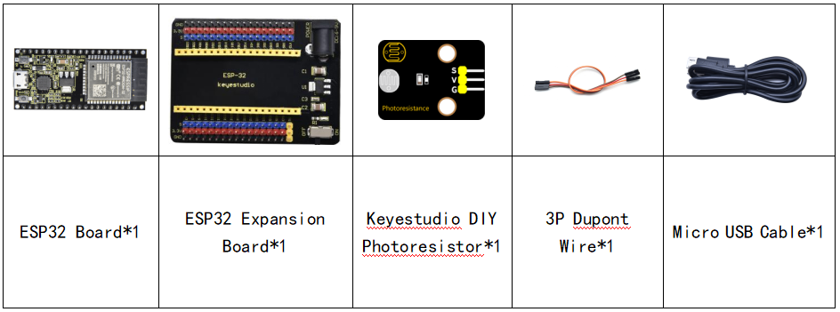
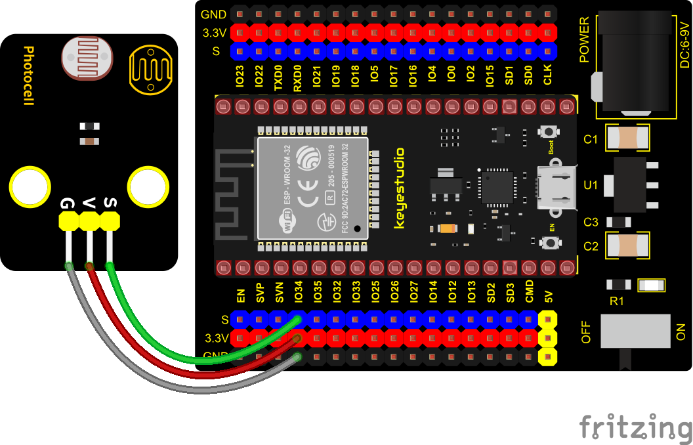
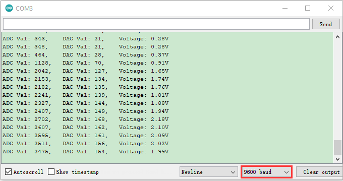

### Project 15: Photoresistor


**Description**

In this kit, there is a photoresistor consists of photosensitive resistance elements. Its resistance changes with the light intensity.
Also, it converts the resistance change into a voltage change through the characteristic of the photosensitive resistive element. When wiring it up, we interface its signal terminal (S terminal) with the analog port of ESP32 , so as to sense the change of the analog value, and display the corresponding analog value in the shell.

**Working Principle**

If there is no light, the resistance is 0.2MΩ and the detected voltage at the terminal 2 is close to 0. When the light intensity increases, the resistance of photoresistor and detected voltage will diminish.



**Components**



**Connection Diagram**



**Test Code**


```c
//**********************************************************************************
/*  
 * Filename    : Photoresistance
 * Description : Read the basic usage of ADC，DAC and Voltage
 * Auther      : http//www.keyestudio.com
*/
#define PIN_ANALOG_IN  34  //the pin of the Photoresistance

void setup() {
  Serial.begin(9600);
}

//In loop()，the analogRead() function is used to obtain the ADC value, 
//and then the map() function is used to convert the value into an 8-bit precision DAC value. 
//The input and output voltage are calculated according to the previous formula, 
//and the information is finally printed out.
void loop() {
  int adcVal = analogRead(PIN_ANALOG_IN);
  int dacVal = map(adcVal, 0, 4095, 0, 255);
  double voltage = adcVal / 4095.0 * 3.3;
  Serial.printf("ADC Val: %d, \t DAC Val: %d, \t Voltage: %.2fV\n", adcVal, dacVal, voltage);
  delay(200);
}
//**********************************************************************************
```


**Test Result**

Connect the wires according to the experimental wiring diagram, compile and upload the code to the ESP32. After uploading successfully，we will use a USB cable to power on, open the serial monitor and set the baud rate to 9600. The serial monitor will display the photoresistor’s ADC value, DAC value and voltage value. When the light intensity gets stronger, the analog values will get larger, as shown below:

