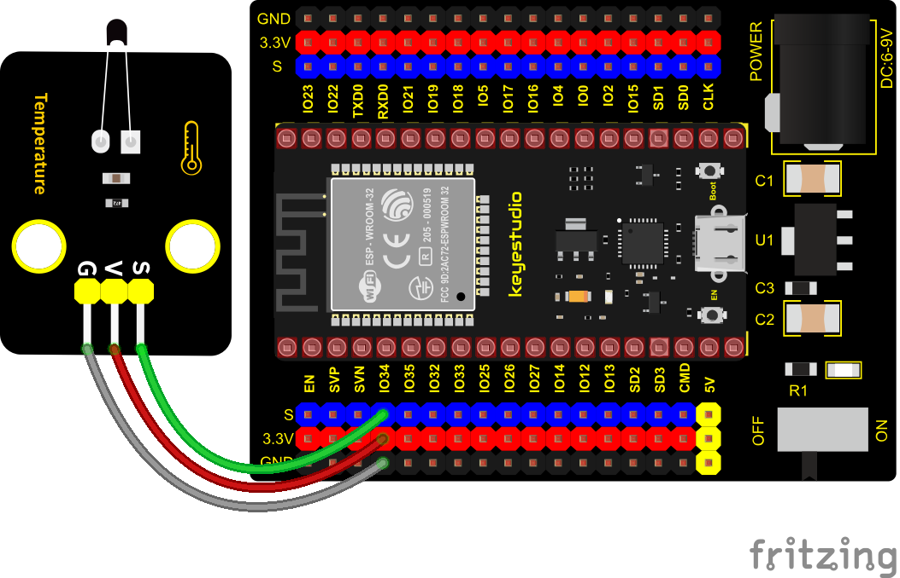
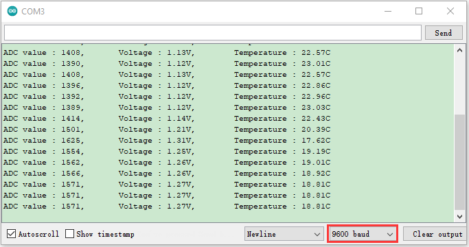

### Project 16: NTC-MF52AT Thermistor


**Overview**

In the experiment, there is a NTC-MF52AT analog thermistor. We connect its signal terminal to the analog port of the ESP32 mainboard and read the corresponding ADC value, voltage value and thermistor value.

We can use analog values to calculate the temperature of the current environment through specific formulas. Since the temperature calculation formula is more complicated, we only read the corresponding analog value.

**Working Principle**


This module mainly uses NTC-MF52AT thermistor element, which can sense the changes of the surrounding environment temperature. Resistance changes with the temperature, causing the voltage of the signal terminal S to change.

This sensor uses the characteristics of NTC-MF52AT thermistor element to convert resistance changes into voltage changes.

**Components**


**Connection Diagram**



**Test Code**


```c
//**********************************************************************************
/*  
 * Filename    : Temperature sensor
 * Description : Making a thermometer by thermistor.
 * Auther      : http//www.keyestudio.com
*/
#define PIN_ANALOG_IN   34
void setup() {
  Serial.begin(9600);
}

void loop() {
  int adcValue = analogRead(PIN_ANALOG_IN);                       //read ADC pin
  double voltage = (float)adcValue / 4095.0 * 3.3;                // calculate voltage
  double Rt = (3.3 - voltage) / voltage * 10;                     //calculate resistance value of thermistor
  double tempK = 1 / (1 / (273.15 + 25) + log(Rt / 4.7) / 3950.0); //calculate temperature (Kelvin)
  double tempC = tempK - 273.15;                                  //calculate temperature (Celsius)
  Serial.printf("ADC value : %d,\tVoltage : %.2fV, \tTemperature : %.2fC\n", adcValue, voltage, tempC);
  delay(1000);
}
//**********************************************************************************
```

**Test Result**

Connect the wires according to the experimental wiring diagram, compile and upload the code to the ESP32. After uploading successfully，we will use a USB cable to power on, open the serial monitor and set the baud rate to 9600. The serial monitor will display the thermistor’s ADC value, DAC value and voltage value, as shown below:



