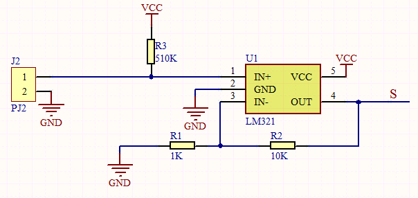
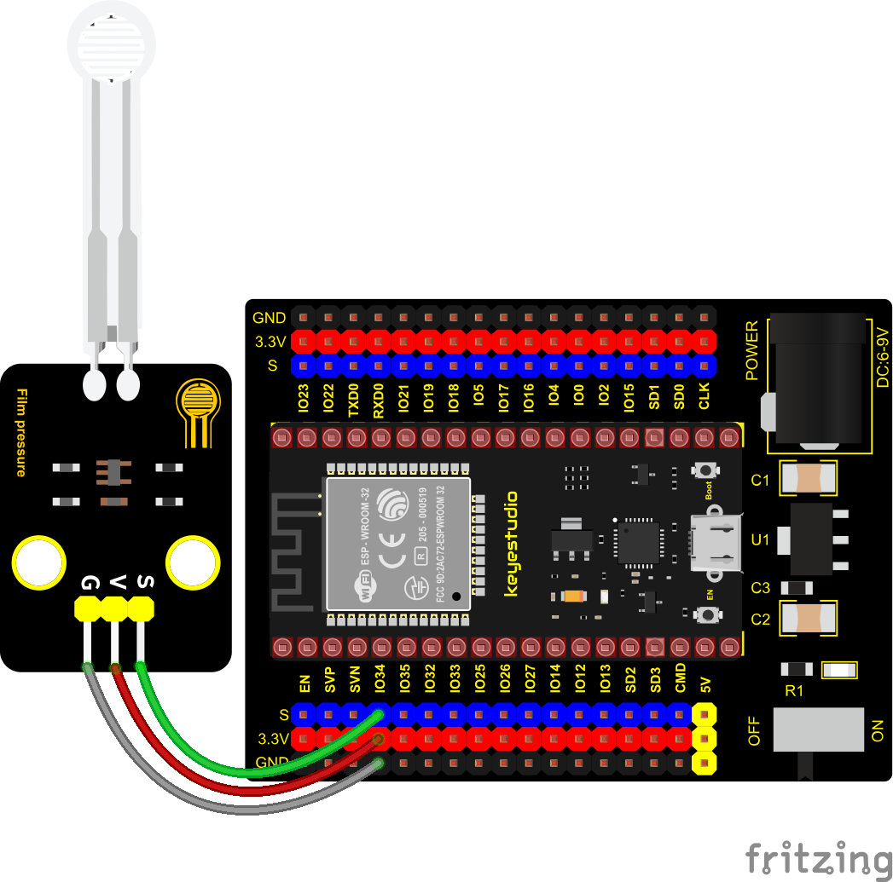
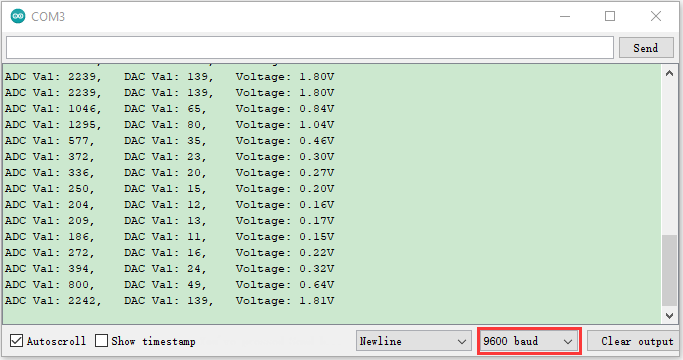

### Project 17: Thin-film Pressure Sensor


**Overview**

In this kit, there is a Keyestudio thin-film pressure sensor, which is composed of a new type of nano pressure-sensitive material and a comfortable ultra-thin film substrate, has waterproof and pressure-sensitive functions.

In the experiment, we determine the pressure by collecting the analog signal on the S end of the module. The smaller the ADC value, DAC value and voltage value, the greater the pressure; and the displayed results will shown on the Shell.



**Working Principle**

When the sensor is pressed by external forces, the resistance value of sensor will vary. We convert the pressure signals detected by the sensor into the electric signals through a circuit. Then we can obtain the pressure changes by detecting voltage signal changes.


**Components**


**Connection Diagram**



**Test Code**


```c
//**********************************************************************************
/*  
 * Filename    : Film pressure sensor
 * Description : Read the basic usage of ADC，DAC and Voltage
 * Auther      : http//www.keyestudio.com
*/
#define PIN_ANALOG_IN  34  //the pin of the Film pressure sensor
void setup() {
  Serial.begin(9600);
}

//In loop()，the analogRead() function is used to obtain the ADC value, 
//and then the map() function is used to convert the value into an 8-bit precision DAC value. 
//The input and output voltage are calculated according to the previous formula, 
//and the information is finally printed out.
void loop() {
  int adcVal = analogRead(PIN_ANALOG_IN);
  int dacVal = map(adcVal, 0, 4095, 0, 255);
  double voltage = adcVal / 4095.0 * 3.3;
  Serial.printf("ADC Val: %d, \t DAC Val: %d, \t Voltage: %.2fV\n", adcVal, dacVal, voltage);
  delay(200);
}
//**********************************************************************************
```

**Test Result**

Connect the wires according to the experimental wiring diagram, compile and upload the code to the ESP32. After uploading successfully，we will use a USB cable to power on, open the serial monitor and set the baud rate to 9600. The serial monitor will display the thin-film’s ADC value, DAC value and voltage value, when the thin-film is pressed by fingers, the analog value will decrease, as shown below;

