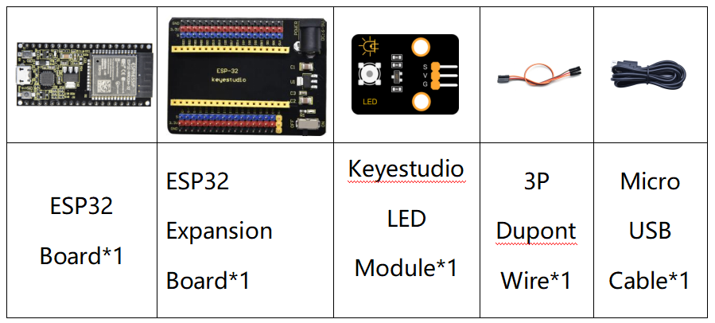
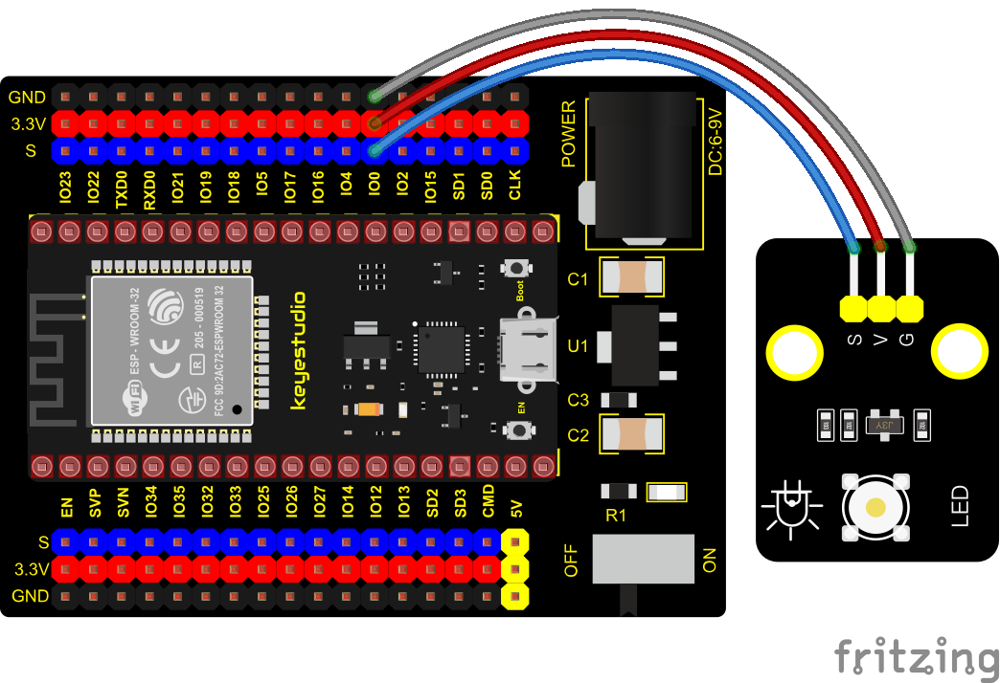
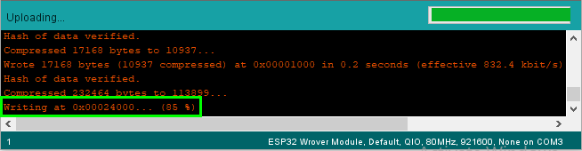

### Project 2: Lighting up LED


**Overview**

There is a Keyestudio Purple Module in this kit, which is very simple to control. If you want to light up the LED, you just need to make a certain voltage across it.

In the project, we will control the high and low level of the signal end S through programming, so as to control the LED on and off. 

**Working Principle**

The two circuit diagrams are given.

The left one is wrong wiring-up diagram. Theoretically, when the S terminal outputs high levels, the LED will receive the voltage and light up.

Due to limitation of IO ports of ESP32 board, weak current can’t make LED brighten.

The right one is correct wiring-up diagram. GND and VCC are powered up. When the S terminal is a high level, the triode Q1 will be connected and LED will light up(note: current passes through LED and R3 to reach GND by VCC not IO ports). Conversely, when the S terminal is a low level, the triode Q1 will be disconnected and LED will go off.


**Components**



**Wiring Diagram**



**Test Code**


```c
//*************************************************************************************
/*
 * Filename    : Blink
 * Description : led Flashing 1 s
 * Auther      : http://www.keyestudio.com
*/
int ledPin = 0; //Define LED pin connection to GPIO0
void setup() {
  pinMode(ledPin, OUTPUT);//Set mode to output
}

void loop() {
  digitalWrite(ledPin, HIGH); //Output high level, turn on led
  delay(1000);//Delay 1000 ms
  digitalWrite(ledPin, LOW); //Output low level,turn off led
  delay(1000);//Delay 1000 ms
}
//*************************************************************************************
```


**Code Explanation**

1\. PinMode(pin,mode): Pin is the ESP32 GPIO pin number used to set the mode, here we set pin 0 as output mode.

2\. DigitalWrite(pin, value): Pin is the GPIO pin, which is defined GP0 here. Valueis the digital level that we will output（HIGH/LOW. If the pin is configured to OUTPUT using pinMode(), its voltage is set to the corresponding value: 3.3V is HIGH, low level is 0V (ground). When connect the LEDs to the pins, using the digitalWrite（HIGH）, the LEDs will get dim.

3\. Setup() executes once, while loop() executes all the time. Delay(ms) is delay function, ms is the number of milliseconds to pause. Data type: unsigned long（range 0\~ 4,294,967,295 (2^32 - 1)）.

Firstly, we connect the module signal to ledPIN, namely GP0, and set it to a high level to light the LEDs on the module. Then delay 1000 ms, controlling the LEDs on the module light up for 1s and off for 1s to achieve the flashing effect. 

**Test Result**

Connect the wires according to the experimental wiring diagram, compile and upload the code to the ESP32. After uploading successfully，we will use a USB cable to power on, the LED in the circuit will flash alternately.

Note: If the uploading code fails, you can press and hold the Boot button on the ESP32 after clickingand release it after the percentage of uploading progress appears., as shown below:  

