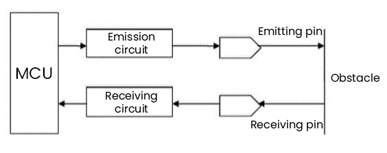
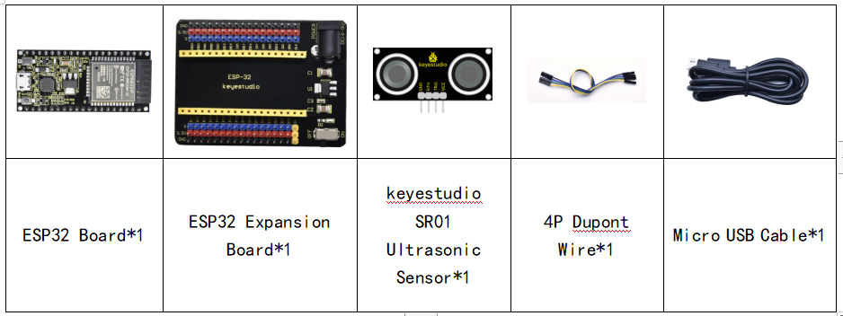
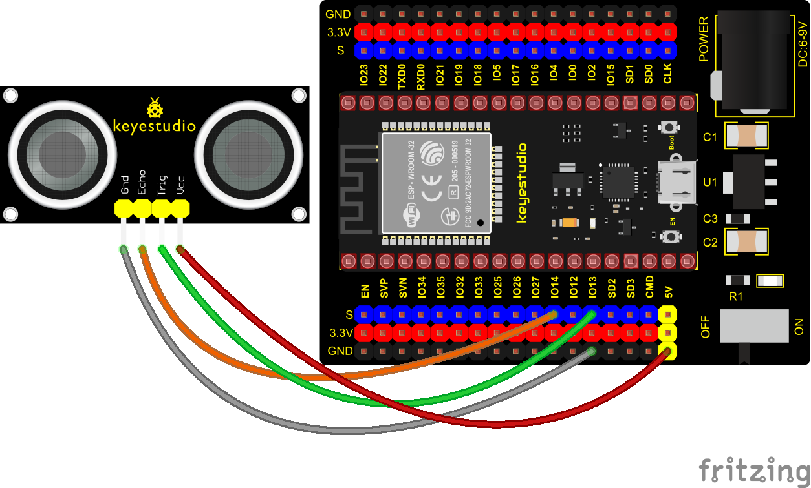
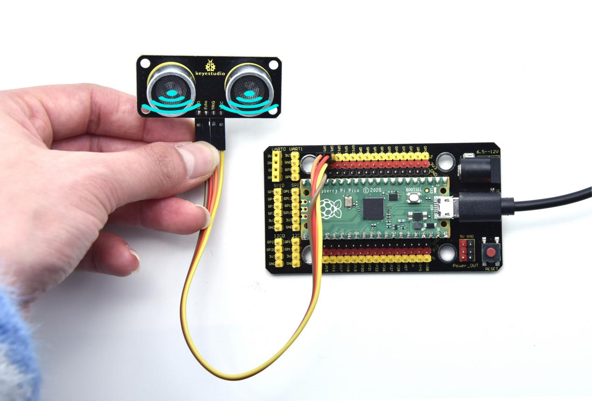
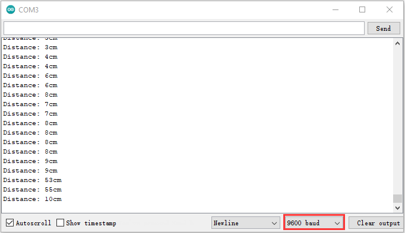

### Project 22: Ultrasonic Sensor


Bats and some marine animals are able to use high frequencies of sound for echolocation or communication. They can emit ultrasonic waves from the larynx through the mouth or nose and use the sound waves that bounce back to orient and determine the position, size and whether nearby objects are moving.

Ultrasonic is a frequency higher than 20000 Hz sound wave, which has a good direction, a strong penetration ability, and is easy to obtain more concentrated sound energy as well as spread far in the water. It can be used for ranging, speed measurement, cleaning, welding, gravel, sterilization and disinfection. What‘s more, it has many applications in medicine, military, industry and agriculture.

**Overview**

In this kit, there is a keyes HC-SR04 ultrasonic sensor, which can detect obstacles and the detailed distance between the sensor and the obstacle. Its principle is the same as that of bat flying. It can emit the ultrasonic signals that cannot be heard by humans. When these signals hit an obstacle and come back immediately. The distance between the sensor and the obstacle can be calculated by the time gap of emitting signals and receiving signals.

In the experiment, we use the sensor to detect the distance between the sensor and the obstacle, and print the test result.

**Working Principle**

The most common ultrasonic ranging method is the echo detection. As shown below; when the ultrasonic emitter emits the ultrasonic waves towards certain direction, the counter will count. The ultrasonic waves travel and reflect back once encountering the obstacle. Then the counter will stop counting when the receiver receives the ultrasonic waves coming back.

The ultrasonic wave is also sound wave, and its speed of sound V is related to temperature. Generally, it travels 340m/s in the air.
According to time t, we can calculate the distance s from the emitting spot to the obstacle.

s=340t/2.

The HC-SR04 ultrasonic ranging module can provide a non-contact distance sensing function of 2cm-400cm, and the ranging accuracy can reach as high as 3mm; the module includes an ultrasonic transmitter, receiver and control circuit. Basic working principle:

1\. First pull down the TRIG, and then trigger it with at least 10us high level signal;

2\. After triggering, the module will automatically transmit eight 40KHZ square waves, and automatically detect whether there is a signal to return.

3\. If there is a signal returned back, through the ECHO to output a high level, the duration time of high level is actually the time from emission to reception of ultrasonic.

Test distance = high level duration \* 340m/s \* 0.5.



**Components**




**Connection Diagram**



**Test Code**


```c
//**********************************************************************************
/*  
 * Filename    : Ultrasonic
 * Description : Use the ultrasonic module to measure the distance.
 * Auther      : http//www.keyestudio.com
*/
const int TrigPin = 13; // define TrigPin
const int EchoPin = 14; // define EchoPin.
int duration = 0; // Define the initial value of the duration to be 0
int distance = 0;//Define the initial value of the distance to be 0
void setup() 
{
  pinMode(TrigPin , OUTPUT); // set trigPin to output mode
  pinMode(EchoPin , INPUT); // set echoPin to input mode
  Serial.begin(9600);  // Open serial monitor at 9600 baud to see ping results.
}
void loop()
{
 // make trigPin output high level lasting for 10μs to triger HC_SR04 
  digitalWrite(TrigPin , HIGH);
  delayMicroseconds(10);
  digitalWrite(TrigPin , LOW);
  // Wait HC-SR04 returning to the high level and measure out this waitting time
  duration = pulseIn(EchoPin , HIGH);
  // calculate the distance according to the time
  distance = (duration/2) / 28.5 ;
  Serial.print("Distance: ");
  Serial.print(distance); //Serial port print distance value
  Serial.println("cm");
  delay(300); // Wait 100ms between pings (about 20 pings/sec).
}
//**********************************************************************************
```


**Test Result**

Connect the wires according to the experimental wiring diagram, compile and upload the code to the ESP32. After uploading successfully，we will use a USB cable to power on. Open the serial monitor and set baud rate to 9600.

The serial monitor will print the distance between the ultrasonic sensor and the object.



