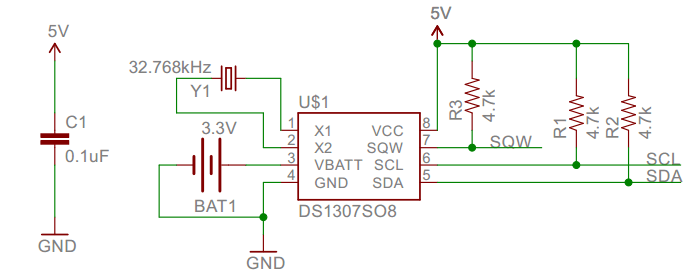
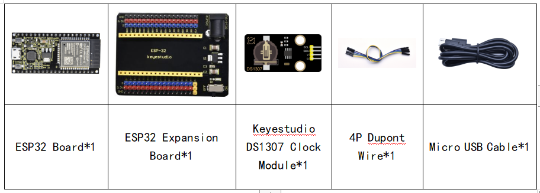
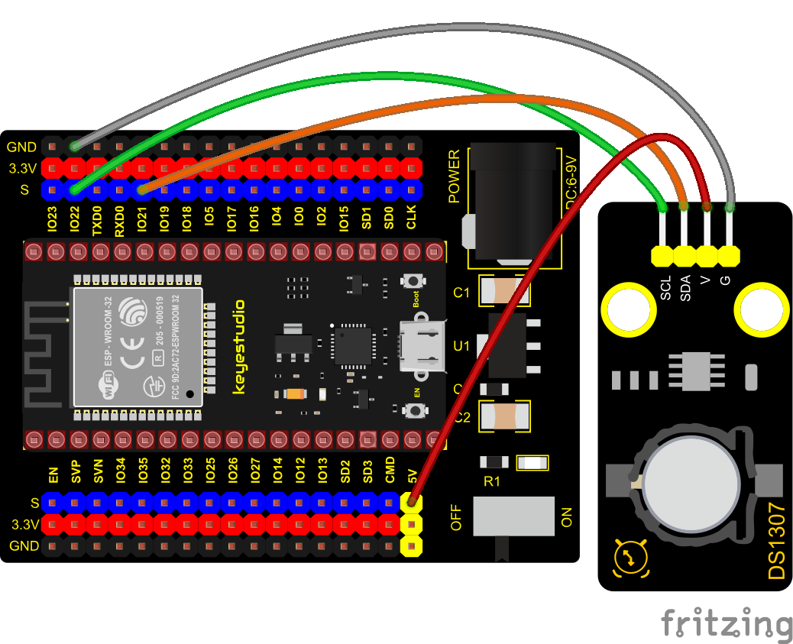
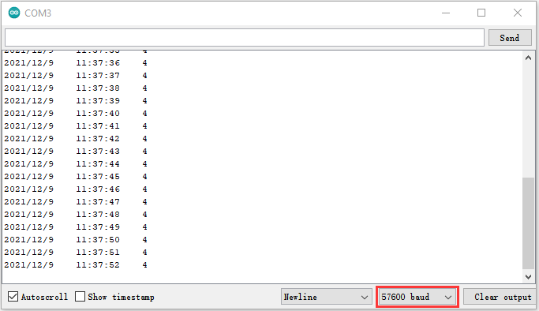

### Project 24: DS1307 Clock Module


**Overview**

This module mainly uses the real-time clock chip DS1307, which is the I2C bus interface chip has second, minute, hour, day, month, year and other functions as well as leap year automatic adjustment function introduced by DALLAS. It can work independently of CPU, and won‘t’ affected by the CPU main crystal oscillator and capacitance as well as keep accurate time. What‘s more, monthly cumulative error is generally less than 10 s.

The chip also has a clock protection circuit in case of main power failure and runs on a back-up battery that denies the CPU read and write access. At the same time, it contains automatic switching control circuit of standby power supply, making it guarantees the accuracy of system clock in case of power failure of main power supply and other bad environment.

Going forward, the DS1307 chip internal integration has a certain capacity, with power failure protection characteristics of static RAM, which can be used to save some key data. 

In the experiment, we use the DS1307 clock module to obtain the system time and print the test results.  

**Working Principle**

Serial real-time clock records year, month, day, hour, minute, second and week; AM and PM indicate morning and afternoon respectively; 56 bytes of NVRAM store data; 2-wire serial port; programmable square wave output; power failure detection and automatic switching circuit; battery current is less than 500nA.



Pins description：X1, 32.768kHz crystal terminal;

VBAT:X2：+3V input;

SDA：serial data;

SCL：serial clock;

SQW/OUT：square waves/output drivers

**Components**




**Connection Diagram**



**Test Code**

```c
//**********************************************************************************
/*  
 * Filename    : DS1307 Real Time Clock
 * Description : Read the year/month/day/hour/minute/second/week of DS1307 clock module
 * Auther      : http//www.keyestudio.com
*/
#include <Wire.h>
#include "RtcDS1307.h"  //DS1307 clock module library

RtcDS1307<TwoWire> Rtc(Wire);//i2cport

void setup(){
  Serial.begin(57600);//Set baud rate to 57600
  Rtc.Begin();
  Rtc.SetIsRunning(true);

  Rtc.SetDateTime(RtcDateTime(__DATE__, __TIME__));  
}

void loop(){
  // Print year/month/day/hour/minute/second/week
  Serial.print(Rtc.GetDateTime().Year());
  Serial.print("/");
  Serial.print(Rtc.GetDateTime().Month());
  Serial.print("/");
  Serial.print(Rtc.GetDateTime().Day());
  Serial.print("    ");
  Serial.print(Rtc.GetDateTime().Hour());
  Serial.print(":");
  Serial.print(Rtc.GetDateTime().Minute());
  Serial.print(":");
  Serial.print(Rtc.GetDateTime().Second());
  Serial.print("    ");
  Serial.println(Rtc.GetDateTime().DayOfWeek());
  delay(1000);//Delay 1 second
}
//**********************************************************************************
```


**Code Explanation**

Rtc.GetDateTime(): the obtained current time and date.

**Rtc.Begin();**enable DS1307 real-time clock

**Rtc.SetIsRunning(true);** run the DS1307 real-time clock, if true changes into false, time will stop.

**Rtc.SetDateTime()；**set time

**Rtc.GetDateTime().Year()** return year

**Rtc.GetDateTime().Month()** return month

**Rtc.GetDateTime().Day()**return date

**Rtc.GetDateTime().Hour()**return hour

**Rtc.GetDateTime().Minute()**return minute

**Rtc.GetDateTime().Second()**return second

**Rtc.GetDateTime().DayOfWeek() return week**


**Test Result**

Connect the wires according to the experimental wiring diagram, attach the DS1307 sensor to a battery, compile and upload the code to the ESP32. After uploading successfully，we will use a USB cable to power on. Open the serial monitor and set baud rate to 9600. We can see the displayed year, month, day, hour, minute, second and week on the serial monitor, and set the time and date to refresh every second, as shown below:

