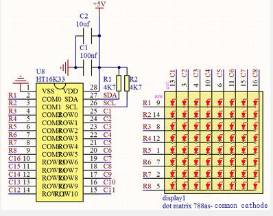
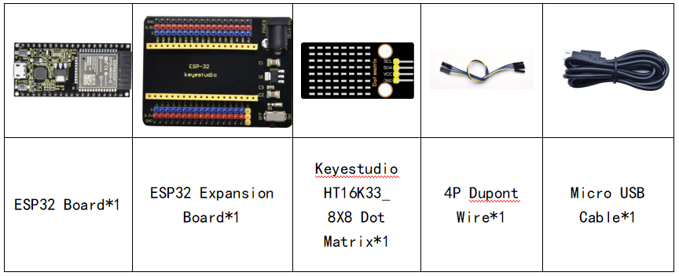
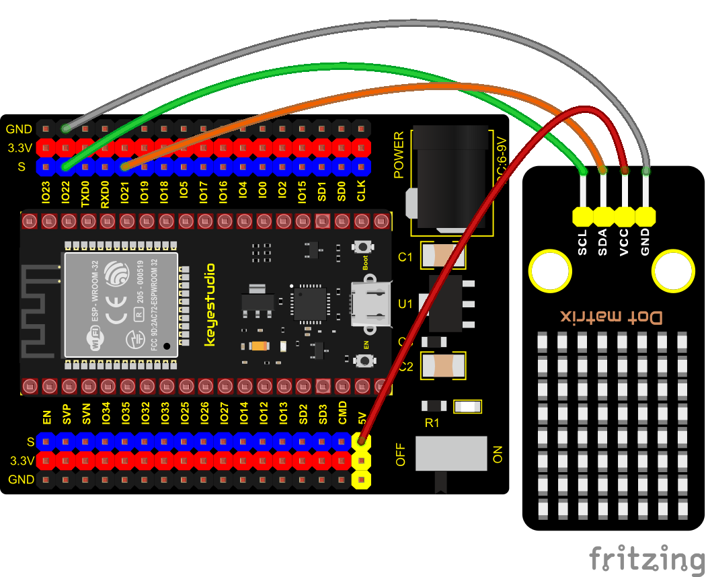
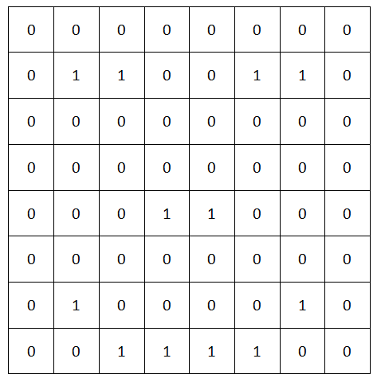

### Project 26: HT16K33\_8X8 Dot Matrix Module


**Overview**

What is the dot matrix display?

The 8X8 dot matrix is composed of 64 light-emitting diodes, and each light-emitting diode is placed at the intersection of the row line and the column line. When the corresponding row is set to 1 level, and a certain column is set to 0 level, the corresponding diode will light up.

**Working Principle**

As the schematic diagram shown, to light up the LED at the first row and column, we only need to set C1 to high level and R1 to low level. To turn on LEDs at the first row, we set R1 to low level and C1-C8 to high level. 16 IO ports are needed, which will highly waste the MCU resources.

Therefore, we designed this module, using the HT16K33 chip to drive an 8\*8 dot matrix, which greatly saves the resources of the single-chip microcomputer.



There are three DIP switches on the module, all of which are set to I2C communication address. The setting method is shown below. A0，A1 and A2 are grounded, that is, the address is 0x70.

<table class="colwidths-auto docutils align-default">
<tbody>
<tr class="odd">
<td>A0（1）</td>
<td>A1（2）</td>
<td>A2（3）</td>
<td>A0（1）</td>
<td>A1（2）</td>
<td>A2（3）</td>
<td>A0（1）</td>
<td>A1（2）</td>
<td>A2（3）</td>
</tr>
<tr class="even">
<td>0（OFF）</td>
<td>0（OFF）</td>
<td>0（OFF）</td>
<td>1（ON）</td>
<td>0（OFF）</td>
<td>0（OFF）</td>
<td>0（OFF）</td>
<td>1（ON）</td>
<td>0（OFF）</td>
</tr>
<tr class="odd">
<td>OX70</td>
<td>OX71</td>
<td>OX72</td>
<td></td>
<td></td>
<td></td>
<td></td>
<td></td>
<td></td>
</tr>
<tr class="even">
<td>A0（1）</td>
<td>A1（2）</td>
<td>A2（3）</td>
<td>A0（1）</td>
<td>A1（2）</td>
<td>A2（3）</td>
<td>A0（1）</td>
<td>A1（2）</td>
<td>A2（3）</td>
</tr>
<tr class="odd">
<td>1（ON）</td>
<td>1（ON）</td>
<td>0（OFF）</td>
<td>0（OFF）</td>
<td>0（OFF）</td>
<td>1（ON）</td>
<td>1（ON）</td>
<td>0（OFF）</td>
<td>1（ON）</td>
</tr>
<tr class="even">
<td>OX73</td>
<td>OX74</td>
<td>OX75</td>
<td></td>
<td></td>
<td></td>
<td></td>
<td></td>
<td></td>
</tr>
<tr class="odd">
<td>A0（1）</td>
<td>A1（2）</td>
<td>A2（3）</td>
<td>A0（1）</td>
<td>A1（2）</td>
<td>A2（3）</td>
<td></td>
<td></td>
<td></td>
</tr>
<tr class="even">
<td>0（OFF）</td>
<td>1（ON）</td>
<td>1（ON）</td>
<td>1（ON）</td>
<td>1（ON）</td>
<td>1（ON）</td>
<td></td>
<td></td>
<td></td>
</tr>
<tr class="odd">
<td>OX76</td>
<td>OX77</td>
<td></td>
<td></td>
<td></td>
<td></td>
<td></td>
<td></td>
<td></td>
</tr>
</tbody>
</table>


**Components**




**Connection Diagram**



**Test Code**


```c
//**********************************************************************************
/*
 * Filename    : 8×8 Dot-matrix Display
 * Description : 8x8 LED dot matrix display“Heart” pattern.
 * Auther      : http//www.keyestudio.com
*/
#include "HT16K33_Lib_For_ESP32.h"

#define SDA 21
#define SCL 22

ESP32_HT16K33 matrix = ESP32_HT16K33();

//The brightness values can be set from 1 to 15, with 1 darkest and 15 brightest
#define  A  15

byte result[8][8];
byte test1[8] = {0x00,0x42,0x41,0x09,0x09,0x41,0x42,0x00};

void setup()
{
  matrix.init(0x70, SDA, SCL);//Initialize matrix
  matrix.showLedMatrix(test1,0,0);
  matrix.show();
}

void loop()
{
  for (int i = 0; i <= 7; i++)
  {
    matrix.setBrightness(i);
    delay(100);
  }
  for (int i = 7; i > 0; i--)
  {
    matrix.setBrightness(i);
    delay(100);
  }
}
//**********************************************************************************
```

**Code Explanation**

First we need to import the library file.

The pattern in our code is an array of byte data type, which is shown in the table below. We convert  into binary, and fill in the 8\*8 form below to make it clear. 1 means on, 0 means off. Then we can see that it is a smile shape.



**Test Result**

Connect the wires according to the experimental wiring diagram, compile and upload the code to the ESP32. After uploading successfully，we will use a USB cable to power on. Then the dot matrix displays a “ smile ”pattern.