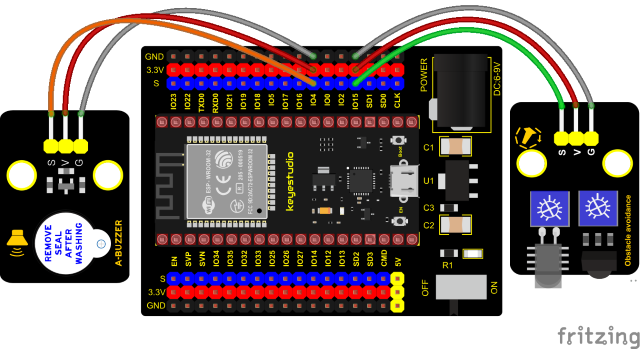

### Project 28: Alarm Experiment


**Overview**

In the previous experiment, we control an output module though an input module. In this lesson, we will make an experiment that the active buzzer will emit sounds once an obstacle appears.

**Components**


**Connection Diagram**



**Test Code**

```c
//**********************************************************************************
/*  
 * Filename    : Avoiding alarm
 * Description : Obstacle avoidance sensor controls the buzzer
 * Auther      : http//www.keyestudio.com
*/
int item = 0;
void setup() {
  pinMode(15, INPUT);  //Obstacle avoidance sensor is connected to GPIO15 and set to input mode
  pinMode(4, OUTPUT); //The buzzer is connected to GPIO4 and set to output mode
}

void loop() {
  item = digitalRead(15);//Read the level value output by the obstacle avoidance sensor
  if (item == 0) {//Obstruction detected
    digitalWrite(4, HIGH);//The buzzer sounded
  } else {//No obstacles detected
    digitalWrite(4, LOW);//The buzzer is off
  }
  delay(100);//Delay 100ms
}
//**********************************************************************************
```

**Code Explanation**

Set IO ports according to connection diagram then configure pins mode.

The value is 0 when pressing the button, So, we can determine the key value(0）through if (item == 0) and make the buzzer beep digitalWrite(4, HIGH).

**Test Result**

Connect the wires according to the experimental wiring diagram, compile and upload the code to the ESP32. After uploading successfully，we will use a USB cable to power on. If the obstacle is detected, the active buzzer will chime; if not, it won’t beep.