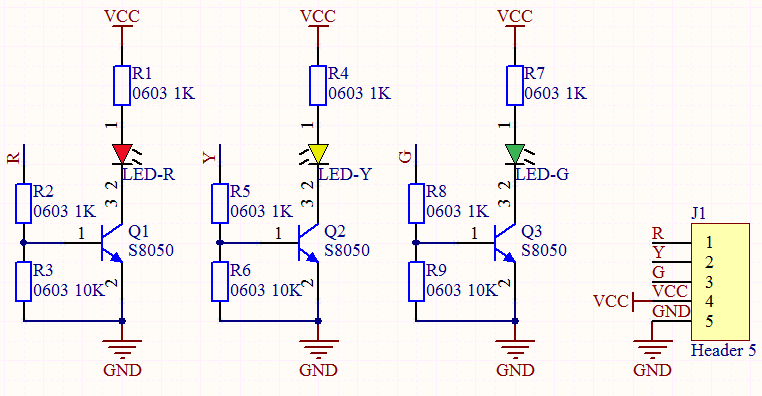
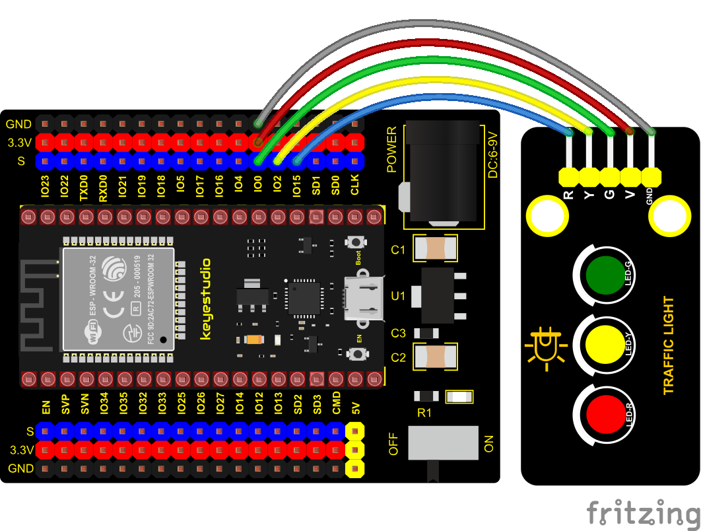

### Project 3: Traffic Lights Module


**Overview**

In this lesson, we will learn how to control multiple LED lights and simulate the operation of traffic lights.

Traffic lights are signal devices positioned at road intersections, pedestrian crossings, and other locations to control flows of traffic.

In this kit, we will use the traffic light module to simulate the traffic light.


**Working Principle**

In previous lesson, we already know how to control an LED. In this part, we only need to control three separated LEDs. Output high levels to the signal R(3.3V), then the red LED will be on.



**Components**


**Wiring Diagram**
    



**Test Code**


```c
//*************************************************************************************
/*
 * Filename    : Traffic_Light
 * Description : Simulated traffic lights
 * Auther      : http://www.keyestudio.com
*/
int redPin = 15;   //Red LED connected to GPIO15
int yellowPin = 2; //Yellow LED connected to GPIO2
int greenPin = 0;   //Green LED connected to GPIO0

void setup() {
  //LED interfaces are set to output mode
  pinMode(greenPin, OUTPUT);
  pinMode(yellowPin, OUTPUT);
  pinMode(redPin, OUTPUT);
}

void loop() {
  digitalWrite(greenPin, HIGH); //Lighting green LED
  delay(5000);  //Delay for 5 seconds
  digitalWrite(greenPin, LOW); //Turn off green LEDS
  for (int i = 1; i <= 3; i = i + 1) {  //run three times
    digitalWrite(yellowPin, HIGH); //Lighting yellow LED
    delay(500); //Delay for 0.5 seconds
    digitalWrite(yellowPin, LOW); //Turn off yellow LED
    delay(500); //Delay for 0.5 seconds
  }
  digitalWrite(redPin, HIGH); //Lighting red LED
  delay(5000);  //Delay5s
  digitalWrite(redPin, LOW); //Turn off red LED
}
//*************************************************************************************
```


**Code Explanation**

Create pins, set pins mode and delayed functions.

We use the function for(). for (int i = 1; i \<= 3; i = i + 1) represents the variable i adds 1 fir each time from 1 to 3.

The function for (int i = 255; i \>= 0; i = i - 1) indicates that i reduces by 1 each time. When i\<0, exit the for() loop and execute 256
times.


**Test Result**

Connect the wires according to the experimental wiring diagram, compile and upload the code to the ESP32. After uploading successfully，we will use a USB cable to power on，the green LED will be on for 5s then off, the yellow LED will flash for 3s then go off and the red one will be on for 5s then off, the three LED modules will simulate the circulation of traffic lights automatically.