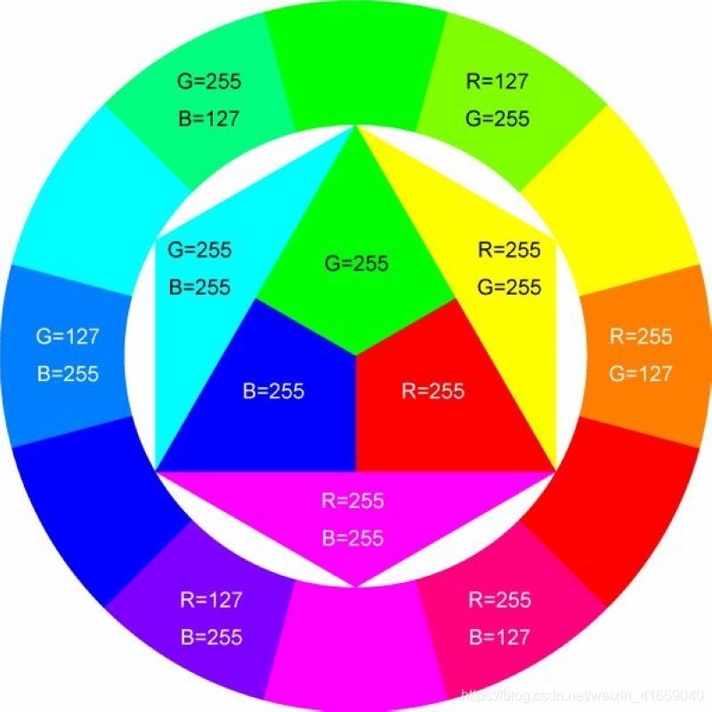
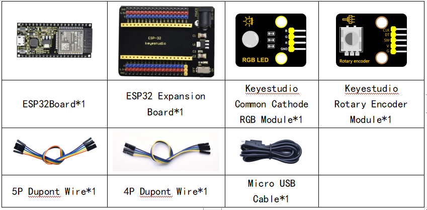
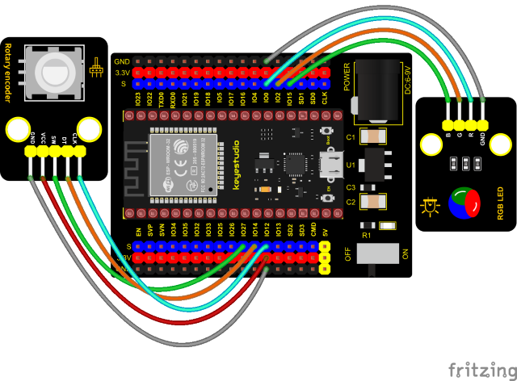
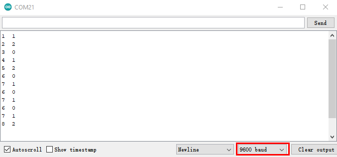

### Project 30: Rotary Encoder control RGB



**Introduction**

In this lesson, we will control the LED on the RGB module to show different colors through a rotary encoder.

When designing the code, we need to divide the obtained values by 3 to get the remainders. The remainder is 0 and the LED will become red. The remainder is 1, the LED will become green. The remainder is 2, the LED will turn blue.

**Components**



**Connection Diagram**



**Test Code**

```c
//**********************************************************************************
/*  
 * Filename    : Encoder control RGB
 * Description : Rotary encoder controls RGB to present different effects
 * Auther      : http//www.keyestudio.com
*/
//Interfacing Rotary Encoder with Arduino
//Encoder Switch -> pin 27
//Encoder DT -> pin 14
//Encoder CLK -> pin 12
int Encoder_DT  = 14;
int Encoder_CLK  = 12;
int Encoder_Switch = 27;

int Previous_Output;
int Encoder_Count;

int ledPins[] = {0, 2, 15};    //define red, green, blue led pins
const byte chns[] = {0, 1, 2};        //define the pwm channels
int red, green, blue;

int val;
void setup() {
  Serial.begin(9600);

  //pin Mode declaration
  pinMode (Encoder_DT, INPUT);
  pinMode (Encoder_CLK, INPUT);
  pinMode (Encoder_Switch, INPUT);

  Previous_Output = digitalRead(Encoder_DT); //Read the inital value of Output A
  for (int i = 0; i < 3; i++) {   //setup the pwm channels,1KHz,8bit
    ledcSetup(chns[i], 1000, 8);
    ledcAttachPin(ledPins[i], chns[i]);
   }
}

void loop() {
  //aVal = digitalRead(pinA);

  if (digitalRead(Encoder_DT) != Previous_Output)
  {
    if (digitalRead(Encoder_CLK) != Previous_Output)
    {
      Encoder_Count ++;
      Serial.print(Encoder_Count);
      Serial.print("  ");
      val = Encoder_Count % 3;
      Serial.println(val);
    }
    else
    {
      Encoder_Count--;
      Serial.print(Encoder_Count);
      Serial.print("  ");
      val = Encoder_Count % 3;
      Serial.println(val);
    }
  }

  Previous_Output = digitalRead(Encoder_DT);

  if (digitalRead(Encoder_Switch) == 0)
  {
    delay(5);
    if (digitalRead(Encoder_Switch) == 0) {
      Serial.println("Switch pressed");
      while (digitalRead(Encoder_Switch) == 0);
    }
  }
  if (val == 0) {
    //RED(255, 0, 0)
    ledcWrite(chns[0], 255 ); 
    ledcWrite(chns[1], 0);
    ledcWrite(chns[2], 0);
  } else if (val == 1) {
    //GREEN(0, 255, 0)
    ledcWrite(chns[0], 0); 
    ledcWrite(chns[1], 255);
    ledcWrite(chns[2], 0);
  } else {
    //BLUE(0, 0, 255)
    ledcWrite(chns[0], 0); 
    ledcWrite(chns[1], 0);
    ledcWrite(chns[2], 255);
  }
}
//**********************************************************************************
```


**Code Explanation**


1. In the experiment, we set the val to the remainder of Encoder\_Count divided by 3. Encoder\_Count is the value of the encoder. Then we can set pin GPIO0 (red), GPIO2 (green) and GPIO15 (blue) according to remainders.

2. Referring to the control method learned in the previous experiment, use the LED on the remainder control module to display the corresponding light color. The value obtained by taking the remainder of 3 for any number is 0 or 1 or 2. We use these three values to judge, and display the corresponding color.


**Test Result**

Connect the wires according to the experimental wiring diagram, compile and upload the code to the ESP32. After uploading successfully, we will use a USB cable to power on. Open the serial monitor and set the baud rate to 9600, then rotate the knob of the rotary encoder to display the reminders, which can control colors of LED(red green blue).

