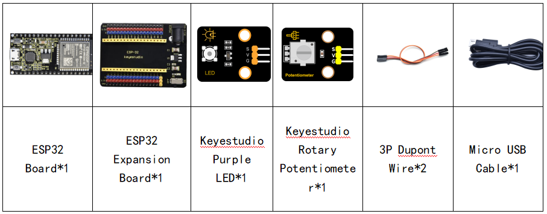
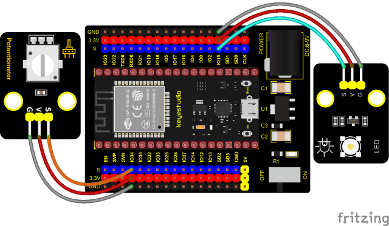

### Project 31: Rotary Potentiometer


**Introduction**

In the previous courses, we did experiments of breathing light and controlling LED with button. In this course, we do these two experiments by controlling the brightness of LED through an adjustable potentiometer. The brightness of LED is controlled by PWM values, and the range of analog values is 0 to 4095 and the PWM value range is 0-255.

After the code is set successfully, we can control the brightness of the LED on the module by rotating the potentiometer.

**Required Components**




**Connection Diagram**



**Test Code**


```c
//**********************************************************************************
/*  
 * Filename    : adjust the light
 * Description : Controlling the brightness of LED by potentiometer.
 * Auther      : http//www.keyestudio.com
*/
#define PIN_ANALOG_IN    34  //the pin of the potentiometer
#define PIN_LED     15  // the pin of the LED
#define CHAN            0
void setup() {
  ledcSetup(CHAN, 1000, 12);
  ledcAttachPin(PIN_LED, CHAN);
}

void loop() {
  int adcVal = analogRead(PIN_ANALOG_IN); //read adc
  int pwmVal = adcVal;        // adcVal re-map to pwmVal
  ledcWrite(CHAN, pwmVal);    // set the pulse width.
  delay(10);
}
//**********************************************************************************
```

**Code Explanation**

In the experiment, the mapping function maps adcVal from the range of 0-4095 to 0-255, and assigns it to pwmVal.

**Test Result**

Connect the wires according to the experimental wiring diagram, compile and upload the code to the ESP32. After uploading successfully，we will use a USB cable to power on. Rotating the potentiometer on the module can adjust the brightness of the LED on the LED module.