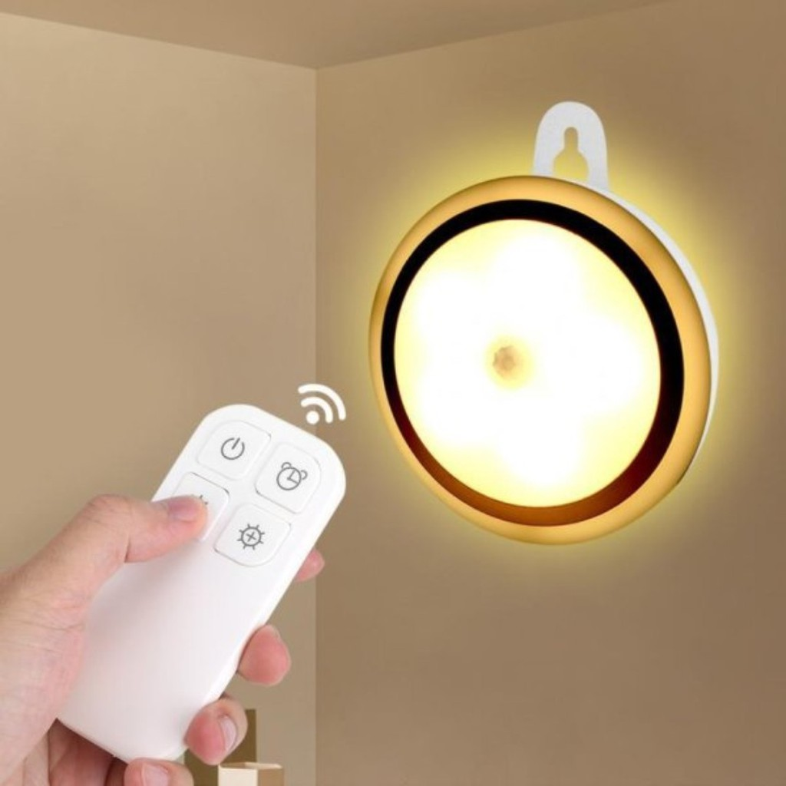
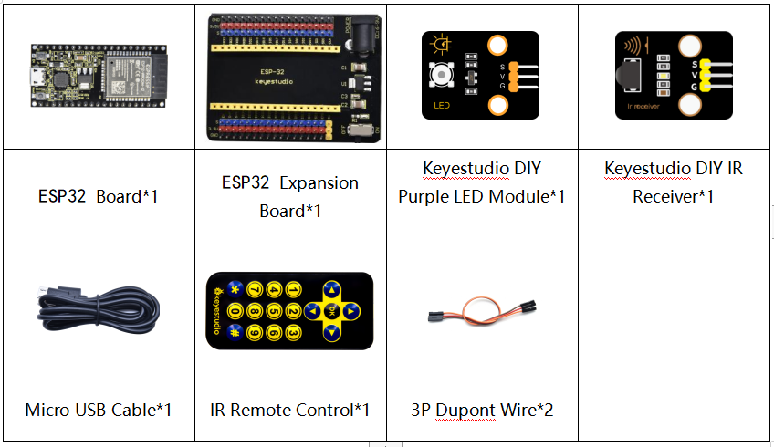
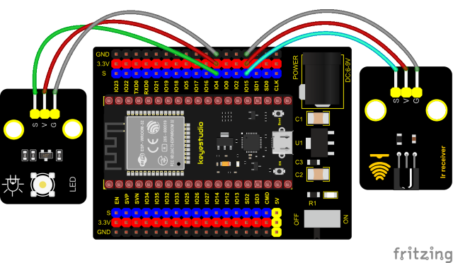
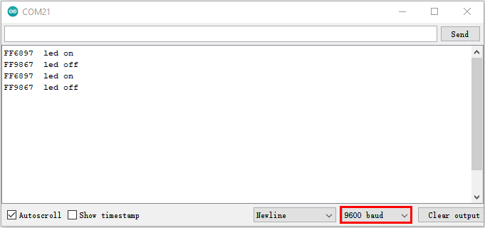

### Project 34: IR Remote Control



**Introduction**

In the previous experiments, we learned to turn on or turn off the LED, adjust the brightness of a light through PWM, and how to use the infrared receiver module. So in this experiment, we use an infrared remote control to control an LED module.

When we receive a value, we set the PWM value by the corresponding button value, thus you can adjust the brightness. Control the LED to turn on or turn off is in the same way. If we want to use the same button to control the LED to turn on or turn off, we can achieve it through the code.

**Components**




**Connection Diagram**



**Test Code**


```c
//**********************************************************************************
/*  
 * Filename    : IR Control LED
 * Description : Remote controls LED on and off
 * Auther      : http//www.keyestudio.com
*/
#include <Arduino.h>
#include <IRremoteESP8266.h>
#include <IRrecv.h>
#include <IRutils.h>

const uint16_t recvPin = 15; // Infrared receiving pin 15
IRrecv irrecv(recvPin);      // Create a class object used to receive class
decode_results results;       // Create a decoding results class object
int led = 4;//LED connect to GP4

void setup() {
  Serial.begin(9600);
  irrecv.enableIRIn();                  // Start the receiver
  pinMode(led, OUTPUT);
}
////////////////////
void loop() {
  if(irrecv.decode(&results)) {        // Waiting for decoding
    serialPrintUint64(results.value, HEX);// Print out the decoded results
    Serial.print("");
    handleControl(results.value);       // Handle the commands from remote control
    irrecv.resume();                    // Receive the next value
  }
}
  void handleControl(unsigned long value) {
    if (value == 0xFF6897) // Receive the number '1'
     {
       digitalWrite(led, HIGH);//turn on LED
       Serial.println("  led on");
     } 
    else if (value == 0xFF9867) // Receive the number '2'
     {
        digitalWrite(led, LOW);//turn off LED
       Serial.println("  led off"); 
    }
}
//**********************************************************************************
```


**Test Result**

Connect the wires according to the experimental wiring diagram, compile and upload the code to the ESP32. After uploading successfully，we will use a USB cable to power on. Open the serial monitor and set the baud rate to 9600. Press the button 1 of the remote, which will be displayed on the monitor, and the LED will be on. Similarly, press the button 2 , the LED will be off.

