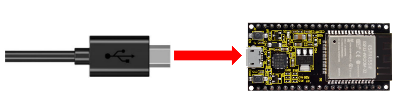
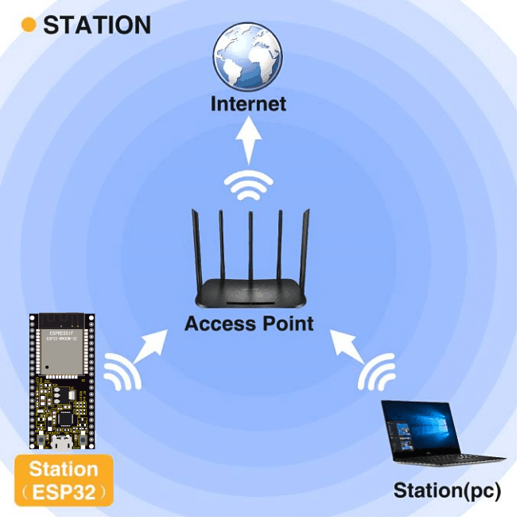
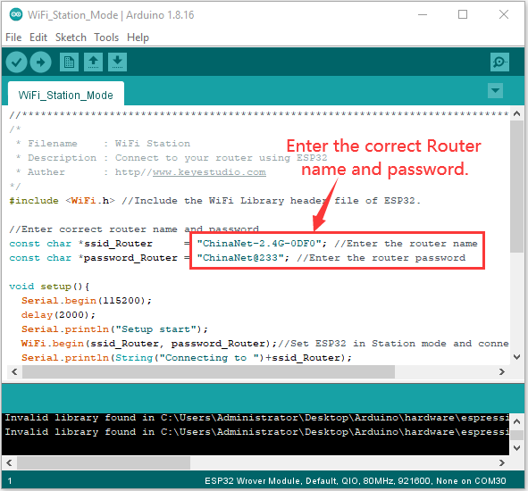
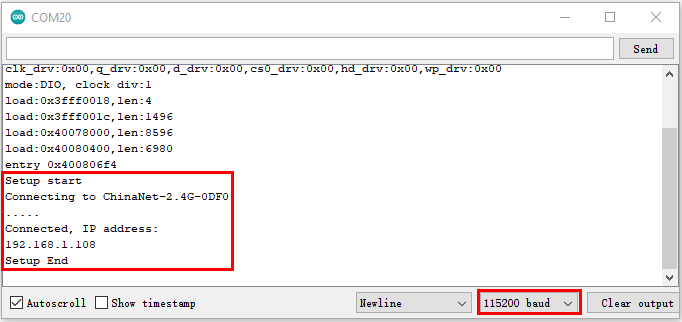

### Project 36 WIFI Station Mode

**Description**

ESP32 has three different WiFi modes: Station mode, AP mode and AP+Station mode. All WiFi programming projects must be configured with WiFi running mode before using, otherwise the WiFi cannot be used. In this project, we are going to learn the WiFi Station mode of the ESP32.

**Components**

|  |  |
| ------------------- | ------------------- |
| Micro USB Cable*1   | ESP32*1             |

**Wiring Diagram**

Plug the ESP32 to the USB port of your PC



**Component Knowledge**

**Station mode：**

When setting Station mode, the ESP32 is taken as a WiFi client. It can connect to the router network and communicate with other devices on the router via a WiFi connection. As shown in the figure below, the PC and the router have been connected. If the ESP32 wants to communicate with the PC, the PC and the router need to be connected.



**Test Code**

Since WiFi names and passwords vary from place to place, thereby users need to enter the correct WiFi names and passwords in the box shown below before the program code runs.  




```c
//**********************************************************************************
/*
 * Filename    : WiFi Station
 * Description : Connect to your router using ESP32
 * Auther      : http//www.keyestudio.com
*/
#include <WiFi.h> //Include the WiFi Library header file of ESP32.

//Enter correct router name and password.
const char *ssid_Router     = "ChinaNet-2.4G-0DF0"; //Enter the router name
const char *password_Router = "ChinaNet@233"; //Enter the router password

void setup(){
  Serial.begin(115200);
  delay(2000);
  Serial.println("Setup start");
  WiFi.begin(ssid_Router, password_Router);//Set ESP32 in Station mode and connect it to your router.
  Serial.println(String("Connecting to ")+ssid_Router);
//Check whether ESP32 has connected to router successfully every 0.5s.  
  while (WiFi.status() != WL_CONNECTED){
    delay(500);
    Serial.print(".");
  }
  Serial.println("\nConnected, IP address: ");
  Serial.println(WiFi.localIP());//Serial monitor prints out the IP address assigned to ESP32.
  Serial.println("Setup End");
}
 
void loop() {
}
//**********************************************************************************
```


**Test Result**

After entering the correct WiFi names and passwords, compile and upload the code to the ESP32. After uploading successfully，we will use a USB cable to power on. Open the serial monitor and set the baud rate to 115200.

When the ESP32 successfully connects to ssid\_WiFi, the serial monitor prints out the IP address, then monitor will display as follows: (If open the serial monitor and set the baud rate to 115200, the information is not displayed, please press the RESET button of the ESP32)


