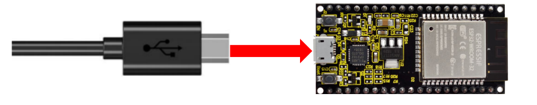
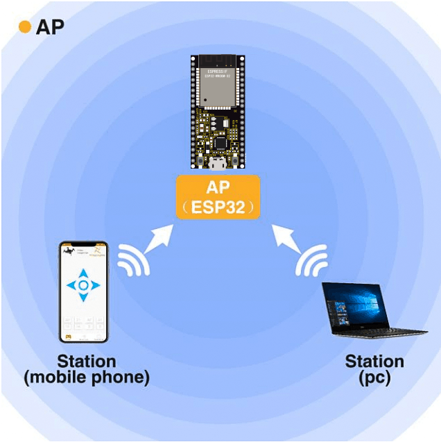
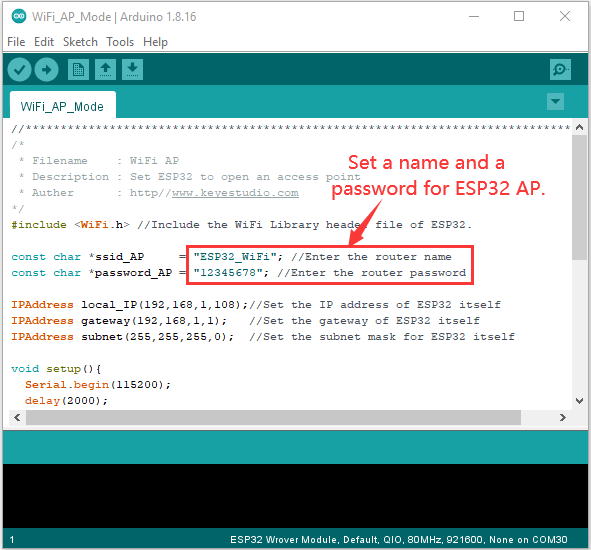
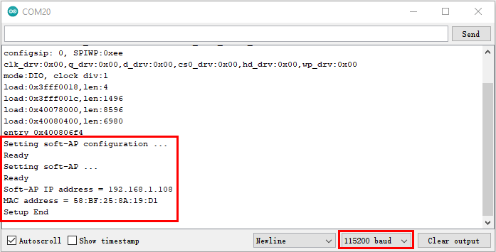

### Project 37：WIFI AP Mode

**Description**

In this project, we are going to learn the WiFi AP mode of the ESP32.

**Components**

|  |  |
| ------------------- | ------------------- |
| Micro USB Cable*1   | ESP32*1             |

**Wiring Diagram**

Plug the ESP32 mainboard to the USB port of your PC



**Component Knowledge**

**AP Mode:**

When setting AP mode, a hotspot network will be created, waiting for other WiFi devices to connect. As shown below;

Take the ESP32 as the hotspot, if a phone or PC needs to communicate with the ESP32, it must be connected to the ESP32's hotspot. Communication is only possible after a connection is established via the ESP32.



**Test Code**

Before running the code , you can make any changes to the ESP32 AP name and password in the box as shown below, but in a default circumstance, it doesn’t need to modify.




```c
//**********************************************************************************
/*
 * Filename    : WiFi AP
 * Description : Set ESP32 to open an access point
 * Auther      : http//www.keyestudio.com
*/
#include <WiFi.h> //Include the WiFi Library header file of ESP32.

const char *ssid_AP     = "ESP32_WiFi"; //Enter the router name
const char *password_AP = "12345678"; //Enter the router password

IPAddress local_IP(192,168,1,108);//Set the IP address of ESP32 itself
IPAddress gateway(192,168,1,1);   //Set the gateway of ESP32 itself
IPAddress subnet(255,255,255,0);  //Set the subnet mask for ESP32 itself

void setup(){
  Serial.begin(115200);
  delay(2000);
  Serial.println("Setting soft-AP configuration ... ");
  WiFi.disconnect();
  WiFi.mode(WIFI_AP);
  Serial.println(WiFi.softAPConfig(local_IP, gateway, subnet) ? "Ready" : "Failed!");
  Serial.println("Setting soft-AP ... ");
  boolean result = WiFi.softAP(ssid_AP, password_AP);
  if(result){
    Serial.println("Ready");
    Serial.println(String("Soft-AP IP address = ") + WiFi.softAPIP().toString());
    Serial.println(String("MAC address = ") + WiFi.softAPmacAddress().c_str());
  }else{
    Serial.println("Failed!");
  }
  Serial.println("Setup End");
}
 
void loop() {
}
//**********************************************************************************
```


**Test Result**

Compile and upload the code to the ESP32. After uploading successfully，we will use a USB cable to power on. Open the serial
monitor and set the baud rate to 115200, then monitor will display as follows: (If open the serial monitor and set the baud rate to 115200, the information is not displayed, please press the RESET button of the ESP32)




When observing the printed information of the serial monitor, turn on the WiFi scanning function of the mobile phone, you can see the ssid\_AP on ESP32, which is dubbed "ESP32\_Wifi" in this code. You can connect to it either by typing the password "12345678" or by modifying the code to change its AP name and password.  

