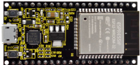
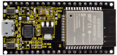
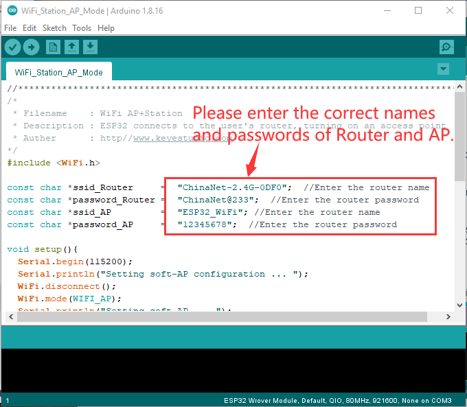
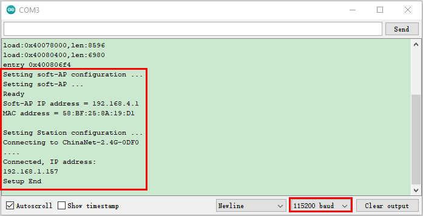

### Project 38：WIFI AP+Station Mode

**Description**

In this project, we are going to learn the AP+Station mode of the ESP32.

**Components**

|  |  |
| ------------------- | ------------------- |
| Micro USB Cable*1   | ESP32*1             |


**Wiring Diagram**

Plug the ESP32 mainboard to the USB port of your PC

      

**Component Knowledge**

**AP+Station mode:**

 In addition to the AP mode and the Station mode, **AP+Station mode** canbe used at the same time. Turn on the Station mode of the ESP32, connect it to the router network, and it can communicate with the Internet through the router. Then turn on the AP mode to create a hotspot network. Other WiFi devices can be connected to the router network or the hotspot network to communicate with the ESP32.

**Test Code**

Before running the code, you need to modify the ssid\_Router、password\_Router、ssid\_AP and password\_AP, as shown in
the box below:




```c
//**********************************************************************************
/*
 * Filename    : WiFi AP+Station
 * Description : ESP32 connects to the user's router, turning on an access point
 * Auther      : http//www.keyestudio.com
*/
#include <WiFi.h>
 
const char *ssid_Router     =  "ChinaNet-2.4G-0DF0";  //Enter the router name
const char *password_Router =  "ChinaNet@233";  //Enter the router password
const char *ssid_AP         =  "ESP32_WiFi"; //Enter the router name
const char *password_AP     =  "12345678";  //Enter the router password

void setup(){
  Serial.begin(115200);
  Serial.println("Setting soft-AP configuration ... ");
  WiFi.disconnect();
  WiFi.mode(WIFI_AP);
  Serial.println("Setting soft-AP ... ");
  boolean result = WiFi.softAP(ssid_AP, password_AP);
  if(result){
    Serial.println("Ready");
    Serial.println(String("Soft-AP IP address = ") + WiFi.softAPIP().toString());
    Serial.println(String("MAC address = ") + WiFi.softAPmacAddress().c_str());
  }else{
    Serial.println("Failed!");
  }
  
  Serial.println("\nSetting Station configuration ... ");
  WiFi.begin(ssid_Router, password_Router);
  Serial.println(String("Connecting to ")+ ssid_Router);
  while (WiFi.status() != WL_CONNECTED){
    delay(500);
    Serial.print(".");
  }
  Serial.println("\nConnected, IP address: ");
  Serial.println(WiFi.localIP());
  Serial.println("Setup End");
}

void loop() {
}
//**********************************************************************************
```


**Test Result**

Ensure that the code in the program has been modified correctly, compile and upload the code to the ESP32. After uploading successfully，we will use a USB cable to power on. Open the serial monitor and set the baud rate to 115200, then monitor will display as follows: (If open the serial monitor and set the baud rate to 115200, the information is not displayed, please press the RESET button of the ESP32)




Open the WiFi scanning function of the mobile phone, you can see the ssid\_AP.

