### Project 39: Comprehensive Experiment


**Introduction**

We did a lot of experiments, and for each one we needed to re-upload the code, so can we achieve different functions through an experiment? In this experiment, we will use an external button module to achieve different functions.

**Components Required**

|          | 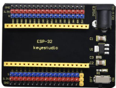     |  | 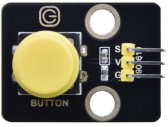 | 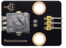   |
| --------------------------- | ------------------------ | -------------------- | -------------------- | ---------------------- |
| ESP32 Board*1               | ESP32 Expansion Board*11 | Purple LED Module*1  | Button Module*1      | Rotary Potentiometer*1 |
| 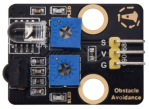        | 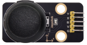     |  | 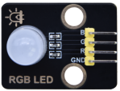 |     |
| Obstacle Avoidance Sensor*1 | Joystick Module*1        | Ultrasonic sensor *1 | RGB Module *1        | MicroUSB Cable*1       |
| 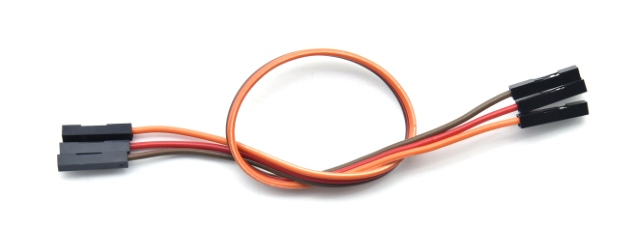       | 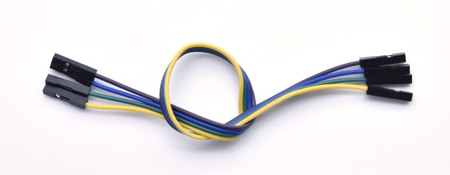    | 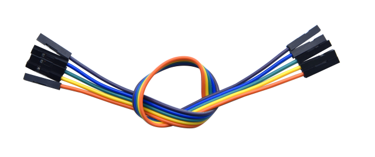 |                      |                        |
| 3PDupont Wire*4             | 4PDupont Wire*1          | 5PDupont Wire*1      |                      |                        |


**Wiring Diagram**

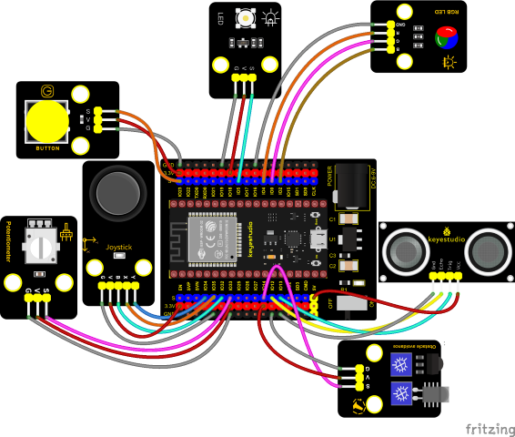

**Test Code**


```c
//**********************************************************************
/*
 * Filename    : Comprehensive experiment
 * Description : Multiple sensors/modules work together
 * Auther      : http//www.keyestudio.com
*/
//rgb is connected to 4,0,2
int ledPins[] = {4, 0, 2};    //define red, green, blue led pins
const byte chns[] = {0, 1, 2};        //define the pwm channels
int red, green, blue;

//Rocker module port
int X = 35;
int Y = 34;
int KEY = 32;

//Potentiometer pin is connected to analog port 33
int resPin = 33;

//Obstacle avoidance sensor pin connected to IO port 14
int Avoid = 14;

//LED is Connected to GP5
#define PIN_LED   5  // the pin of the LED
#define CHAN    3

//Ultrasonic sensor port
int Trig = 13;
int Echo = 12;

//Key module port
int button = 23;

int PushCounter = 0;//Store the number of times a key is pressed
int yushu = 0;
unsigned char dht[4] = {0, 0, 0, 0};//Only the first 32 bits of data are received, not the parity bits
bool ir_flag = 1;
float out_X, out_Y, out_Z;

void counter() {
  delay(10);
  ir_flag = 0;
  if (!digitalRead(button)) {
    PushCounter++;
  }
}

void setup() {
  Serial.begin(9600);//Set baud rate to 9600
  pinMode(KEY, INPUT);//Button of remote sensing module
  ledcSetup(CHAN, 1000, 12);
  ledcAttachPin(PIN_LED, CHAN);
  pinMode(button, INPUT);//The key module
  attachInterrupt(digitalPinToInterrupt(button), counter, FALLING);  //External interrupt 0, falling edge fired
  pinMode(Avoid, INPUT);//Obstacle avoidance sensor
  pinMode(Trig, OUTPUT);//Ultrasonic module
  pinMode(Echo, INPUT);
  for (int i = 0; i < 3; i++) {   //setup the pwm channels,1KHz,8bit
    ledcSetup(chns[i], 1000, 8);
    ledcAttachPin(ledPins[i], chns[i]);
  delay(1000);
 }
}

void loop() {
  yushu = PushCounter % 5;
  if (yushu == 0) {  //The remainder is 0
    yushu_0();  //rgb displays
  } else if (yushu == 1) {  //The remainder is 1
    yushu_1();  //Obstacle avoidance sensor detects obstacles
  } else if (yushu == 2) {  //The remainder is 2
    yushu_2();  //Displays the rocker value
  }else if (yushu == 3) {  //The remainder is 3
    yushu_3();  //Display potentiometer ADC value and potentiometer control LED
  } else if (yushu == 4) {  //The remainder is 4
    yushu_4();  //Shows the distance detected by ultrasound
  } 
}

//RGB
void yushu_0() {
  red = random(0, 256);
  green = random(0, 256);
  blue = random(0, 256);
  setColor(red, green, blue);
  delay(200);
}
void setColor(byte r, byte g, byte b) {
  ledcWrite(chns[0], 255 - r); //Common anode LED, low level to turn on the led.
  ledcWrite(chns[1], 255 - g);
  ledcWrite(chns[2], 255 - b);
}

void yushu_1() {
  int val = digitalRead(Avoid);//Read the digital level output by the Obstacle avoidance sensor
  Serial.print(val);//Serial port print value
  if (val == 0) {//Obstruction detected
    Serial.println("   There are obstacles");
  }
  else {//No obstructions detected
    Serial.println("   All going well");
  }
  delay(100);
}

void yushu_2() {
  int x = analogRead(X);
  int y = analogRead(Y);
  int key = digitalRead(KEY);
  Serial.print("X:");
  Serial.print(x);
  Serial.print("    Y:");
  Serial.print(y);
  Serial.print("    KEY:");
  Serial.println(key);
  delay(100);
}

void yushu_3() {
  int adcVal = analogRead(resPin); //read adc
  Serial.println(adcVal);
  int pwmVal = adcVal;        // adcVal re-map to pwmVal
  ledcWrite(CHAN, pwmVal);    // set the pulse width.
  delay(10);
}

void yushu_4() {
  float distance = checkdistance();
  Serial.print("distance:");
  Serial.print(distance);
  Serial.println("cm");
  delay(100);
}

float checkdistance() {
  digitalWrite(Trig, LOW);
  delayMicroseconds(2);
  digitalWrite(Trig, HIGH);
  delayMicroseconds(10);
  digitalWrite(Trig, LOW);
  float distance = pulseIn(Echo, HIGH) / 58.00;
  delay(10);
  return distance;
}
//*************************************************************************************
```


**Code Explanation**

1\. Calculate how many times the button is pressed, divide it by 5, and get the remainder which is 0, 1 2, 3, and 4. According to different remainders, construct five unique functions to control the experiment and realize different functions.

2\. Following the instructions, we can add or remove sensors/modules in the wiring, and then change the experimental function in the code.

**Test Result**

Connect the wires according to the experimental wiring diagram, compile and upload the code to the ESP32. After uploading successfully，we will use a USB cable to power on. At the beginning, the number of the button is 0 and remainder is 0. Open the monitor and set baud rate to 9600.

Press the button, the RGB stops flashing, press once, the remainder is 1.

The function of the project is whether the obstacle avoidance sensor detects obstacles and reads high and low levels. If the sensor does not detect an obstacle, val is 1 and the serial monitor displays "1 All going well" character. When an obstacle is detected, val is 0, and the serial monitor displays "0 There are obstacles" character. The monitor will display as follows:

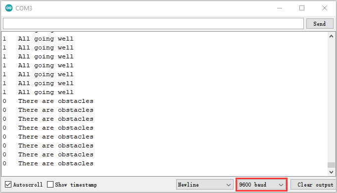

Note: If you press the button first, the button times will change to 1, and when you open the serial monitor, the program will reset and the button times will change to 0. You need to press the button again to reset the button times.  

Press the button again, the time of pressing buttons is 2 and the remainder is 2. Read digital values at x, y and z axis of the joystick module. As shown below;

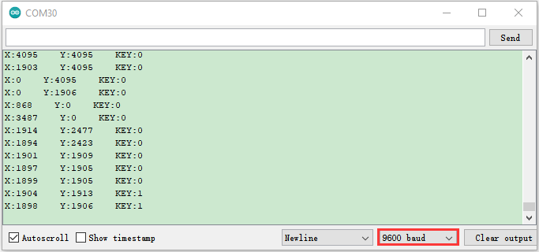

Press the key for the third time, the remainder is 3. Then the potentiometer can adjust the PWM value at the GPI05 port to control LED brightness of the purple LED.

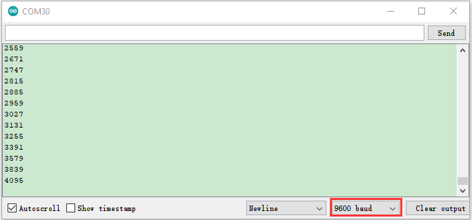

Press the key for the fourth time, the remainder is 4. Then the ultrasonic sensor can detect distance, as shown below;

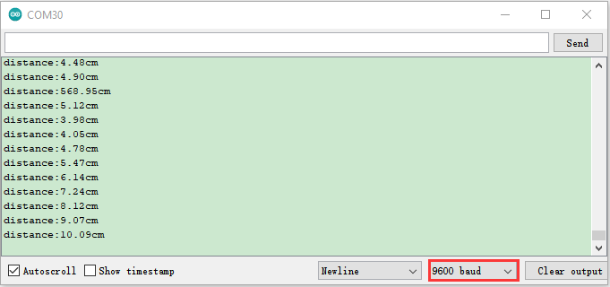

Press the key for the fifth time, the remainder is 0. Then the RGB will flash. If you press keys incessantly, remainders will change in a loop way. So does functions.