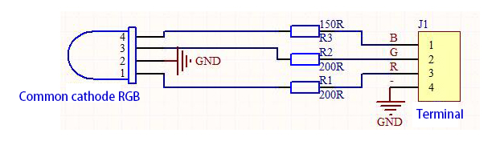
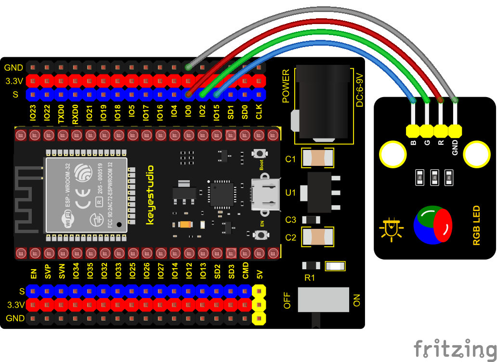

### Project 5: RGB Module


**Overview**
    


Among these modules is a RGB module. It adopts a F10-full color RGB foggy common cathode LED. We connect the RGB module to the PWM port of MCU and the other pin to GND(for common anode RGB, the rest pin will be connected to VCC). So what is PWM?

PWM is a means of controlling the analog output via digital means. Digital control is used to generate square waves with different duty cycles (a signal that constantly switches between high and low levels) to control the analog output.In general, the input voltages of ports are 0V and 5V. What if the 3V is required? Or a switch among 1V, 3V and 3.5V? We cannot change resistors constantly. For this reason, we resort to PWM.

For Arduino digital port voltage outputs, there are only LOW and HIGH levels, which correspond to the voltage outputs of 0V and 5V respectively. You can define LOW as“0”and HIGH as“1’, and let the Arduino output five hundred‘0’or“1”within 1 second. If output five hundred‘1’, that is 5V; if all of which is‘0’,that is 0V; if output 250 01 pattern, that is 2.5V.

This process can be likened to showing a movie. The movie we watch are not completely continuous. Actually, it generates 25 pictures per second, which cannot be told by human eyes. Therefore, we mistake it as a continuous process. PWM works in the same way. To output different voltages, we need to control the ratio of 0 and 1. The more‘0’or‘1’ output per unit time, the more accurate the control.

**Working Principle**

For our experiment, we will control the RGB module to display different colors through three PWM values.



**Components**


**Connection Diagram**



**Test Code**


```c
//**********************************************************************
/*
 * Filename    : RGB LED
 * Description : Use RGBLED to show random color.
 * Auther      : http//www.keyestudio.com
*/
int ledPins[] = {0, 2, 15};    //define red, green, blue led pins
const byte chns[] = {0, 1, 2};        //define the pwm channels
int red, green, blue;
void setup() {
  for (int i = 0; i < 3; i++) {   //setup the pwm channels,1KHz,8bit
    ledcSetup(chns[i], 1000, 8);
    ledcAttachPin(ledPins[i], chns[i]);
  }
}

void loop() {
  red = random(0, 256);
  green = random(0, 256);
  blue = random(0, 256);
  setColor(red, green, blue);
  delay(200);
}

void setColor(byte r, byte g, byte b) {
  ledcWrite(chns[0], 255 - r); //Common anode LED, low level to turn on the led.
  ledcWrite(chns[1], 255 - g);
  ledcWrite(chns[2], 255 - b);
}
//*************************************************************************************
```


**Test Result**

Connect the wires according to the experimental wiring diagram, compile and upload the code to the ESP32. After uploading successfully，we will use a USB cable to power on，then the RGB LED on the module starts to display random colors.