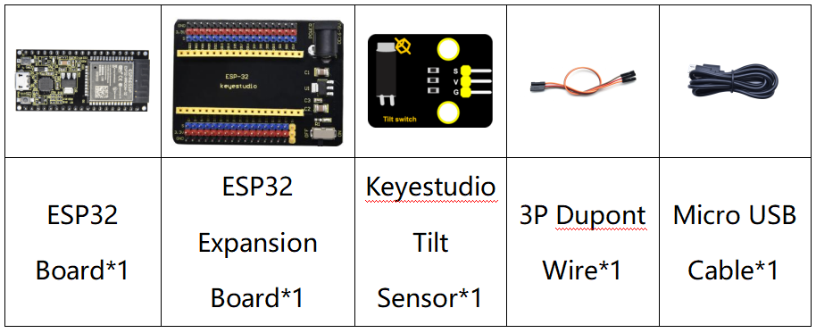
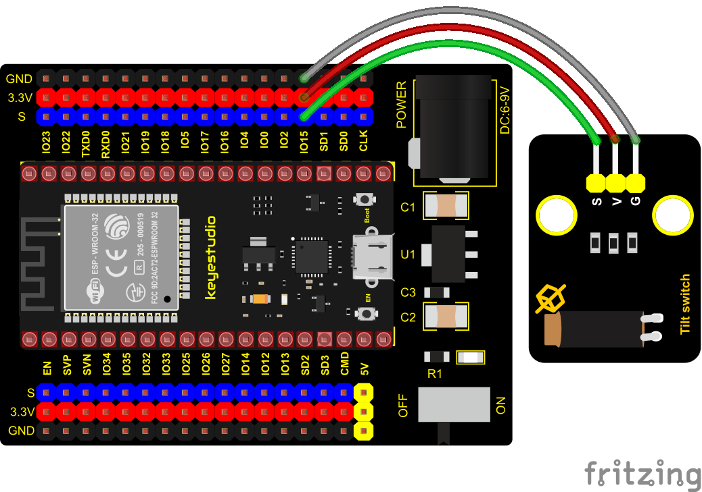
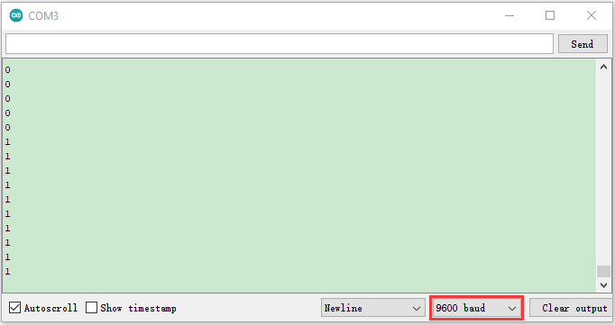

### Project 8: Tilt Module


**Overview**

In this kit, there is a Keyestudio tilt sensor. The tilt switch can output signals of different levels according to whether the module is
tilted. There is a ball inside. When the switch is higher than the horizontal level, the switch is turned on, and when it is lower than the horizontal level, the switch is turned off. This tilt module can be used for tilt detection, alarm or other detection.

**Working Principle**

The working principle is pretty simple. When pin 1 and 2 of the ball switch P1 are connected, the signal S is low level and the red LED will light up; when they are disconnected, the pin will be pulled up by the 4.7K R1 and make S a high level, then LED will be off.


**Components**




**Connection Diagram**



**Test Code**

```c
//*************************************************************************************
/*
 * Filename    : Tilt switch
 * Description : Reading the tilt sensor value
 * Auther      :http://www.keyestudio.com
*/
int val; //Store the level value output by the tilt sensor

void setup() {
  Serial.begin(9600);
  pinMode(15, INPUT);  //Connect the pin of the tilt sensor to GP15 and set GP15 to the input mode
}

void loop() {
  val = digitalRead(15); //Read module level signal
  Serial.println(val);  //Newline print
  delay(100); //Delay for 100 ms
}
//*************************************************************************************
```


**Test Result**

Connect the wires according to the experimental wiring diagram, compile and upload the code to the ESP32. After uploading successfully，we will use a USB cable to power on，open the serial monitor and set the baud rate to 9600. Make the tilt module incline to one side, the red LED on the module will be off and the monitor will display“1”. In contrast, if you make it incline the other side, the red LED will light up and the monitor will display“0”.

