## 3.1.1 About MakeCode (Must-Read)

⚠️ **The following steps are operated on the Windows operating system. If you use another operating system, you can take them as a reference. Here are demonstrated on Google Chrome / Microsoft Edge.**

**MakeCode Programming Environment:**

Open the <u>[online version of MakeCode editor](https://makecode.microbit.org/#editor)</u> .

MakeCode main interface:

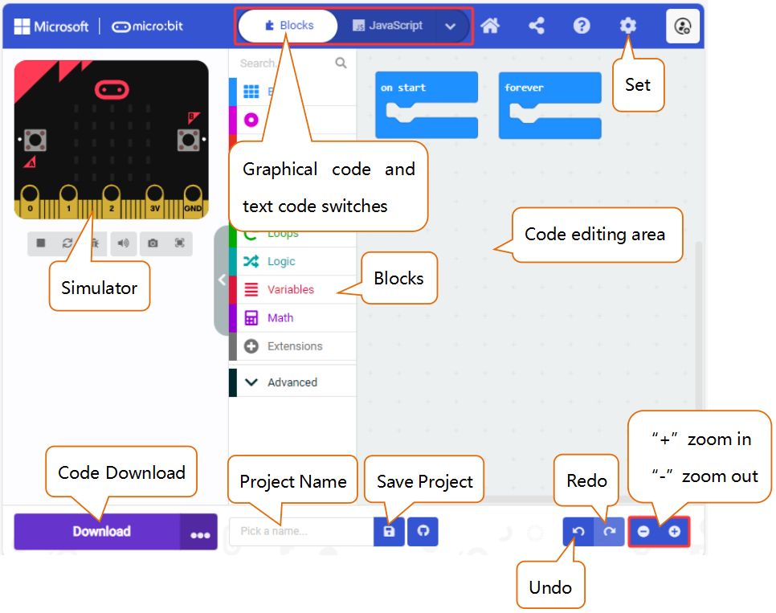

There are blocks "**on start**" and "**forever**" in the code editing area. When the power is plugged or reset, "on start" means that the code in the block only executes once, while "forever" implies that the code runs cyclically.

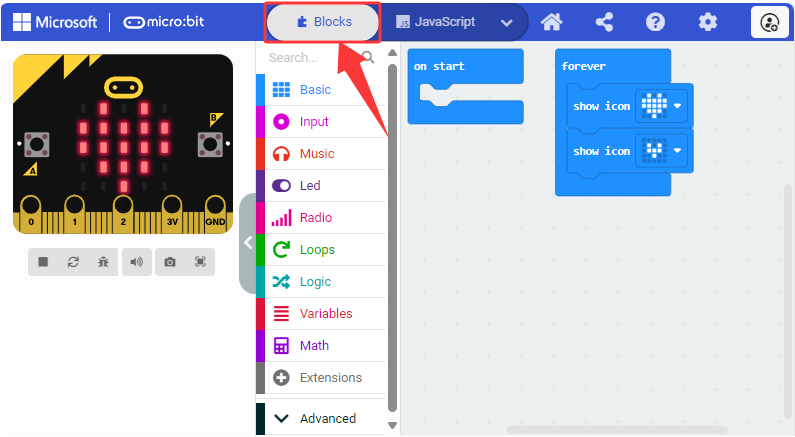

Click "**JS JavaScript**" to see the JavaScript code:

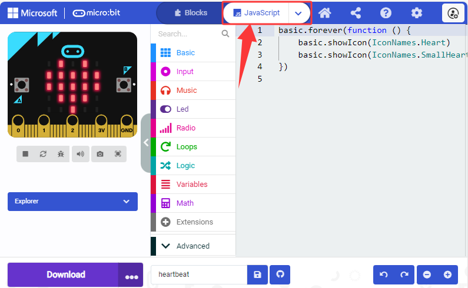

Or click "**Python**" to switch to Python code:

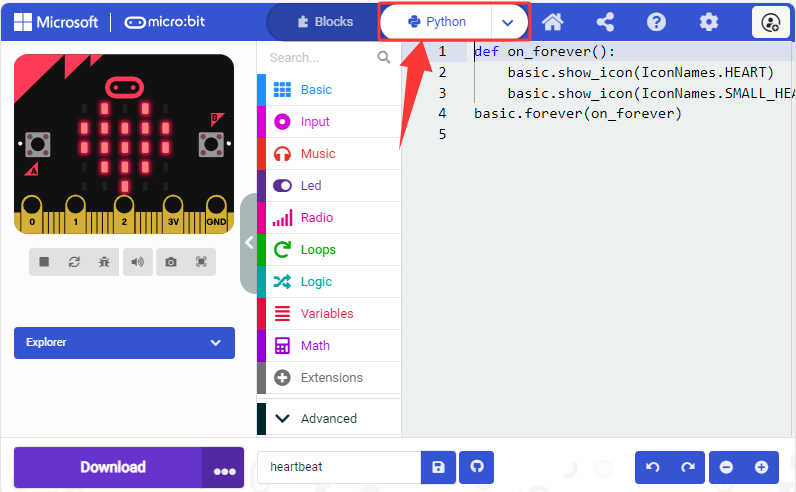

**Language settings:**

---------------

## 3.1.2 Makecode Extension Library (Important)

### 3.1.2.1 Add Library

⚠️ **We provide code files (.hex) for each projects, so you can directly load them to the MakeCode editor. Or if you want, you can also drag and drop code blocks to build code by yourself. Note that libraries are required when build them manually.**

<u>[MakeCode online version](https://makecode.microbit.org/#editor)</u>

⚠️ **Special Reminder:** Copy and paste the link: `https://github.com/keyestudio2019/pxt-creative-inventors-kit-master.git` into the search box, to add the corresponding library.

### 3.1.2.2 Update/Delete Library

⚠️ **Special reminder: Generally, there is no need to remove libraries, unless they are not required. This section is only for learning how to delete unnecessary library files.**

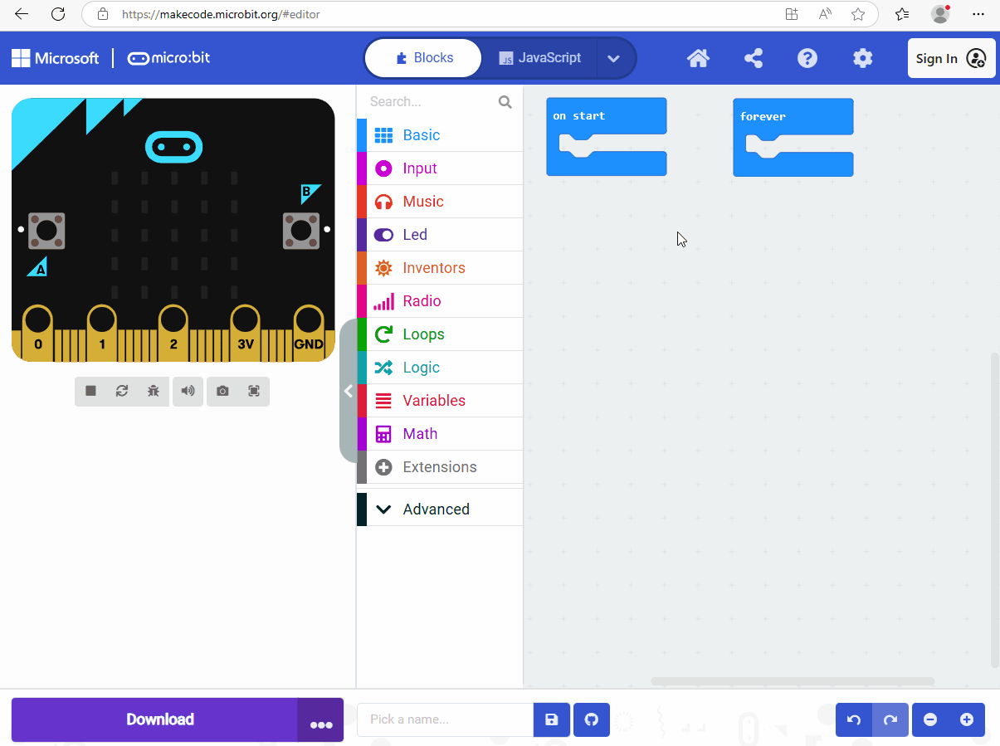

---------------

## 3.1.3 MakeCode Program (Important)

### 3.1.3.1 Import Program in MakeCode

1\. Click to download sample code: [heartbeat](./heartbeat.zip).

2\. Connect the Micro:bit V2 board to your computer via Micro USB cable.

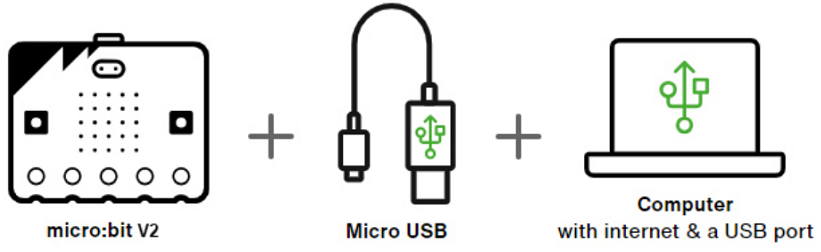

On the Micro:bit V2 board, there is a yellow LED indicator that will flash when the Micro:bit V2 board communicates with your computer through Micro USB cable.

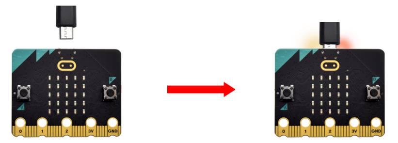

Open **Finder (Mac) / File Explorer (Windows)** after connecting the Micro:bit V2 board to the computer, and you can see a USB drive named "**MICROBIT**". Yet note that it is not a common disk!

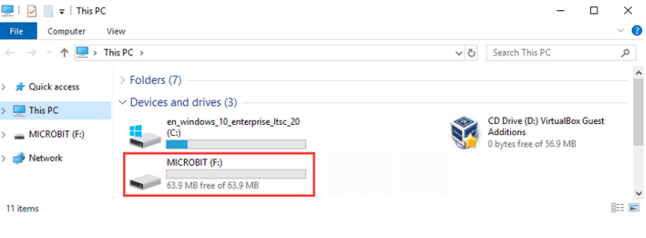

3\. There are two ways to import/update the stored code file (**.hex**) in <u>[MakeCode](https://makecode.microbit.org)</u> . We will take the file "**heartbeat**" as an example.

**Method 1:** Just click "**import**" on the main interface: 

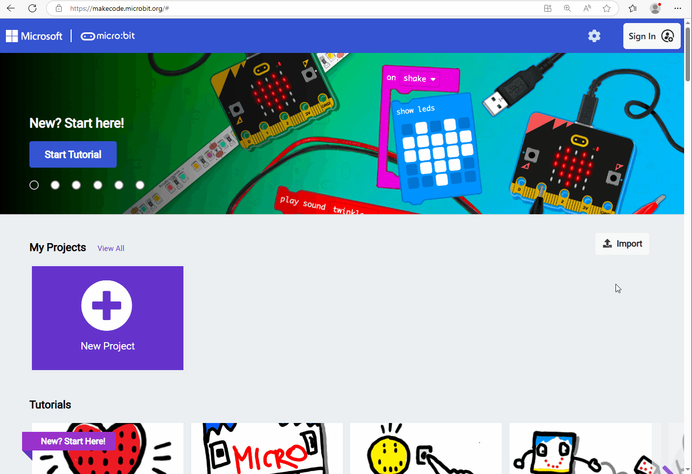

**Method 2:** Drag and drop the "**.hex**" file to the Makecode main interface or Makecode editing window:

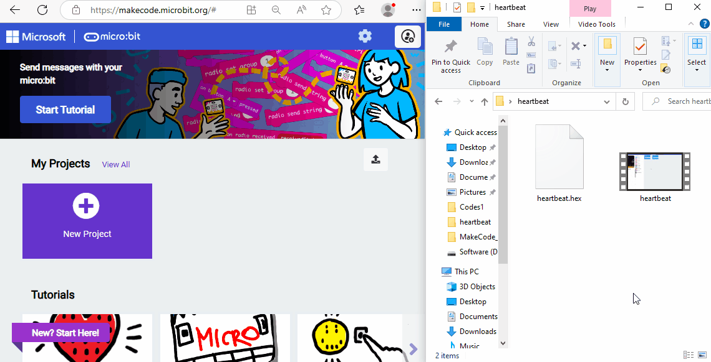

**Note:** The Micro:bit V2 board runs only one program at a time. Each time you download and send another "**.hex**" file to the device via the Micro USB cable, it will erase the current one and replace it with a new one.

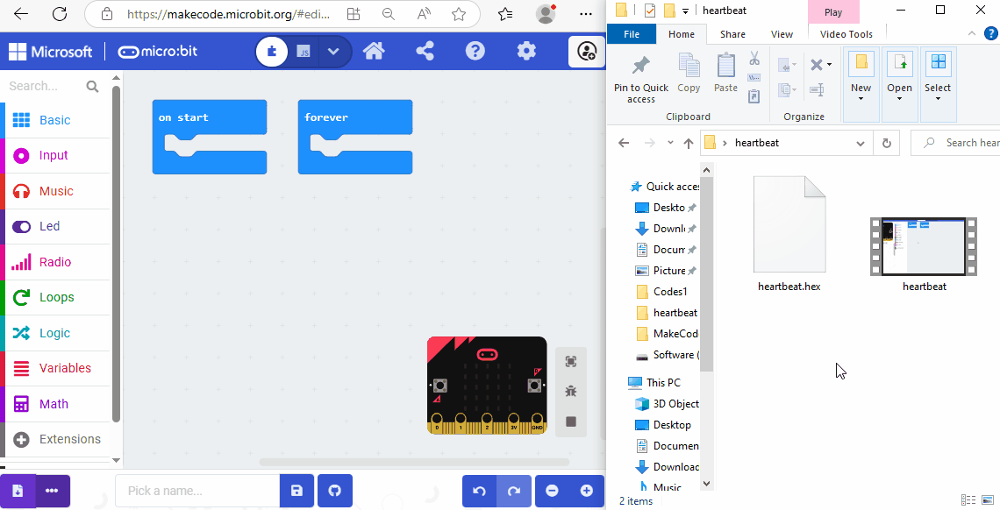

### 3.1.3.2 Download sample code (WebUSB function)

For browsers like **Google Chrome / Microsoft Edge**, their WebUSB function allows direct access to the Micro USB hardware device through online web page. Click "**Connect Device**" to pair the device first. After that, click "**Download**" to load the code to the Micro:bit V2 board.

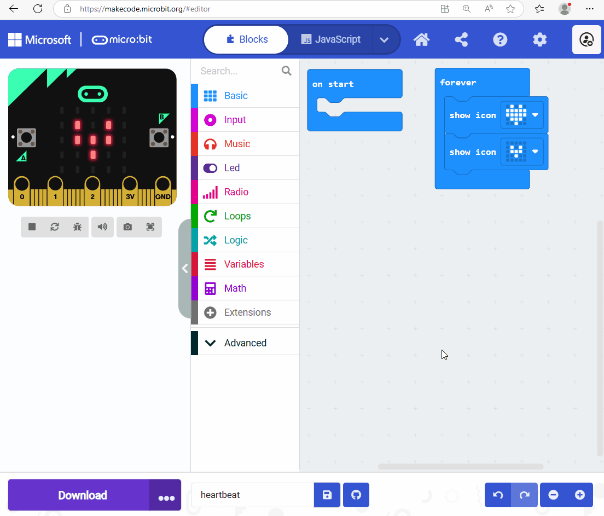

⚠️ **Tips**

If there is no device for pairing in the interface, please see the <u>[device-webusb-troubleshoot](https://makecode.microbit.org/device/usb/webusb/troubleshoot)</u> .

If the Micro:bit firmware requires an update, please see <u>[how-to-update-the-firmware](https://microbit.org/guide/firmware/)</u> .

### 3.1.3.3 Download sample code (non WebUSB functionality)

For browsers like **Safari / Firefox / Other**, please load the sample code to the Micro:bit V2 board as follows:

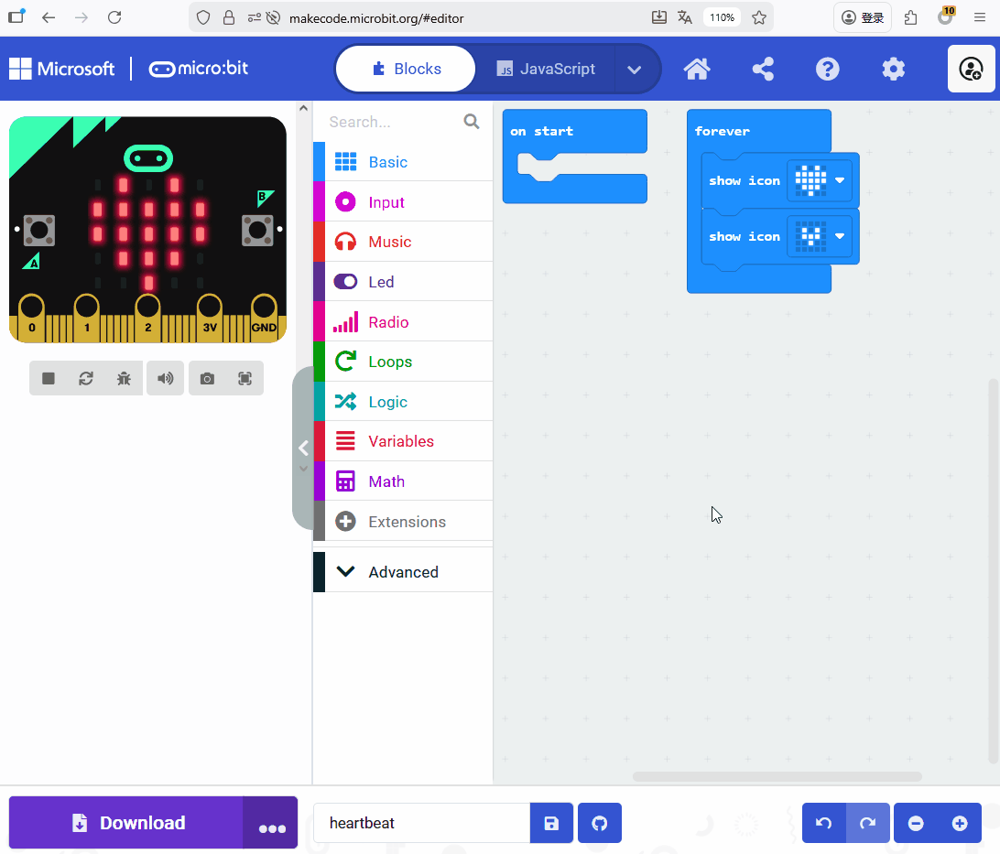

### 3.1.3.4 Download sample Code (Transfer a program that has been downloaded as a .hex file)

Find the downloaded "**heartbeat.hex**" file, and then drag and drop it to the **MICROBIT** drive.

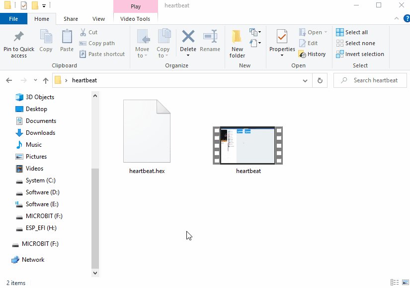

Or you can right-click on the "**heartbeat.hex**" file and select "**Send to -> MICROBIT**".

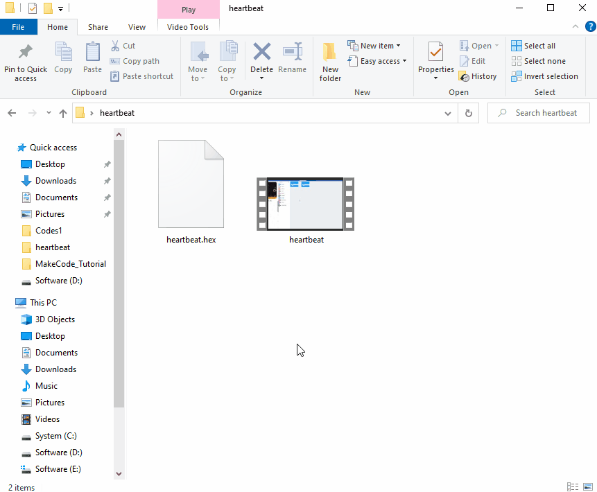

After uploading the sample code program to the Micro:bit V2 board using any of the above methods, connect the Micro:bit V2 board to the computer via Micro USB cable and power on, and you can see the on-board 5x5 LED matrix repeatedly shows  and .

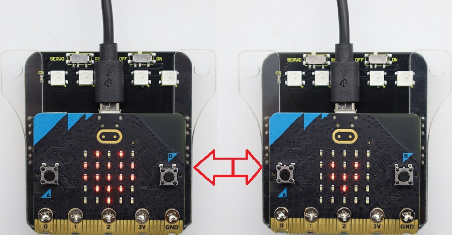

⚠️ **Tip 1:** There is also a get-stared guide for <u>[how to transfer code to the micro:bit from multiple device](https://microbit.org/get-started/user-guide/transfer-code-to-the-microbit)</u> .

⚠️ **Tip 2:** During each programing, the MICROBIT disk will automatically eject and return, and the **.hex** files you have copied to it will not be displayed. That is because the Micro:bit V2 board only receives and runs the latest uploaded program rather than stores them.

---------------

