# 1. Product Introduction

---------------

## 1.1 Product Safety 

1\. This kit contains small parts. Please keep it out of the reach of children to avoid any accidental contact.

2\. Please follow the instructions strictly to avoid damaging the product. Pay attention to electrical safety.

---------------

## 1.2 Introduction

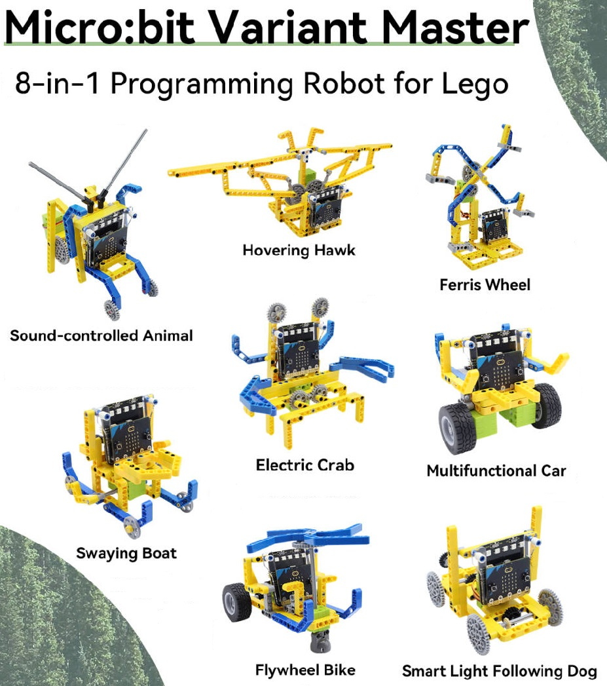

**8 Forms in One · Future in Fun**

The Keyestudio Micro:bit Variant Master 8-in-1 Programming Robot is fully compatible with Lego parts. Let children cultivate logical thinking, hands-on skills and creativity in building and programming!

**Features:**

🎯 ​8 Forms in One, Creativity Fine

It can be transformed into 8 different forms such as cars, animals, and machinery, which can stimulate children's creative interest and exploration desire.

🎯 Compatible with Lego, Expansion Flexible

Standard Lego interfaces are reserved for Lego bricks to create unique works.

🎯 ​Graphical Programming, Easy Learning

MakeCode is supported that you can program by drag and drop code blocks, so even beginners can quickly get started and develop logical thinking and practical skills.

🎯 ​Interaction of Light & Sound, Full of Fun

The Micro:bit V2 board is equipped with sound, light and touch sensor(the logo), along with SK6812 RGB LEDs and a 5×5 LED matrix screen, enabling rich audio and visual effects.

🎯 ​For Families, For Classrooms

It is not only a programming toy for parent-child interaction, but also an ideal STEAM teaching tool for schools and training agencies.

**Details:**

🎯 Mainboard: Micro:bit V2, supporting interaction with various built-in sensors and lights.

🎯 Expansion board: Servo control, driving multiple mechanical structures.

🎯 Servo: 2 × 360° Lego servo, dynamic stability.

🎯 Building blocks: 200+ Lego parts, with high degree of freedom in assembly.

🎯 Programming software: MakeCode graphical programming, supporting Windows/Mac/tablets.

**Applicable population:**

🎯 Children and teenagers over the age of 6.

🎯 Parents who want to cultivate their children's logical thinking and practical skills.

🎯 STEAM course teachers in school and training institution.

**Competitiveness:**

🎯 Learning in Entertainment: Master programming and mechanical knowledge in play.

🎯 Continuous Challenge: 8 different styles + free expansion, keeping children's interest.

🎯 Safe Material: Environment-friendly ABS plastic, safeguarding children's health.

🎯 Professional Support: Offer detailed tutorials and examples, making it easy to get started.

---------------

## 1.3 Kit List

If you found any part is missing, please contact our sales staff immediately.

| # | name | qty | pic |
| :--: | :--: | :--: | :--: |
| 1 | Microbit V2 board + servo expansion board | 1 | 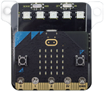 |
| 2 | 360° Lego servo | 2 | 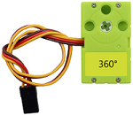 |
| 3 | Building block disassembly pliers | 1 | 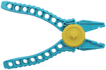 |
| 4 | 32009 part | 6 | |
| 5 | 64179 part | 5 | 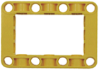 |
| 6 | 32278 part | 5 | 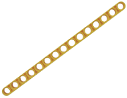 |
| 7 | 41239 part | 4 | 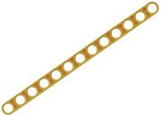 |
| 8 | 32525 part | 4 | 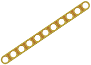 |
| 9 | 40490 part | 4 | 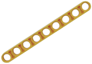 |
| 10 | 32524 part | 3 | 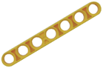 |
| 11 | 32316 part | 5 | 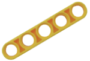 |
| 12 | 32523 part | 4 | 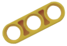 |
| 13 | 32526 part | 12 | 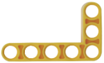 |
| 14 | 32348 part | 2 |  |
| 15 | 60484 part | 2 | 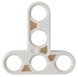 |
| 16 | 14720 part | 5 | 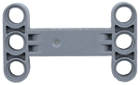 |
| 17 | 3649 part | 4 |  |
| 18 | 3648 part | 6 |  |
| 19 | 4185 part | 4 | 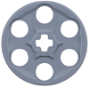 |
| 20 | 32269 part | 3 | 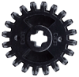 |
| 21 | 3647 part | 2 | 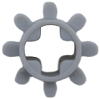 |
| 22 | 4716 part | 2 | 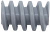 |
| 23 | 6589 part | 2 | 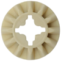 |
| 24 | 55615 part | 2 | 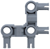 |
| 25 | 48989 part | 2 | 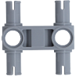 |
| 26 | 3708 part (about 9.6cm) | 2 | 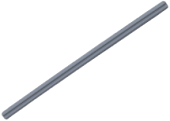 |
| 27 | 3707 part (about 6.4cm) | 1 | 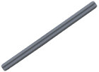 |
| 28 | 44294 part (about 5.6cm) | 2 | 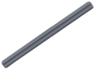 |
| 29 | 32073 part (about 4cm) | 2 | 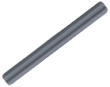 |
| 30 | 3705 part (about 3.2cm) | 2 | 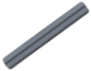 |
| 31 | 4519 part (about 2.4cm) | 2 | 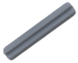 |
| 32 | 32062 part | 4 |  |
| 33 | Wheel | 2 | 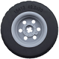 |
| 34 | 32034 part | 2 | 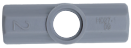 |
| 35 | 32039 part | 4 | 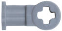 |
| 36 | 32192 part | 2 | 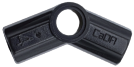 |
| 37 | 32184 part | 2 | 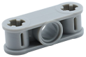 |
| 38 | 15100 part | 4 | 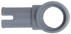 |
| 39 | 3713 part | 6 | 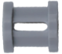 |
| 40 | 18654 part | 2 | 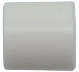 |
| 41 | 4265c part | 6 |  |
| 42 | 2780 part | 50 | 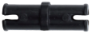 |
| 43 | 6558 part | 13 | 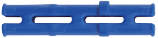 |
| 44 | 3749 part | 12 | 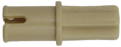 |
| 45 | 3673 part | 13 | 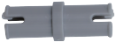 |
| 46 | 32002 part | 5 | 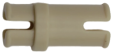 |
| 47 | Universal wheel | 1 | 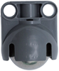 |
| 48 | Micro USB cable | 1 | 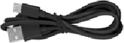 |
| 49 | AAA-1.5V battery (not included in the kit) |4| 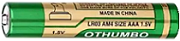 |

---------------

## 1.4 Parameters

- Operating voltage: DC 3.3V ~ 6V 
- Battery voltage: DC 6V 
- Maximum output current: About 600mA (affected by the battery internal resistance and load, the peak value varies from battery brands and conditions) 
- Maximum dissipation power: About 3.6W (6V × 600mA; actual value depends on the load) 
- Operating temperature: -25℃ ~ 65℃ 
- Product weight: 865g ± 1% (weight after packaging) 
- Packaging dimensions: 313mm × 160mm × 72mm (±1%)

---------------

## 1.5 About Micro:bit V2

### 1.5.1 What is Micro:bit V2 ?

The Micro:bit V2 board is equipped with loads of components, including a 5x5 programmable LED matrix, two programmable buttons, an accelerometer, a compass, a thermometer, a touch-sensitive logo, a MEMS microphone, a Bluetooth module of low energy, and a buzzer on its back, so it can play all kinds of sounds without any external equipment.

Moreover, this board has a sleeping mode to lower power consumption of batteries when users long-press the Reset & Power button on the back. 

### 1.5.2 Micro:bit V2 Mainboard Layout

### 1.5.3 Micro:bit V2 Pin-out

**Micro:bit pin functions:**

| Function | Pin |
| :--: | :---: |
| GPIO | P0, P1, P2, P3, P4, P5, P6, P7, P8, P9, P10, P11, P12, P13, P14, P15, P16, P19, P20 |
| ADC/DAC | P0, P1, P2, P3, P4, P10 |
| IIC | P19 (SCL), P20 (SDA) |
| SPI | P13 (SCK), P14 (MISO), P15 (MOSI) |
| PWM (commonly-used) | P0, P1, P2, P3, P4, P10 |
| Occupied | P3 (LED Col3), P4 (LED Col1), P5 (Button A), P6 (LED Col4), P7 (LED Col2), P10 (LED Col5), P11 (Button B) |

**Visit the official website for more details:**

- <u>[https://tech.microbit.org/hardware/edgeconnector/](https://tech.microbit.org/hardware/edgeconnector/)</u>

- <u>[https://microbit.org/code/](https://microbit.org/code/)</u>

- <u>[https://microbit.org/get-started/features/overview/](https://microbit.org/get-started/features/overview/)</u>

- <u>[https://microbit.org/guide/hardware/pins/](https://microbit.org/guide/hardware/pins/)</u>

- <u>[https://microbit.org/projects/make-it-code-it/](https://microbit.org/projects/make-it-code-it/)</u>

- <u>[https://microbit.org/get-started/what-is-the-microbit/](https://microbit.org/get-started/what-is-the-microbit/)</u>

Regarding the programming environment, the BBC offers <u>[Micro:bit online programming](https://makecode.microbit.org)</u> , where is an easy-to-use graphical programming program called MakeCode.

---------------

## 1.6 Servo Expansion Board

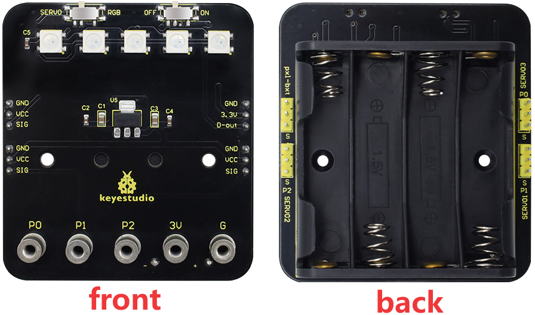

### 1.6.1 Introduction

The servo expansion board is fully compatible with the Micro:bit V2 mainboard. It has an onboard slot for four AAA batteries, five SK6812 RGB LEDs, and four  sets of standard 3-pin peripheral interfaces with a spacing of 2.54mm. Besides, it can expand to RGB LED light strip and control 3 servos.

**DIP Switches:**

- **The right one:**

  - **ON:** The power is supplied by the battery box.
  
  - **OFF:** The power supply is cut off.

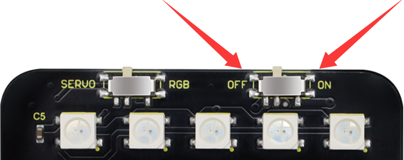

- **The left one:**

   - **RGB:** The Micro:bit V2 board can be programmed to change the colors of the five onboard SK6812 RGB LEDs. Moreover, the 3-pin interface on the pxl-bxt can also be connected to the SK6812 RGB light strip to control its colors.
   
   - **SERVO:** The Micro:bit V2 board can be programmed to adjust the angle of the external servos at 3-pin interface of SERVO3.

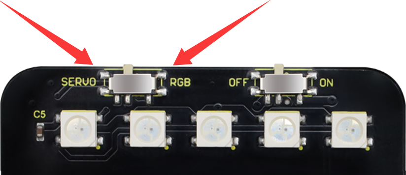

- **Note: The SK6812 RGB LED and SERVO mode are multiplexed. Please switch to the corresponding mode according to your need.**

### 1.6.2 Parameters

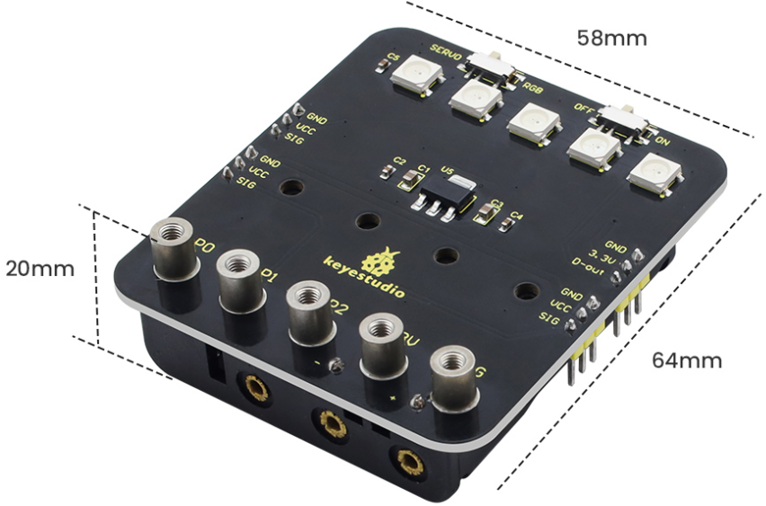

- Operating voltage: 3.3V ~ 6V (recommended onboard power supply: 4 AAA batteries(1.5V each), with the nominal total voltage about 6V).

- Standby current: About 60mA (excluding peripherals). 

- Maximum output current: About 600mA (affected by the battery internal resistance and load, the peak value varies from battery brands and conditions).

- Maximum power: About 3.6 W (6V × 600mA; actual value depends on the load). 

- Operating temperature: -25℃ ~ 65℃

- Dimensions: 64mm × 58mm × 21mm 

- Weight: About 28.1 g (the battery holder is included, batteries and Micro:bit V2 board are not). 

- Environmental: ROHS

- Interfaces and resources:

   - Onboard SK6812 RGB LED × 5 (programmable full-color).
  
   - 3-pin servo interface × 3 (SERVO1/SERVO2/SERVO3, standard GND/VCC/SIG 3-pin). 
   
   - General 3-pin 2.54mm interface × 4 (GND/VCC/SIG, GND/3.3V/D-out).
   
   - Interface for SK6812 RGB LED strip × 1 (GND/3.3V/D-out). 

- Insert four new AAA batteries, paying attention to the correct polarity.

- Connect external devices:
    
    - RGB expansion: Connect the programmable RGB module to the 3Pin interface (note the DIN direction).
    
    - Servo expansion: Connect the servo signal wires to SERVO1/2/3 (brown/black = GND, red = VCC, orange/yellow = SIG).

- DIP switch settings:

    - Switch the right-side power to ON to enable power supply.
    
    - Switch the left-side to RGB or SERVO according to your application mode.
    
---------------

