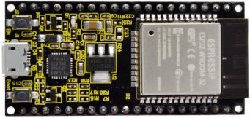
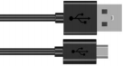
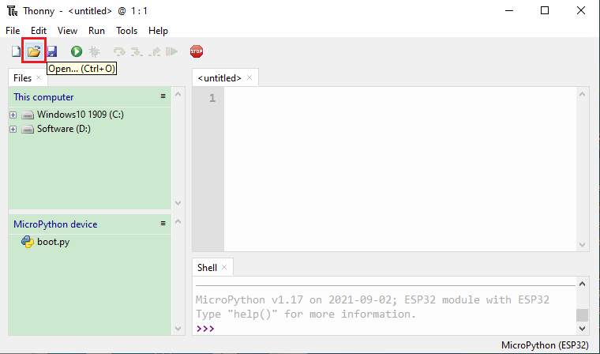
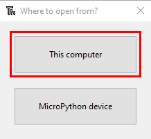
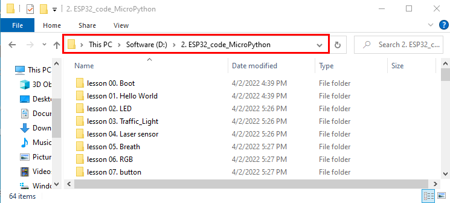
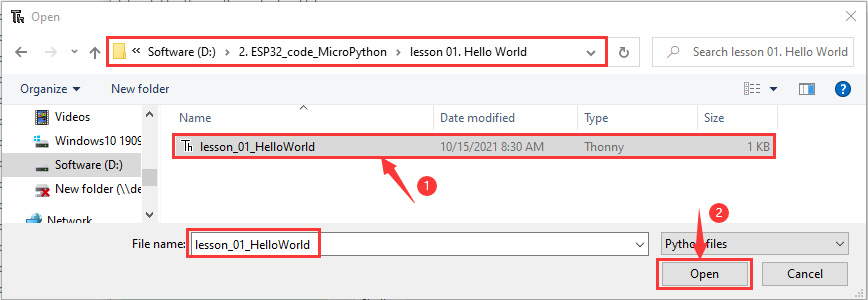
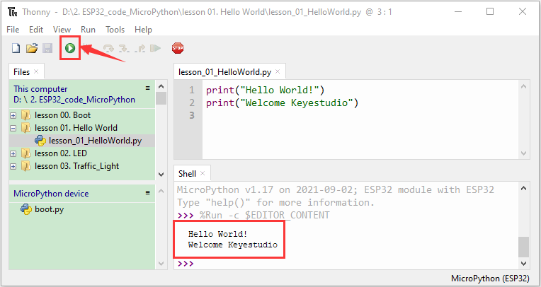
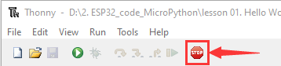

## 2. Single Sensor/Experiment Projects：

When we get the kit, we can see that there are 24 sensors/modules in the kit, which contain the corresponding ESP32 mainboard, ESP32 Expansion Board and wirings. Here, we will connect the 24 sensors individually to the ESP32 mainboard and the ESP32 Expansion Board using a wiring. Then run the corresponding test code to test the function of each sensor separately. Our next lesson is to study the principles of individual modules/sensors from simple to complex as well as some extended applications of sensors to consolidate and deepen our understanding of the kits.  

<span style="color: rgb(255, 76, 65);">Note :</span> When connecting the module/sensor wirings in the experiment, the wiring method and position must be followed in the document. What’s more, do not misconnect the power supply and signal pin, otherwise there may be no experimental results or damage to the modules/sensors.  

### Project 1: Hello World

**1. Overview**

For ESP32 beginners, we will start with some simple things. In this project, you only need a ESP32 mainboard, a USB cable and a computer to complete the "Hello World\!" project, which is a test of communication between the ESP32 mainboard and the computer as well as a primary project.

**2. Components**

<table class="colwidths-auto docutils align-default">
<tbody>
<tr class="odd">
<td>

</td>
<td>

</td>
</tr>
<tr class="even">
<td>ESP32*1</td>
<td>USB Cable*1</td>
</tr>
</tbody>
</table>

**3. Wiring Diagram**

In this project, we will use a USB cable to connect the ESP32 to a computer.


**4. Running code online**

To run the ESP32 online, you need to connect the ESP32 to the computer, which allows you to compile or debug programs using Thonny software.  

<span style="color: rgb(255, 169, 0);">Advantages:</span>

1\. You can use the Thonny software to compile or debug programs.

2\. Through the "Shell" window, you can view error messages and output results generated during the running of the program as well as query related function information online to help improve the program.  

<span style="color: rgb(255, 169, 0);">Disadvantages:</span>

1\. To run the ESP32 online, you must connect the ESP32 to a computer and run it with the Thonny software.  
    
2\. If the ESP32 is disconnected from the computer , when they reconnect, the program won't run again.  

<span style="color: rgb(255, 76, 65);">Basic Operation:</span>

1\. Open Thonny and click“Open...”.
    


2\. Click“This computer”in the new pop-up window.
    


In the new dialog box，select“Project\_01\_HelloWorld.py”,click“Open”. The code used in this tutorial is saved in the file **KS5007(KS5008)Keyestudio ESP32 24 in 1 Sensor Kit\\Windows\\MicroPython\\2.ESP32\_code\_MicroPython**. You can move the code to anywhere, for example, we can save the**2.ESP32\_code\_MicroPython in the** Disk(D), the route is <span style="color: rgb(255, 76, 65);">**D:\\2.ESP32\_code\_MicroPython.**</span>（The code in this tutorial is saved in the Disk(D) on your computer）





3\. Click“Run current script”to execute the program“Hello World\!”, "Welcome Keyestudio" , which will be printed in the“Shell”window.
    


**5. Exit running online**

When running online, click “Stop /Restart Backend”or press “Ctrl+C”on the Thonny to exit the program.  



**6. Test Code**

```Python
print("Hello World!")
print("Welcome Keyestudio")
```
