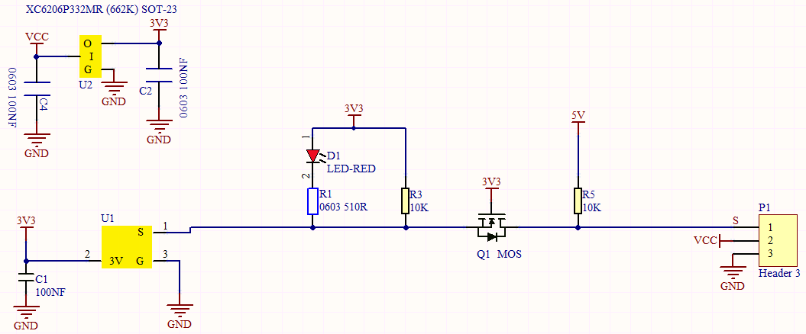
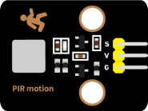
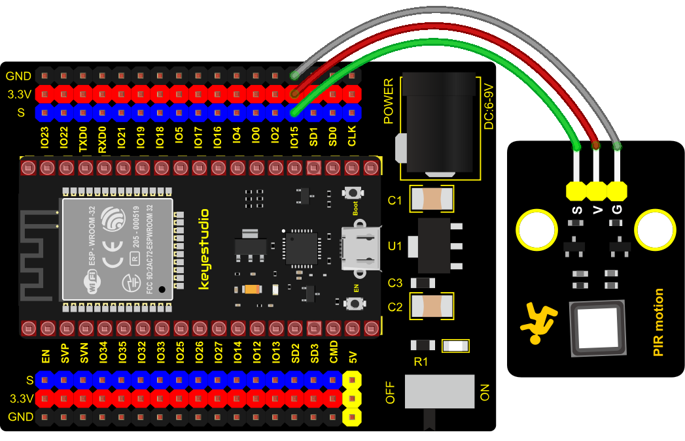
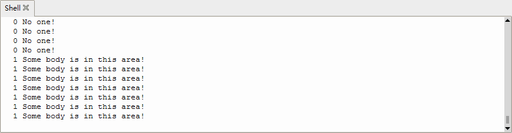

### Project 10: PIR Motion Sensor


**1. Overview**

In this kit, there is a Keyestudio PIR motion sensor, which mainly uses an RE200B-P sensor elements. It is a human body pyroelectric motion sensor based on pyroelectric effect, which can detect infrared rays emitted by humans or animals, and the Fresnel lens can make the sensor's detection range farther and wider.

In the experiment, we determine if there is someone moving nearby by reading the high and low levels of the S terminal on the module. The detected results will be displayed on the Shell.

**2. Working Principle**

The upper left part is voltage conversion(VCC to 3.3V). The working voltage of sensors we use is 3.3V, therefore we can’t use 5V directly. The voltage conversion circuit is needed.

When no person is detected or no infrared signal is received, and pin 1 of the sensor outputs low level. At this time, the LED on the module will light up and the MOS tube Q1 will be connected and the signal terminal S will detect Low levels.

When one is detected or an infrared signal is received, and pin 1 of the sensor outputs a high level. Then LED on the module will go off, the MOS tube Q1 is disconnected and the signal terminal S will detect high levels.



**3. Required Components**

<table class="colwidths-auto docutils align-default">
<tbody>
<tr class="odd">
<td>


</td>
<td>

</td>
<td>

</td>
<td>

</td>
<td>

</td>
</tr>
<tr class="even">
<td>ESP32 Board*1</td>
<td>ESP32 Expansion Board*1</td>
<td>Keyestudio DIY PIR Motion Sensor*1</td>
<td>3P Dupont Wire*1</td>
<td>Micro USB Cable*1</td>
</tr>
</tbody>
</table>

**4. Connection Diagram**



**5. Test Code**

```Python
from machine import Pin
import time

PIR = Pin(15, Pin.IN)
while True:
    value = PIR.value()
    print(value, end = " ")
    if value == 1:
        print("Some body is in this area!")
    else:
        print("No one!")
    time.sleep(0.1)
```

**6. Test Result**

Connect the wires according to the experimental wiring diagram and power on. Click “Run current script”, the code starts executing, the string and the data will be displayed in the ”Shell“ window. When the sensor detects someone nearby, value is 1, the LED will go off and the ”Shell“ window will show“1 Somebody is in this area\!”.

On the contrary, the value is 0, the LED will go up and“0 No one\!”will be shown, as shown below. Press “Ctrl+C”or click“Stop/Restart backend”to exit the program.

