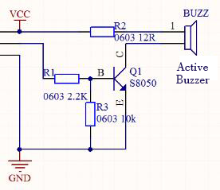
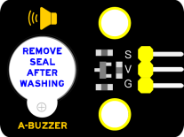
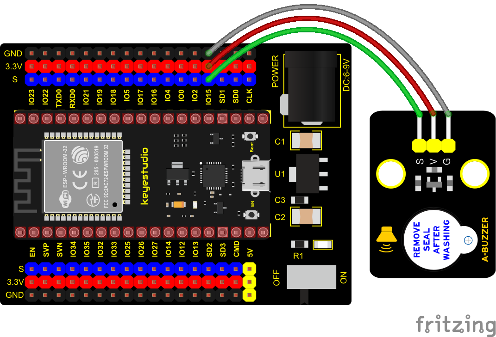

### Project 11: Active Buzzer


**1. Overview**

In this kit, it contains an active buzzer module and a power amplifier module (the principle is equivalent to a passive buzzer). In this experiment, we control the active buzzer to emit sounds. Since it has its own oscillating circuit, the buzzer will automatically sound if given large voltage.

**2. Working Principle**

From the schematic diagram, the pin of buzzer is connected to a resistor R2 and another port is linked with a NPN triode Q1. So, if this triode Q1 is powered, the buzzer will sound.

If the base electrode of the triode connected to the R1 resistor is a high level, the triode Q1 will be connected. If the base electrode is pulled down by the resistor R3, the triode is disconnected.

When we output a high level from the IO port to the triode, the buzzer will emit sounds; if outputting low levels, the buzzer won’t emit sounds.



**3. Components**

<table class="colwidths-auto docutils align-default">
<tbody>
<tr class="odd">
<td>


</td>
<td>

</td>
<td>

</td>
<td>

</td>
<td>

</td>
</tr>
<tr class="even">
<td>ESP32 Board*1</td>
<td>ESP32 Expansion Board*1</td>
<td>Keyestudio Active Buzzer*1</td>
<td>3P Dupont Wire*1</td>
<td>Micro USB Cable*1</td>
</tr>
</tbody>
</table>

**4. Connection Diagram**




**5. Test Code**


```Python
from machine import Pin
import time

buzzer = Pin(15, Pin.OUT)
while True:
    buzzer.value(1)
    time.sleep(1)
    buzzer.value(0)
    time.sleep(1)
```


**6. Code Explanation**

In the experiment, we set the pin to GPIO15. When setting to high, the active buzzer will beep. When setting to low, the active buzzer will stop emitting sounds.

**7. Test Result**

Connect the wires according to the experimental wiring diagram and power on. Click “Run current script”, the code starts executing. The active buzzer will emit sound for 1 s, and stop for 1 s. Press “Ctrl+C”or click“Stop/Restart backend”to exit the program.