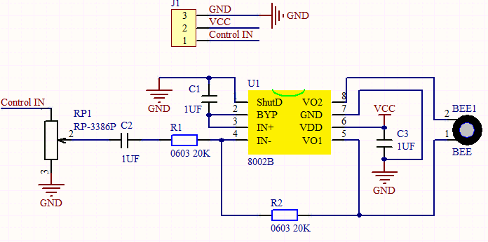
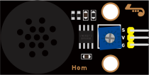
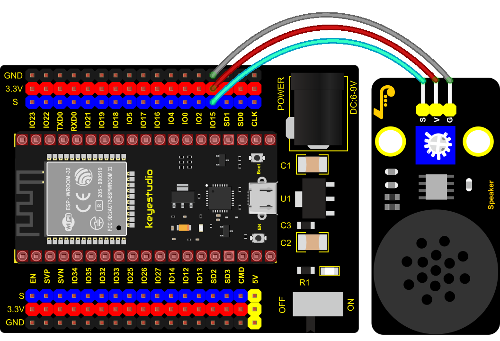

### Project 12: 8002b Audio Power Amplifier


**1. Overview**

In this kit, there is a Keyestudio 8002b audio power amplifier. The main components of this module are an adjustable potentiometer, a speaker, and an audio amplifier chip.

The main function of this module is: it can amplify the output audio signal, with a magnification of 8.5 times, and play sound or music through the built-in low-power speaker, as an external amplifying device for some music playing equipment.

In the experiment, we used the 8002b power amplifier speaker module to emit sounds of various frequencies.

**2. Working Principle**

In fact, it is similar to a passive buzzer. The active buzzer has its own oscillation source. Yet, the passive buzzer does not have internal oscillation. When controlling the circuit, we need to input square waves of different frequencies to the positive pole of the component and ground the negative pole to control the buzzer to chime sounds of different frequencies.



**3. Components**

<table class="colwidths-auto docutils align-default">
<tbody>
<tr class="odd">
<td>


</td>
<td>

</td>
<td>

></td>
<td>

</td>
<td>

</td>
</tr>
<tr class="even">
<td>ESP32 Board*1</td>
<td>ESP32 Expansion Board*1</td>
<td>Keyestudio 8002b Audio Power Amplifier*1</td>
<td>3P Dupont Wire*1</td>
<td>Micro USB Cable*1</td>
</tr>
</tbody>
</table>

**4. Connection Diagram**



**5. Test Code**

```Python
from machine import Pin, PWM
from time import sleep
buzzer = PWM(Pin(15))

buzzer.duty(1000)

buzzer.freq(523)#DO
sleep(0.5)
buzzer.freq(586)#RE
sleep(0.5)
buzzer.freq(658)#MI
sleep(0.5)
buzzer.freq(697)#FA
sleep(0.5)
buzzer.freq(783)#SO
sleep(0.5)
buzzer.freq(879)#LA
sleep(0.5)
buzzer.freq(987)#SI
sleep(0.5)
buzzer.duty(0)
```

**6. Code Explanation**

In this experiment, we use the PWM class of the machine module, buzzer = PWM(Pin(15)) to create an instance of the PWM class, and the buzzer pin is connected to GPIO15.

The buzzer.duty(1000): set the duty cycle, and the duty cycle is 1000/4095. The larger the value, the louder the buzzer. When set to 0, the buzzer does not emit sound. **buzzer.freq()** is the frequency setting method.

In the experiment, we use the PWM on the machine module. **buzzer =PWM(Pin(15))**

**7. Test Result**

Connect the wires according to the experimental wiring diagram and power on. Click “Run current script”, the code starts executing. The power amplifier module will emit the sound of the corresponding frequency corresponding to the beat :DO for 0.5s, Re for 0.5s, Mi for 0.5s, Fa for 0.5s, So for 0.5s, La 0.5s and Si for 0.5s. Press “Ctrl+C”or click“Stop/Restart backend”to exit the program.