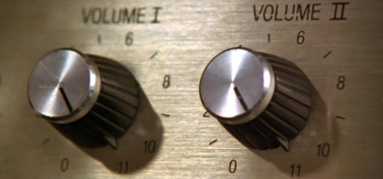
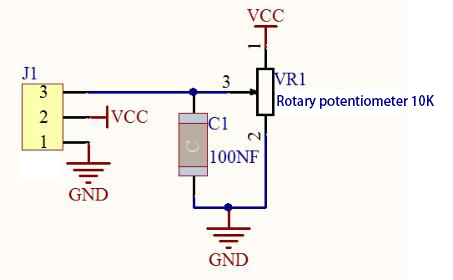
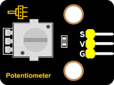
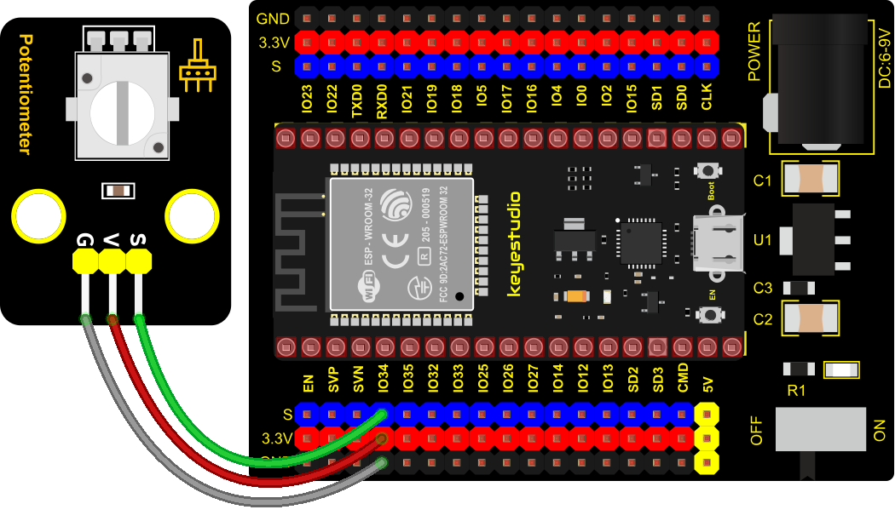
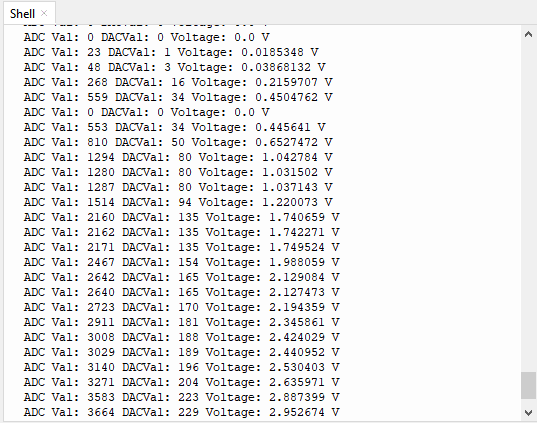

### Project 13: Potentiometer



**1. Overview**

The following we will introduce is the Keyestudio rotary potentiometer which is an analog sensor.

The digital IO ports can read the voltage value between 0 and 3.3V and the module only outputs high levels. However, the analog sensor can read the voltage value through 16 ADC analog ports on the ESP32 board. In the experiment, we will display the test results on the Shell.

**2. Working Principle**



It uses a 10K adjustable resistor. We can change the resistance by rotating the potentiometer. The signal S can detect the voltage changes(0-3.3V) which are analog quantity.

**ADC：** The more bits an ADC has, the denser the partitioning of the simulation, the higher the accuracy of the final conversion.


Subsection 1: The analog value within 0V ~ 3.3/4095 V corresponds to the number 0;

Subsection 2: The analog value within 3.3/4095 V ~ 2*3.3/4095 V corresponds to the number 1;
 …

The conversion formula is as follows:


**DAC：** The higher the precision of DAC, the higher the precision of the output voltage value.  

The conversion formula is as follows:  

**ADC on ESP32：**

The ESP32 has 16 pins that can be used to measure analog signals. GPIO pin serial numbers and analog pin definitions are shown below:  

<table class="colwidths-auto docutils align-default">
<tbody>
<tr class="odd">
<td>ADC number in ESP32</td>
<td>ESP32 GPIO number</td>
</tr>
<tr class="even">
<td>ADC0</td>
<td>GPIO 36</td>
</tr>
<tr class="odd">
<td>ADC3</td>
<td>GPIO 39</td>
</tr>
<tr class="even">
<td>ADC4</td>
<td>GPIO 32</td>
</tr>
<tr class="odd">
<td>ADC5</td>
<td>GPIO33</td>
</tr>
<tr class="even">
<td>ADC6</td>
<td>GPIO34</td>
</tr>
<tr class="odd">
<td>ADC7</td>
<td>GPIO 35</td>
</tr>
<tr class="even">
<td>ADC10</td>
<td>GPIO 4</td>
</tr>
<tr class="odd">
<td>ADC11</td>
<td>GPIO0</td>
</tr>
<tr class="even">
<td>ADC12</td>
<td>GPIO2</td>
</tr>
<tr class="odd">
<td>ADC13</td>
<td>GPIO15</td>
</tr>
<tr class="even">
<td>ADC14</td>
<td>GPIO13</td>
</tr>
<tr class="odd">
<td>ADC15</td>
<td>GPIO 12</td>
</tr>
<tr class="even">
<td>ADC16</td>
<td>GPIO 14</td>
</tr>
<tr class="odd">
<td>ADC17</td>
<td>GPIO27</td>
</tr>
<tr class="even">
<td>ADC18</td>
<td>GPIO25</td>
</tr>
<tr class="odd">
<td>ADC19</td>
<td>GPIO26</td>
</tr>
</tbody>
</table>


**DAC on ESP32：**

The ESP32 has two 8-bit digital-to-analog converters connected to GPIO25 and GPIO26 pins, which are immutable, as shown below :

<table class="colwidths-auto docutils align-default">
<tbody>
<tr class="odd">
<td>Simulate pin number</td>
<td>GPIO number</td>
</tr>
<tr class="even">
<td>DAC1</td>
<td>GPIO25</td>
</tr>
<tr class="odd">
<td>DAC2</td>
<td>GPIO26</td>
</tr>
</tbody>
</table>


**3. Components**

<table class="colwidths-auto docutils align-default">
<tbody>
<tr class="odd">
<td>


</td>
<td>

</td>
<td>

</td>
<td>

</td>
<td>

</td>
</tr>
<tr class="even">
<td>ESP32 Board*1</td>
<td>ESP32 Expansion Board*1</td>
<td>Keyestudio Rotary Potentiometer*1</td>
<td>3P Dupont Wire*1</td>
<td>Micro USB Cable*1</td>
</tr>
</tbody>
</table>

**4. Connection Diagram**



**5. Test Code**


```Python
# Import Pin, ADC and DAC modules.
from machine import ADC,Pin,DAC
import time

# Turn on and configure the ADC with the range of 0-3.3V 
adc=ADC(Pin(34))
adc.atten(ADC.ATTN_11DB)
adc.width(ADC.WIDTH_12BIT)

# Read ADC value once every 0.1seconds, convert ADC value to DAC value and output it,
# and print these data to “Shell”. 
try:
    while True:
        adcVal=adc.read()
        dacVal=adcVal//16
        voltage = adcVal / 4095.0 * 3.3
        print("ADC Val:",adcVal,"DACVal:",dacVal,"Voltage:",voltage,"V")
        time.sleep(0.1)
except:
    pass
```


**6. Code Explanation**

In the experiment, add "From Machine import ADC" to the top of your Python file every time you use the ACD module, the same goes for DAC modules. 

**machine.ADC(pin):** Create an ADC object associated with the given pin.
**pin：** The available pins are Pin(36)、Pin(39)、Pin(34）、Pin(35)、Pin(32)、Pin(33). 

**DAC(pin):** Create an DAC object associated with the given pin. Pin：The available pins are pin (25) 、pin (26).

**ADC. Read():** Read ADC value and return ADC value.  

**ADC.atten(db):** Set attenuation ration (that is, the full range voltage, such as the voltage of 11db full range is 3.3V)

**db：** attenuation ratio

**ADC.ATTIN\_0DB** —full range of 1.2V

**ADC.ATTN\_2\_5\_DB** —full range of 1.5V

**ADC.ATTN\_6DB** —full range of 2.0 V

**ADC.ATTN\_11DB** —full range of 3.3V

**ADC.width(bit):** Set data width.

**bit：** data bit

**ADC.WIDTH\_9BIT** —9 data width

**ADC.WIDTH\_10BIT** — 10 data width

**ADC.WIDTH\_11BIT** — 11 data width

**ADC.WIDTH\_12BIT** — 12 data width

**The read()method reads the** ADCvalue，rang is 0\~4095，the **adc.read()** reads the ADC value input by the ADC(Pin(34)) Pin and assigns it to a variable named adcVal.  

**DAC.write(value):** Output the voltage value, the data rang : 0-255，the corresponding output voltage is 0-3.3V.

**7. Test Result**

Connect the wires according to the experimental wiring diagram and power on. Click “Run current script”, the code starts executing. The "Shell" window prints and displays the potentiometer ADC value, DAC value and voltage value. Rotating the potentiometer handle, the ADC value, DAC value and voltage value will change. Press “Ctrl+C”or click“Stop/Restart backend”to exit the program.

