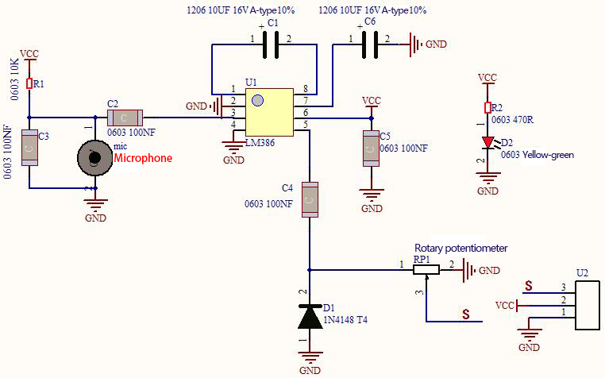
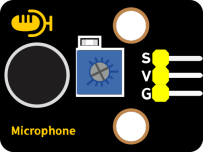
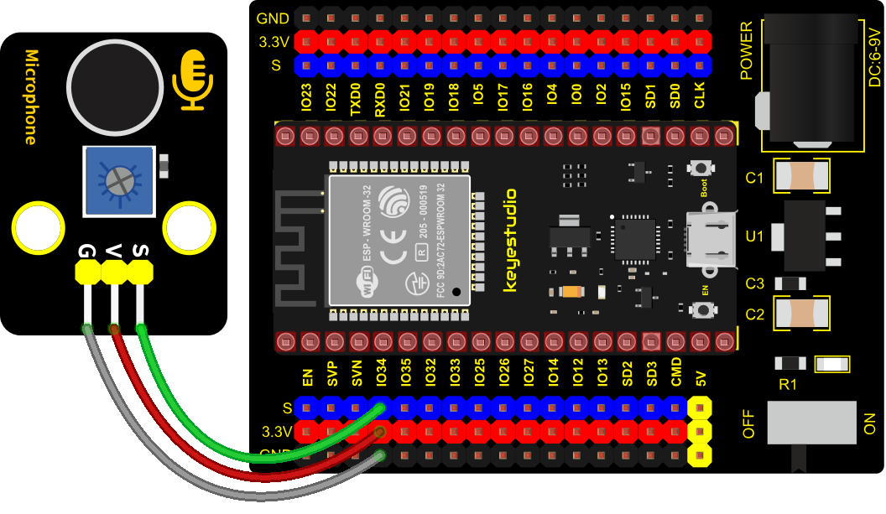
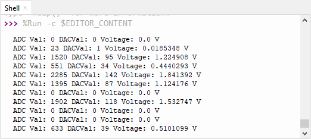

### Project 14: Sound Sensor


**1. Overview**

In this kit, there is a Keyestudio DIY electronic block and a sound sensor. In the experiment, we test the analog value corresponding to the sound level in the current environment with it. The louder the sound, the larger the ADC, DAC and the voltage value, and the “shell” window will display the test results.

**2. Working Principle**

It uses a high-sensitive microphone component and an LM386 chip. We build the circuit with the LM386 chip and amplify the sound through the high-sensitive microphone. In addition, we can adjust the sound volume by the potentiometer. Rotate it clockwise, the sound will get louder.



**3. Components**

<table class="colwidths-auto docutils align-default">
<tbody>
<tr class="odd">
<td>


</td>
<td>

</td>
<td>

</td>
<td>

</td>
<td>

</td>
</tr>
<tr class="even">
<td>ESP32 Board*1</td>
<td>ESP32 Expansion Board*1</td>
<td>Keyestudio DIY Sound Sensor*1</td>
<td>3P Dupont Wire*1</td>
<td>Micro USB Cable*1</td>
</tr>
</tbody>
</table>

**4. Connection Diagram**



**5. Test Code**

```Python
# Import Pin, ADC and DAC modules.
from machine import ADC,Pin,DAC
import time

# Turn on and configure the ADC with the range of 0-3.3V 
adc=ADC(Pin(34))
adc.atten(ADC.ATTN_11DB)
adc.width(ADC.WIDTH_12BIT)

# Read ADC value once every 0.1seconds, convert ADC value to DAC value and output it,
# and print these data to “Shell”. 
try:
    while True:
        adcVal=adc.read()
        dacVal=adcVal//16
        voltage = adcVal / 4095.0 * 3.3
        print("ADC Val:",adcVal,"DACVal:",dacVal,"Voltage:",voltage,"V")
        time.sleep(0.1)
except:
    pass
```

**6. Test Result**

Connect the wires according to the experimental wiring diagram and power on. Click “Run current script”, the code starts executing. The "Shell" window will display the sound sensor ADC value, DAC value and voltage value. Rotate the potentiometer clockwise and speak at the MIC. Then you can see the analog value get larger, as shown below. Press “Ctrl+C”or click“Stop/Restart backend”to exit the program.

