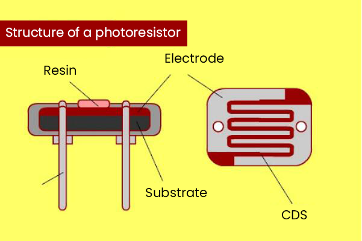
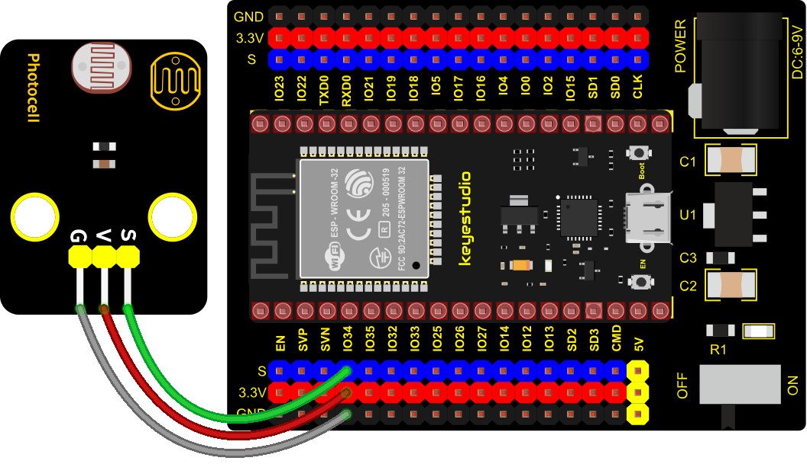
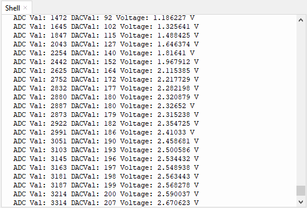

### Project 15: Photoresistor



**1. Description**

In this kit, there is a photoresistor which consists of photosensitive resistance elements. Its resistance changes with the light intensity. Also, it converts the resistance change into a voltage change through the characteristic of the photosensitive resistive element. When wiring it up, we interface its signal terminal (S terminal) with the analog port of ESP32 , so as to sense the change of the analog value, and display the corresponding analog value in the shell.

**2. Working Principle**

If there is no light, the resistance is 0.2MΩ and the detected voltage at the signal terminal is close to 0. When the light intensity increases, the resistance of photoresistor and detected voltage will diminish and the detected voltage will increase. 


**3. Components**


**4. Connection Diagram**



**5. Test Code**


```Python
# Import Pin, ADC and DAC modules.
from machine import ADC,Pin,DAC
import time

# Turn on and configure the ADC with the range of 0-3.3V 
adc=ADC(Pin(34))
adc.atten(ADC.ATTN_11DB)
adc.width(ADC.WIDTH_12BIT)

# Read ADC value once every 0.1seconds, convert ADC value to DAC value and output it,
# and print these data to “Shell”. 
try:
    while True:
        adcVal=adc.read()
        dacVal=adcVal//16
        voltage = adcVal / 4095.0 * 3.3
        print("ADC Val:",adcVal,"DACVal:",dacVal,"Voltage:",voltage,"V")
        time.sleep(0.1)
except:
    pass
```


**6. Test Result**

Connect the wires according to the experimental wiring diagram and power on. Click “Run current script”, the code starts executing. The "Shell" window will display the photoresistor ADC value, DAC value and voltage value. The brighter the light, the greater the analog value, as shown below. Press “Ctrl+C”or click“Stop/Restart backend”to exit the program.

