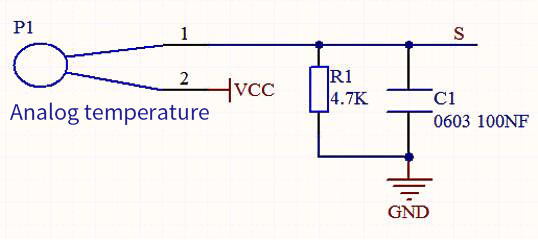
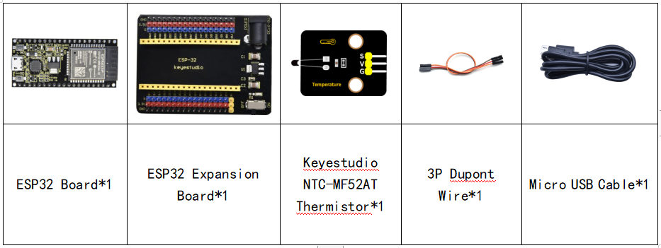
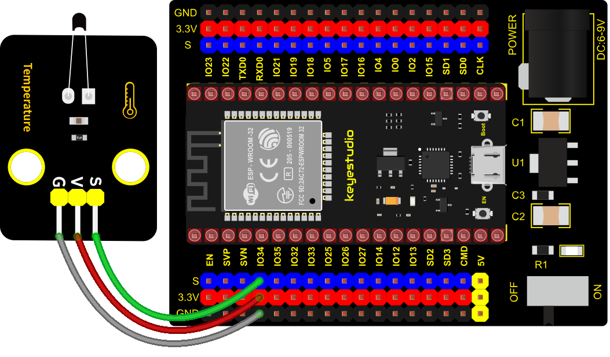
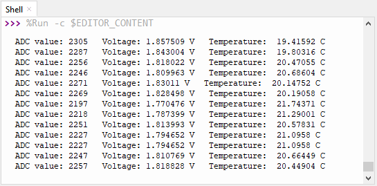

### Project 16: NTC-MF52AT Thermistor


**1. Overview**

In the experiment, there is a NTC-MF52AT analog thermistor. We connect its signal terminal to the analog port of the ESP32 mainboard and read the corresponding ADC value, voltage value and thermistor value.

We can use analog values to calculate the temperature of the current environment through specific formulas. Since the temperature calculation formula is more complicated, we only read the corresponding analog value.

**2. Working Principle**



This module mainly uses NTC-MF52AT thermistor element, which can sense the changes of the surrounding environment temperature. Resistance changes with the temperature, causing the voltage of the signal terminal S to change.

This sensor uses the characteristics of NTC-MF52AT thermistor element to convert resistance changes into voltage changes.

**3. Components**



**4. Connection Diagram**



**5. Test Code**


```Python
from machine import Pin, ADC
import time
import math

#Set ADC
adc=ADC(Pin(34))
adc.atten(ADC.ATTN_11DB)
adc.width(ADC.WIDTH_12BIT)

try:
    while True:
        adcValue = adc.read()
        voltage = adcValue / 4095 * 3.3
        Rt = 4.7 *  (3.3-voltage)/voltage 
        tempK = (1 / (1 / (273.15+25) + (math.log(Rt/10)) / 3950))
        tempC = (tempK - 273.15)
        print("ADC value:",adcValue,"  Voltage:",voltage,"V","  Temperature: ",tempC,"C");
        time.sleep(1)
except:
    pass
```


**6. Test Result**

Connect the wires according to the experimental wiring diagram and power on. Click “Run current script”, the code starts executing. The "Shell" window will display the thermistor ADC value, voltage value and temperature value, as shown below. Press “Ctrl+C”or click“Stop/Restart backend”to exit the program.

