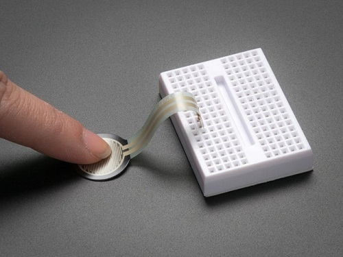
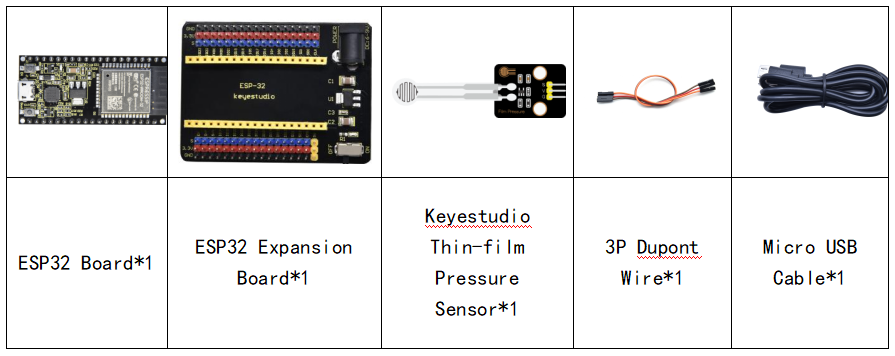
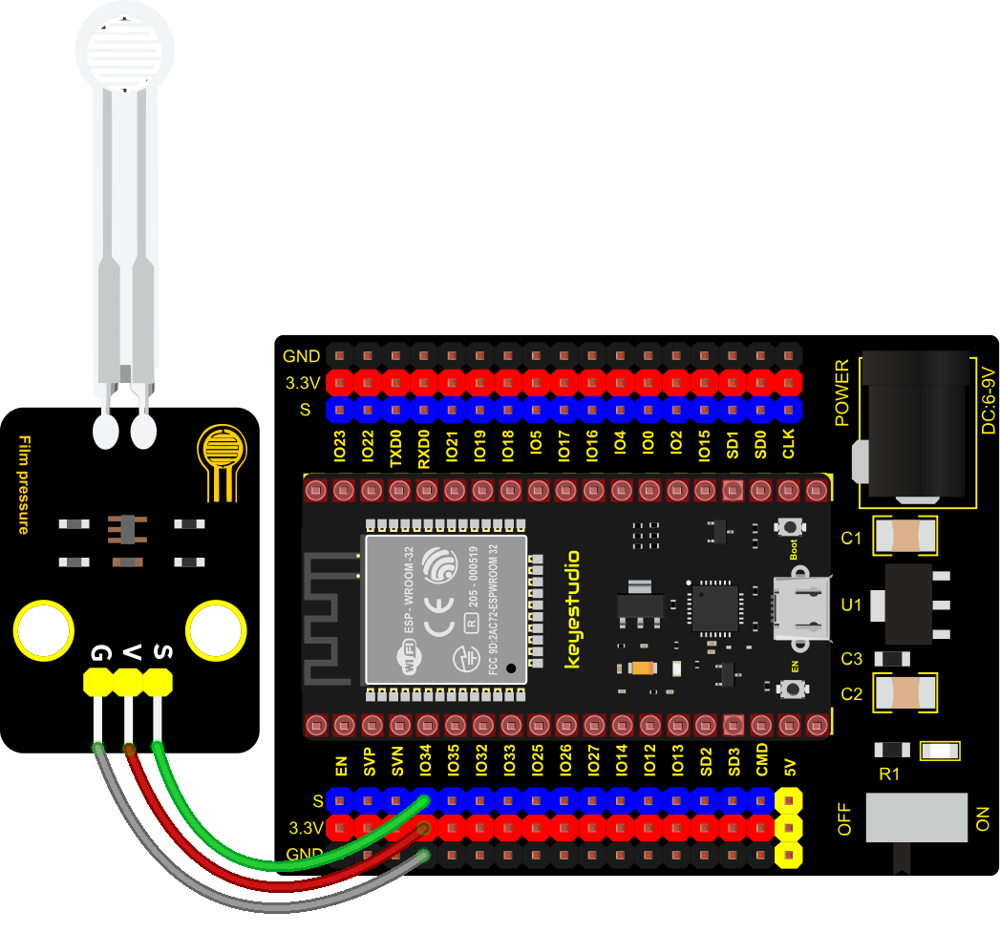
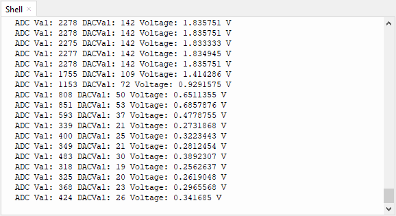

### Project 17: Thin-film Pressure Sensor



**1. Overview**

In this kit, there is a Keyestudio thin-film pressure sensor. The thin-film pressure sensor composed of a new type of nano pressure-sensitive material and a comfortable ultra-thin film substrate, has waterproof and pressure-sensitive functions.

In the experiment, we determine the pressure by collecting the analog signal on the S end of the module. The smaller the ADC value, DAC value and voltage value, the greater the pressure; and the displayed results will shown on the Shell.

**2. Working Principle**

When the sensor is pressed by external forces, the resistance value of sensor will vary. We convert the pressure signals detected by the sensor into the electric signals through a circuit. Then we can obtain the pressure changes by detecting voltage signal changes.


**3. Components**



**4. Connection Diagram**



**5. Test Code**


```Python
# Import Pin, ADC and DAC modules.
from machine import ADC,Pin,DAC
import time

# Turn on and configure the ADC with the range of 0-3.3V 
adc=ADC(Pin(34))
adc.atten(ADC.ATTN_11DB)
adc.width(ADC.WIDTH_12BIT)

# Read ADC value once every 0.1seconds, convert ADC value to DAC value and output it,
# and print these data to “Shell”. 
try:
    while True:
        adcVal=adc.read()
        dacVal=adcVal//16
        voltage = adcVal / 4095.0 * 3.3
        print("ADC Val:",adcVal,"DACVal:",dacVal,"Voltage:",voltage,"V")
        time.sleep(0.1)
except:
    pass
```

**6. Test Result**

Connect the wires according to the experimental wiring diagram and power on. Click “Run current script”, the code starts executing. The "Shell" window will display the thin-film pressure sensor ADC value, voltage value and DAC value. When the thin-film is pressed by fingers, the analog value will decrease, as shown below. Press “Ctrl+C”or click“Stop/Restart backend” to exit the program.

