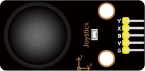
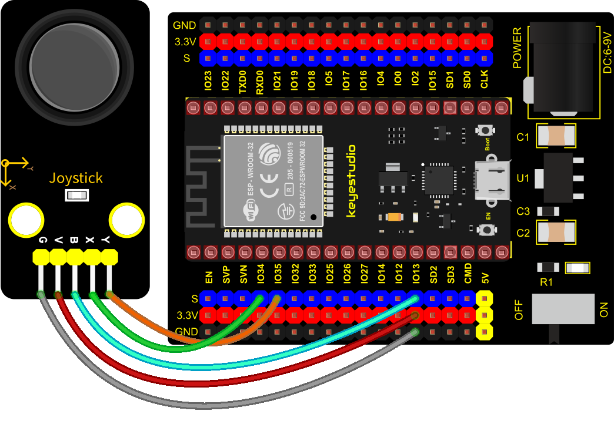
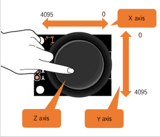
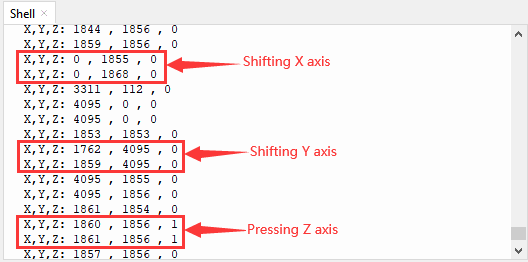

### Project 18: Joystick Module


**1. Overview**

Game handle controllers are ubiquitous.

It mainly uses PS2 joysticks. When controlling it, we need to connect the X and Y ports of the module to the analog port of the single-chip microcomputer, port B to the digital port of the single-chip microcomputer, VCC to the power output port(3.3-5V), and GND to the GND of the MCU. We can read the high and low levels of two analog values and one digital port) to determine the working status of the joystick on the module.

In the experiment, two analog values(x axis and y axis) will be shown on Shell.


**2. Working Principle**

In fact, its working principle is very simple. Its inside structure is equivalent to two adjustable potentiometers and a button. When this button is not pressed and the module is pulled down by R1, low levels will be output ; on the contrary, when the button is pressed, VCC will be connected (high levels). When we move the joystick, the internal potentiometer will adjust to output different voltages, and we can read the analog value.

**3. Components**

<table class="colwidths-auto docutils align-default">
<tbody>
<tr class="odd">
<td>


</td>
<td>

</td>
<td>

</td>
<td>

</td>
<td>

</td>
</tr>
<tr class="even">
<td>ESP32 Board*1</td>
<td>ESP32 Expansion Board*1</td>
<td>Keyestudio Joystick Module*1</td>
<td>5P Dupont Wire*1</td>
<td>Micro USB Cable*1</td>
</tr>
</tbody>
</table>

**4. Connection Diagram**



**5. Test Code**


```Python
from machine import Pin, ADC
import time
# Initialize the joystick module (ADC function)
rocker_x=ADC(Pin(34)) 
rocker_y=ADC(Pin(35))
button_z=Pin(13,Pin.IN,Pin.PULL_UP)

# Set the acquisition range of voltage of the two ADC channels to 0-3.3V,
# and the acquisition width of data to 0-4095.
rocker_x.atten(ADC.ATTN_11DB)
rocker_y.atten(ADC.ATTN_11DB)
rocker_x.width(ADC.WIDTH_12BIT)
rocker_y.width(ADC.WIDTH_12BIT)
 
# In the code, configure Z_Pin to pull-up input mode.
# In loop(), use Read () to read the value of axes X and Y 
# and use value() to read the value of axis Z, and then display them.
while True:
    print("X,Y,Z:",rocker_x.read(),",",rocker_y.read(),",",button_z.value())
    time.sleep(0.5)
```


**6. Code Explanation**

In the experiment, according to the wiring diagram, the x pin is set to GPIO34, the y pin is set to GPIO35 and the pin of the joystick is set to GPIO13.

**7. Test Result**

Wiring up and powering on, then click “Run current script”, the code starts executing. The "Shell" window will print the analog and digital values of the current joystick. Moving the joystick or pressing it will change the analog and digital values in "Shell". Press“Ctrl+C”or click“Stop/Restart backend”to exit the program.



