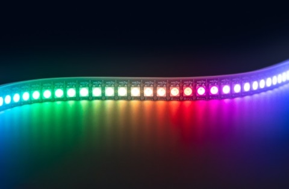
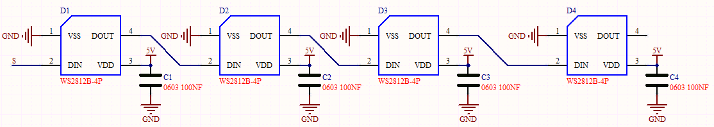
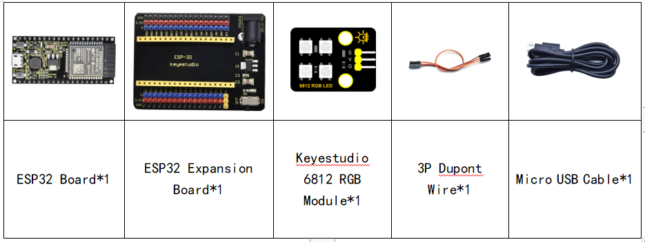
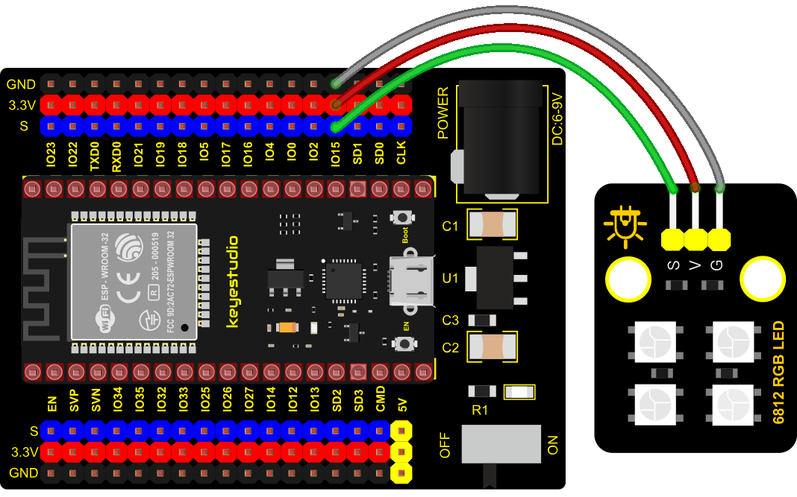

### Project 19: SK6812 RGB Module



**1. Overview**

In previous lessons, we learned about the plug-in RGB module and used PWM signals to color the three pins of the module.

There is a Keyestudio 6812 RGB module whose the driving principle is different from the plug-in RGB module. It can only control with one pin. This is a set. It is an intelligent externally controlled LED light source with the control circuit and the light-emitting circuit. Each LED element is the same as a 5050 LED lamp bead, and each component is a pixel. There are four lamp beads on the module, which indicates four pixels.

In the experiment, we make different lights show different colors.

**2. Working Principle**

From the schematic diagram, we can see that these four pixel lighting beads are all connected in series. In fact, no matter how many they are, we can use a pin to control a light and let it display any color. The pixel point contains a data latch signal shaping amplifier drive circuit, a high-precision internal oscillator and a 12V high-voltage programmable constant current control part, which effectively ensures the color of the pixel point light is highly consistent.

The data protocol adopts a single-wire zero-code communication method. After the pixel is powered up and reset, the S terminal receives the data transmitted from the controller. The first 24bit data sent is extracted by the first pixel and sent to the data latch of the pixel.



**3. Components**



**4. Connection Diagram**



**5. Test Code**


```Python
#Import Pin, neopiexl and time modules.
from machine import Pin
import neopixel
import time

#Define the number of pin and LEDs connected to neopixel.
pin = Pin(15, Pin.OUT)
np = neopixel.NeoPixel(pin, 4) 

#brightness :0-255
brightness=100                                
colors=[[brightness,0,0],                    #red
        [0,brightness,0],                    #green
        [0,0,brightness],                    #blue
        [brightness,brightness,brightness],  #white
        [0,0,0]]                             #close

#Nest two for loops to make the module repeatedly display five states of red, green, blue, white and OFF.    
while True:
    for i in range(0,5):
        for j in range(0,4):
            np[j]=colors[i]
            np.write()
            time.sleep_ms(50)
        time.sleep_ms(500)
    time.sleep_ms(500)
```


**6. Code Explanation**

A few function ports and functions:

**np = neopixel.NeoPixel(pin, 4)** , there are four LED beads, so we set to 4.

**pin = Pin(15, Pin.OUT)** , this is the pin number, we connect to GP15.

**brightness = 100**, brightness setting 255 implies brightest.

**7. Test Result**

Connect the wires according to the experimental wiring diagram and power on. Click “Run current script”, the code starts executing.  Then we can see the four RGB LEDs show different colors.

Press “Ctrl+C”or click“Stop/Restart backend”to exit the program.