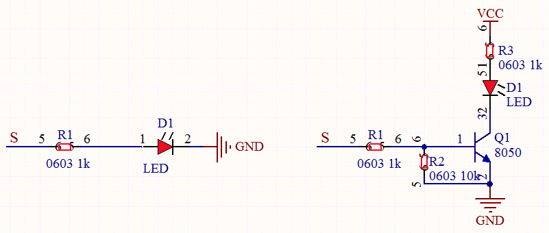
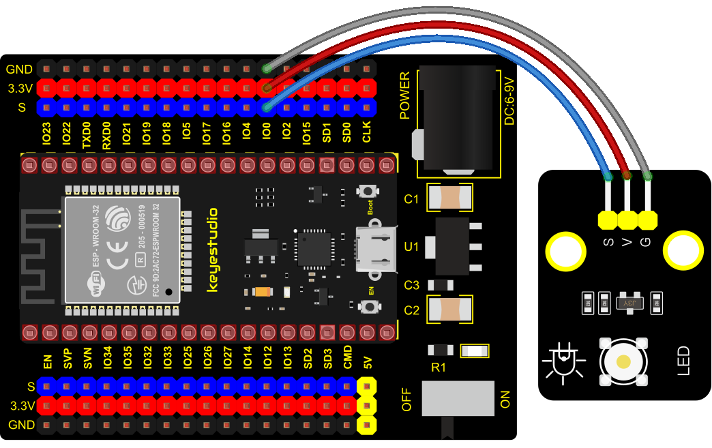

### Project 2: Lighting up LED


**1. Overview**

In this kit, we have a Keyestudio Purple Module, which is very simple to control. If you want to light up the LED, you just need to make a certain voltage across it.

In the project, we will control the high and low level of the signal end S through programming, so as to control the LED on and off. 

**2. Working Principle**

The two circuit diagrams are given.

The left one is wrong wiring-up diagram. Why? Theoretically, when the S terminal outputs high levels, the LED will receive the voltage and light up.

Due to limitation of IO ports of ESP32 board, weak current can’t make LED brighten.

The right one is correct wiring-up diagram. GND and VCC are powered up. When the S terminal is a high level, the triode Q1 will be connected and LED will light up(note: current passes through LED and R3 to reach GND by VCC not IO ports). Conversely, when the S terminal is a low level, the triode Q1 will be disconnected and LED will go off.



**3. Components**

<table class="colwidths-auto docutils align-default">
<tbody>
<tr class="odd">
<td>


</td>
<td>

</td>
<td>

</td>
<td>

</td>
<td>

</td>
</tr>
<tr class="even">
<td>ESP32 Board*1</td>
<td>ESP32 Expansion Board*1</td>
<td>Keyestudio White LED Module*1</td>
<td>3P Dupont Wire*1</td>
<td><p>Micro</p>

<p>USB Cable*1</p></td>

</tr>
</tbody>
</table>

**4. Wiring Diagram**



**5. Test Code**

```Python
from machine import Pin
import time

led = Pin(0, Pin.OUT)# Build an LED object, connect the external LED light to pin 0, and set pin 0 to output mode
while True:
    led.value(1)# turn on led
    time.sleep(1)# delay 1s
    led.value(0)# turn off led
    time.sleep(1)# delay 1s
```

**6. Code Explanation**

1. **Machine** module is indispensable, we use **import machine** or **from machine import...** to program ESP32 with microPython.

2. **time.sleep()** function is used to set delayed time, as **time.sleep(0.01),** which means, the delayed time is 10ms.

3. **led = Pin(0, Pin.OUT)**，created a pin example and we name **led** . **0** is indicative of connected pin GP0，**Pin.OUT represents output mode**， can use **.value() to output high levels** (3.3V)**led.value(1) or low levels** (0V)**led.value(0)**。

4. **while True** is loop function，It means that sentences under this function will loop unless **True** changes into **False.** For the function **while**，**led.value(1)**，outputs high levels to the pin 0; then LED lights up. Then the delayed function **time.sleep(1)** will wait for 1s. When **led.value(0)** output low levels to the pin 0, the LED will go off，and the function **time.sleep(1)** will wait for 1s, cyclically, and LED will flash.

**7. Test Result**

Connect the wires according to the experimental wiring diagram and power on. Click “Run current script”, the code starts executing, we will see that the LED in the circuit will flash alternately. Press “Ctrl+C”or click“Stop/Restart backend”to exit the program.