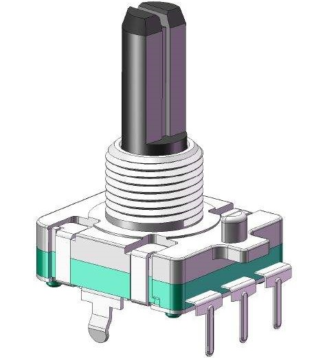
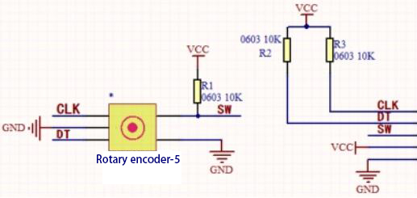
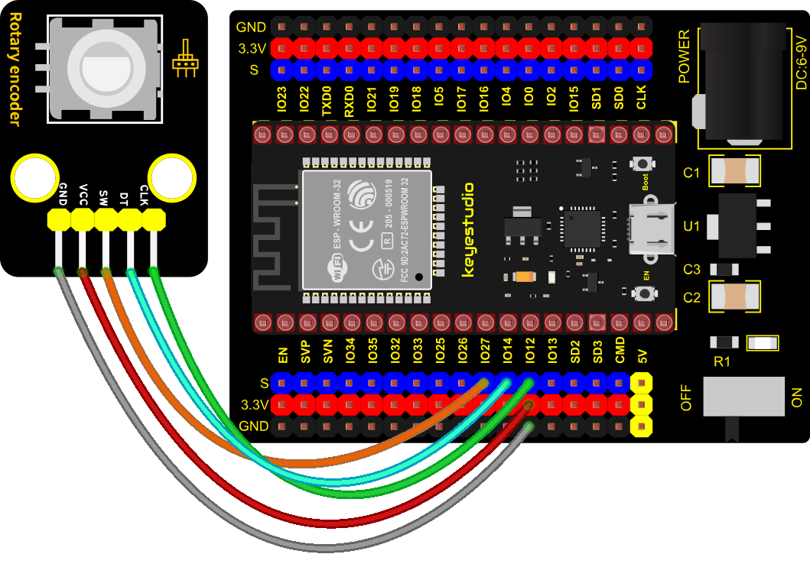
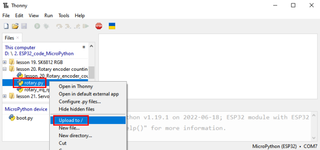
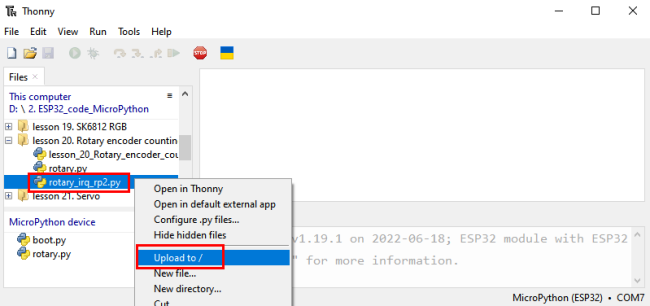
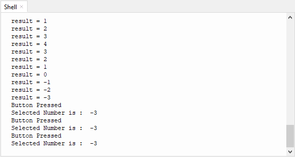

### Project 20: Rotary Encoder



**1. Overview**

In this kit, there is a Keyestudio rotary encoder, dubbed as switch encoder. It is applied to automotive electronics, multimedia audio, instrumentation, household appliances, smart home, medical equipment and so on.

In the experiment, it it used for counting. When we rotate the rotary encoder clockwise, the set data falls by 1. If you rotate it anticlockwise, the set data is up 1, and when the middle button is pressed, the value will be show on Shell.

**2. Working Principle**

The incremental encoder converts the displacement into a periodic electric signal, and then converts this signal into a counting pulse, and the number of pulses indicates the size of the displacement.This module mainly uses 20pulse rotary encoder components. It can calculate the number of pulses output during clockwise and reverse rotation. There is no limit to count rotation. It resets to the initial state, that is, starts counting from 0.           



**3. Components**

<table class="colwidths-auto docutils align-default">
<tbody>
<tr class="odd">
<td>


</td>
<td>

</td>
<td>

</td>
<td>

</td>
<td>

</td>
</tr>
<tr class="even">
<td>ESP32 Board*1</td>
<td>ESP32 Expansion Board*1</td>
<td>Keyestudio Rotary Encoder*1</td>
<td>5P Dupont Wire*1</td>
<td>Micro USB Cable*1</td>
</tr>
</tbody>
</table>

**4. Connection Diagram**



**5. Add Library**

Open“Thonny”，click“This computer”→“D:”→“2. ESP32\_code\_MicroPython”→“lesson 30. Rotary encoder counting”. Select“<span style="color: rgb(255, 76, 65);">rotary\.py</span>”and“<span style="color: rgb(255, 76, 65);">rotary\_irq\_rp2.py</span>”，right-click“<span style="color: rgb(255, 76, 65);">Upload to /</span>”.





**6. Test Code**


```Python
import time
from rotary_irq_rp2 import RotaryIRQ
from machine import Pin

SW=Pin(27,Pin.IN,Pin.PULL_UP)  
r = RotaryIRQ(pin_num_clk=12,
              pin_num_dt=14,
              min_val=0,
              reverse=False,
              range_mode=RotaryIRQ.RANGE_UNBOUNDED)
val_old = r.value()
while True:
    try:
        val_new = r.value()
        if SW.value()==0 and n==0:
            print("Button Pressed")
            print("Selected Number is : ",val_new)
            n=1
            while SW.value()==0:
                continue
        n=0
        if val_old != val_new:
            val_old = val_new
            print('result =', val_new)
        time.sleep_ms(50)
    except KeyboardInterrupt:
        break
```


**7. Code Explanation**

1). We will see the file **rotary\.py** and **rotary\_irq\_rp2.py**. This means that we save them in the ESP32 successfully. Then we can use **from rotary\_irq\_rp2 import RotaryIRQ.**
    
2). **SW=Pin(27,Pin.\IN, Pin.PULL\_UP)** indicates that the SW pin is connected to GPIO27, **pin\_num\_clk=12** indicates that the pin CLK is connected to GPIO12, and **pin\_num\_dt=14** means that the DT pin is connected to GPIO14. We can change these pin numbers.
    
3). **try/except** is the python language exception capture processing statement, **try** executes the code, **except** executes the code, when an exception occurs, and when we press Ctrl+C, the program exits.
    
4). **r.value()** returns the value of the encoder

**8. Test Result**

Connect the wires according to the experimental wiring diagram and power on. Click “Run current script”, the code starts executing. Rotate the encoder clockwise, the displayed data will decrease, rotate the encoder counterclockwise, the displayed data will increase. Press the middle button of the encoder, the displayed data is the value of the encoder, as shown in the figure below. Press “Ctrl+C”or click“Stop/Restart backend”to exit the program.

