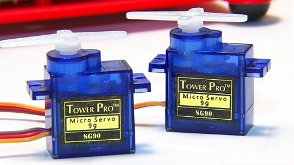
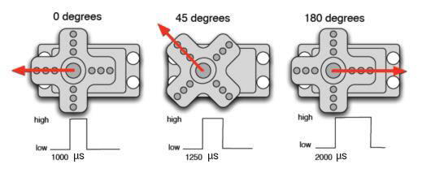
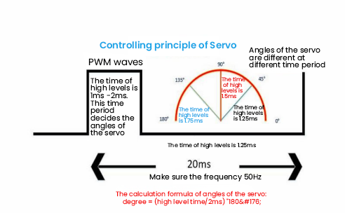
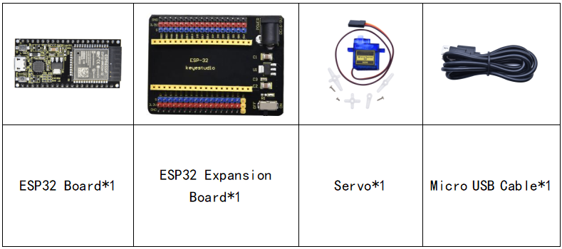
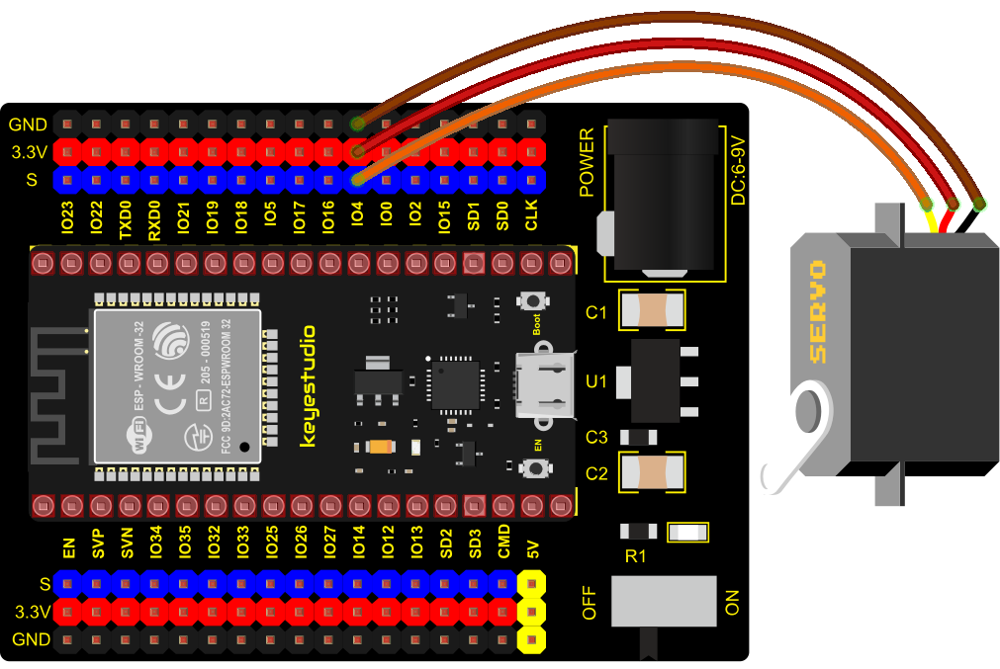

### Project 21: Servo Control



**1. Overview**

Servo is a position control rotary actuator. It mainly consists of a housing, a circuit board, a core-less motor, a gear and a position sensor. 

In general, servo has three lines in brown, red and orange. The brown wire is grounded, the red one is a positive pole line and the orange one is a signal line.



**2. Working Principle**

The rotation angle of servo motor is controlled by regulating the duty cycle of PWM (Pulse-Width Modulation) signal. The standard cycle of PWM signal is 20ms (50Hz). Theoretically, the width is distributed between 1ms-2ms, but in fact, it's between 0.5ms-2.5ms. The width corresponds the rotation angle from 0° to 180°. But note that for different brand motors, the same signal may have different rotation angles. 



**3. Components**



**4. Connection Diagram**



**5. Test Code 1**

```Python
from machine import Pin, PWM
import time
pwm = PWM(Pin(4))  
pwm.freq(50)

'''
Duty cycle corresponding to the Angle
0°----2.5%----25
45°----5%----51.2
90°----7.5%----77
135°----10%----102.4
180°----12.5%----128
'''
angle_0 = 25
angle_90 = 77
angle_180 = 128

while True:
    pwm.duty(angle_0)
    time.sleep(1)
    pwm.duty(angle_90)
    time.sleep(1)
    pwm.duty(angle_180)
    time.sleep(1)
```


**6. Code Explanation 1**

According to the angle of the signal pulse width, it is converted into a duty cycle. The formula is: 2.5+angle/180\*10. The PWM pin resolution of ESP32 is 2^10 = 1024. When converted to 0 degree, its duty cycle is 1024* 2.5% = 25.6 , when the angle is 180 degrees, its duty cycle value is 1024\* 12.5% = 128, these two values will be related to the program, considering the error and rotation angle, I set the duty cycle at between 10 and 150, the servo can rotate smoothly 0\~180 degrees.

**7. Test Result 1**

Connect the wires according to the experimental wiring diagram and power on. Click “Run current script”, the code starts executing, the servo will rotate 0°，90° and 180° cyclically. Press “Ctrl+C”or click“Stop/Restart backend” to exit the program.

**8. Test Code 2**


```Python
from utime import sleep
from machine import Pin
from machine import PWM

pwm = PWM(Pin(4))#Steering gear pin is connected to GP4.
pwm.freq(50)#20ms period, so the frequency is 50Hz
'''
Duty cycle corresponding to the Angle
0°----2.5%----25
45°----5%----51.2
90°----7.5%----77
135°----10%----102.4
180°----12.5%----128
'''
# Set the servo motor rotation Angle
def setServoCycle (position):
    pwm.duty(position)
    sleep(0.01)

# Convert the rotation Angle to duty cycle
def convert(x, i_m, i_M, o_m, o_M):
    return max(min(o_M, (x - i_m) * (o_M - o_m) // (i_M - i_m) + o_m), o_m)

while True:
    for degree in range(0, 180, 1):#servo goes from 0 to 180
        pos = convert(degree, 0, 180, 20, 150)
        setServoCycle(pos)

    for degree in range(180, 0, -1):#servo goes from 180 to 0
        pos = convert(degree, 0, 180, 20, 150)
        setServoCycle(pos)
```


**9. Code Explanation 2**

**convert(x, i\_m, i\_M, o\_m, o\_M)**: x is the value we want to map;
**i\_m, i\_M** are the lower and upper limits of the current value;
**o\_m, o\_M** are the lower and upper limits of the target range we want to map to.

**10. Test Result 2**

Connect the wires according to the experimental wiring diagram and power on. Click “Run current script”, the code starts executing. The servo rotates from 0° to 180° by moving 1° for each 15ms. Press “Ctrl+C”or click“Stop/Restart backend”to exit the program.