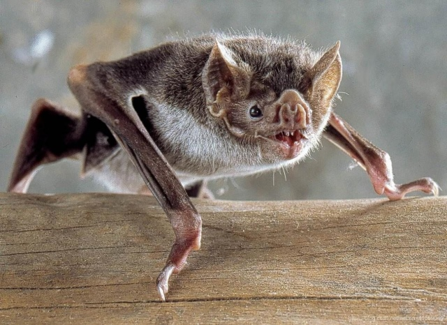
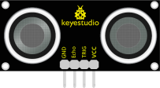
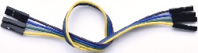
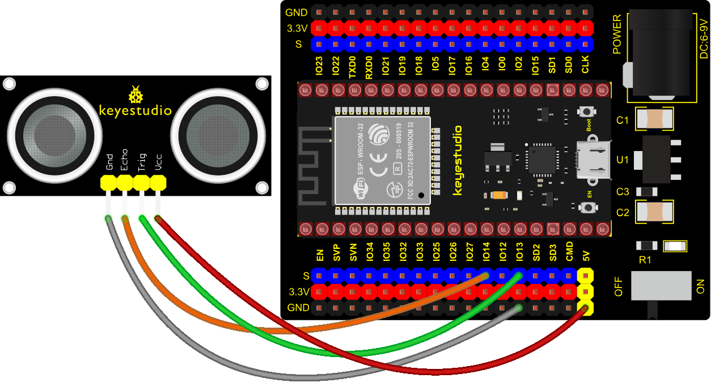
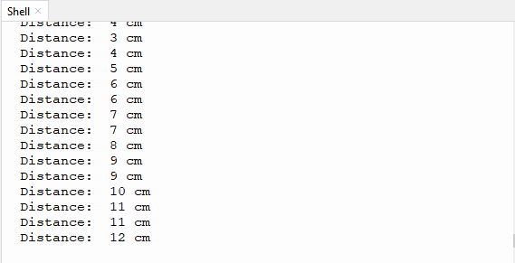

### Project 22: Ultrasonic Sensor



Bats and some marine animals are able to use high frequencies of sound for echolocation or communication. They can emit ultrasonic waves from the larynx through the mouth or nose and use the sound waves that bounce back to orient and determine the position, size and whether nearby objects are moving.

Ultrasonic is a frequency higher than 20000 Hz sound wave, which has a good direction, a strong penetration ability, and is easy to obtain more concentrated sound energy as well as spread far in the water. It can be used for ranging, speed measurement, cleaning, welding, gravel, sterilization and disinfection. What‘s more, it has many applications in medicine, military, industry and agriculture.

**1. Overview**

In this kit, there is a keyes HC-SR04 ultrasonic sensor, which can detect obstacles in front and the detailed distance between the sensor and the obstacle. Its principle is the same as that of bat flying. It can emit the ultrasonic signals that cannot be heard by humans. When these signals hit an obstacle and come back immediately. The distance between the sensor and the obstacle can be calculated by the time gap of emitting signals and receiving signals.

In the experiment, we use the sensor to detect the distance between the sensor and the obstacle, and print the test result.

**2. Working Principle**

The most common ultrasonic ranging method is the echo detection. As shown below; when the ultrasonic emitter emits the ultrasonic waves towards certain direction, the counter will count. The ultrasonic waves travel and reflect back once encountering the obstacle. Then the counter will stop counting when the receiver receives the ultrasonic waves coming back.

The ultrasonic wave is also sound wave, and its speed of sound V is related to temperature. Generally, it travels 340m/s in the air. According to time t, we can calculate the distance s from the emitting spot to the obstacle.

s=340t/2.

The HC-SR04 ultrasonic ranging module can provide a non-contact distance sensing function of 2cm-400cm, and the ranging accuracy can reach as high as 3mm; the module includes an ultrasonic transmitter, receiver and control circuit. Basic working principle:

1). First pull down the TRIG, and then trigger it with at least 10us high level signal;

2). After triggering, the module will automatically transmit eight 40KHZ square waves, and automatically detect whether there is a signal to return.

3). If there is a signal returned back, through the ECHO to output a high level, the duration time of high level is actually the time from emission to reception of ultrasonic.


**3. Components**

<table class="colwidths-auto docutils align-default">
<tbody>
<tr class="odd">
<td>


</td>
<td>

</td>
<td>

</td>
<td>

</td>
<td>

</td>
</tr>
<tr class="even">
<td>ESP32 Board*1</td>
<td>ESP32 Expansion Board*1</td>
<td>keyestudio SR01 Ultrasonic Sensor*1</td>
<td>4P Dupont Wire*1</td>
<td>Micro USB Cable*1</td>
</tr>
</tbody>
</table>

**4. Connection Diagram**



**5. Test Code**


```Python
from machine import Pin
import time

# Define the control pins of the ultrasonic ranging module. 
Trig = Pin(13, Pin.OUT, 0) 
Echo = Pin(14, Pin.IN, 0)

distance = 0 # Define the initial distance to be 0.
soundVelocity = 340 #Set the speed of sound.

# The getDistance() function is used to drive the ultrasonic module to measure distance,
# the Trig pin keeps at high level for 10us to start the ultrasonic module.
# Echo.value() is used to read the status of ultrasonic module’s Echo pin,
# and then use timestamp function of the time module to calculate the duration of Echo
# pin’s high level,calculate the measured distance based on time and return the value.
def getDistance():
    Trig.value(1)
    time.sleep_us(10)
    Trig.value(0)
    while not Echo.value():
        pass
    pingStart = time.ticks_us()
    while Echo.value():
        pass
    pingStop = time.ticks_us()
    pingTime = time.ticks_diff(pingStop, pingStart) // 2
    distance = int(soundVelocity * pingTime // 10000)
    return distance

# Delay for 2 seconds and wait for the ultrasonic module to stabilize,
# Print data obtained from ultrasonic module every 500 milliseconds. 
time.sleep(2)
while True:
    time.sleep_ms(500)
    distance = getDistance()
    print("Distance: ", distance, "cm")
```


**6. Test Result**

Connect the wires according to the experimental wiring diagram and power on. Click “Run current script”, the code starts executing. The "Shell" window will print the distance between the ultrasonic sensor and the object. Press“Ctrl+C”or click“Stop/Restart backend”to exit the program.

