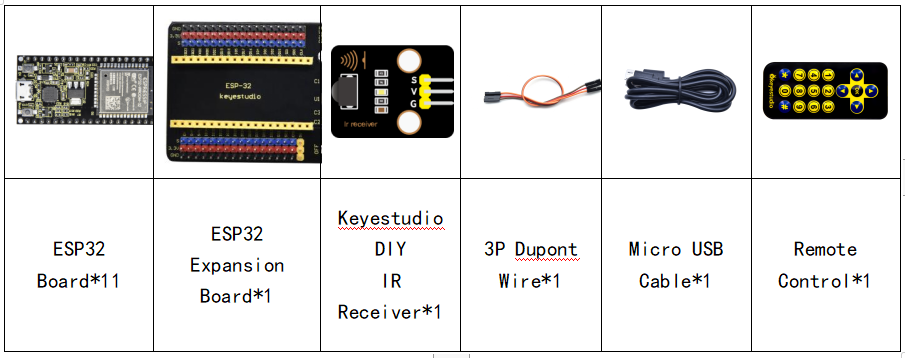
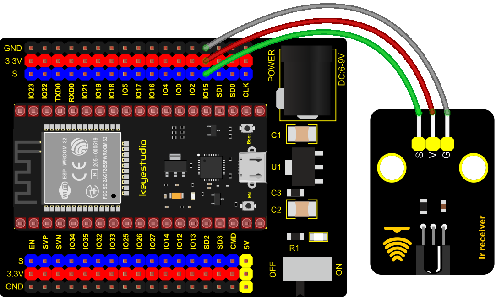
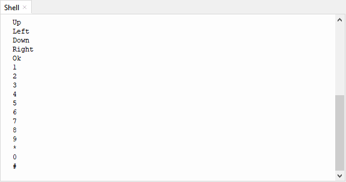

### Project 23: IR Receiver Module


**1. Overview**

Infrared remote control is currently the most widely used means of communication and remote control, which has the characteristics of small volume, low power consumption, strong function and low cost. Therefore, recorder, audio equipment, air conditioning machine and toys and other small electrical devices have also used the infrared remote control.

Its transmitting circuit is the use of infrared light emitting diode to emit modulated infrared light wave. The circuit is composed of infrared receiving diode, triode or silicon photocell. They convert infrared light emitted by infrared emitter into corresponding electrical signal, and then send back amplifier.    ​    

In this experiment, we need to know how to use the infrared receiving sensor, which mainly uses the VS1838B infrared receiving sensor element. It integrates receiving, amplifying, and demodulating. The internal IC has already completed the demodulation, and the output is a digital signal. It can receive 38KHz modulated remote control signal. In the experiment, we use the IR receiver to receive the infrared signal emitted by the external infrared transmitting device, and display the received signal in the shell.

**2. Working Principle**

The main part of the IR remote control system is modulation, transmission and reception. The modulated carrier frequency is generally between 30khz and 60khz, and most of them use a square wave of 38kHz and a duty ratio of 1/3. A 4.7K pull-up resistor R3 is added to the signal end of the infrared receiver.


**3. Components**



**4. Connection Diagram**



**5. Test Code**


```Python
import utime
from machine import Pin 

ird = Pin(15,Pin.IN)

act = {"1": "LLLLLLLLHHHHHHHHLHHLHLLLHLLHLHHH","2": "LLLLLLLLHHHHHHHHHLLHHLLLLHHLLHHH","3": "LLLLLLLLHHHHHHHHHLHHLLLLLHLLHHHH",
       "4": "LLLLLLLLHHHHHHHHLLHHLLLLHHLLHHHH","5": "LLLLLLLLHHHHHHHHLLLHHLLLHHHLLHHH","6": "LLLLLLLLHHHHHHHHLHHHHLHLHLLLLHLH",
       "7": "LLLLLLLLHHHHHHHHLLLHLLLLHHHLHHHH","8": "LLLLLLLLHHHHHHHHLLHHHLLLHHLLLHHH","9": "LLLLLLLLHHHHHHHHLHLHHLHLHLHLLHLH",
       "0": "LLLLLLLLHHHHHHHHLHLLHLHLHLHHLHLH","Up": "LLLLLLLLHHHHHHHHLHHLLLHLHLLHHHLH","Down": "LLLLLLLLHHHHHHHHHLHLHLLLLHLHLHHH",
       "Left": "LLLLLLLLHHHHHHHHLLHLLLHLHHLHHHLH","Right": "LLLLLLLLHHHHHHHHHHLLLLHLLLHHHHLH","Ok": "LLLLLLLLHHHHHHHHLLLLLLHLHHHHHHLH",
       "*": "LLLLLLLLHHHHHHHHLHLLLLHLHLHHHHLH","#": "LLLLLLLLHHHHHHHHLHLHLLHLHLHLHHLH"}

def read_ircode(ird):
    wait = 1
    complete = 0
    seq0 = []
    seq1 = []

    while wait == 1:
        if ird.value() == 0:
            wait = 0
    while wait == 0 and complete == 0:
        start = utime.ticks_us()
        while ird.value() == 0:
            ms1 = utime.ticks_us()
        diff = utime.ticks_diff(ms1,start)
        seq0.append(diff)
        while ird.value() == 1 and complete == 0:
            ms2 = utime.ticks_us()
            diff = utime.ticks_diff(ms2,ms1)
            if diff > 10000:
                complete = 1
        seq1.append(diff)

    code = ""
    for val in seq1:
        if val < 2000:
            if val < 700:
                code += "L"
            else:
                code += "H"
    # print(code)
    command = ""
    for k,v in act.items():
        if code == v:
            command = k
    if command == "":
        command = code
    return command

while True:
    command = read_ircode(ird)
    print(command)
    utime.sleep(0.5)
```


**6. Code Explanation**

**read\_ircode(ird) c**orresponds to the key symbol for remote control

**7. Test Result**

Connect the wires according to the experimental wiring diagram and power on. Click “Run current script”, the code starts executing. Find the infrared remote control, pull out the insulating sheet, and press the button at the receiving head of the infrared receiving sensor. After receiving the signal, the LED on the infrared receiving sensor also starts to flash, as shown in the figure below. Press “Ctrl+C”or click“Stop/Restart backend”to exit the program.

