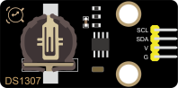
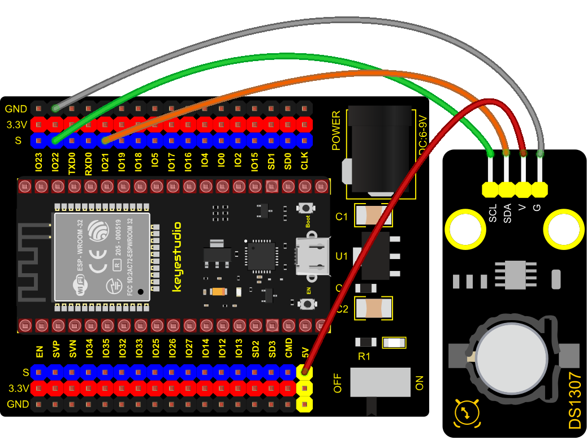
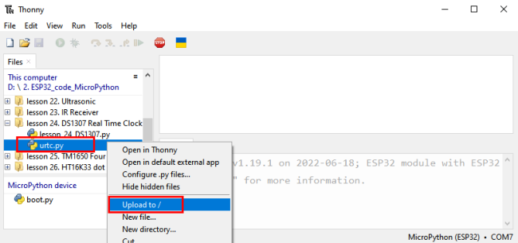
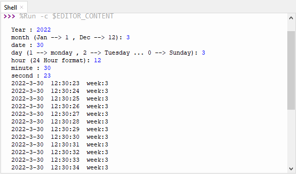

### Project 24: DS1307 Clock Module


**1. Overview**

This module mainly uses the real-time clock chip DS1307, which is the I2C bus interface chip that has second, minute, hour, day, month, year and other functions as well as leap year automatic adjustment function introduced by DALLAS. It can work independently of CPU, and won‘t’ affected by the CPU main crystal oscillator and capacitance as well as keep accurate time. What‘s more, monthly cumulative error is generally less than 10 seconds.

The chip also has a clock protection circuit in case of main power failure and runs on a back-up battery that denies the CPU read and write access. At the same time, it contains automatic switching control circuit of standby power supply, so it can guarantee the accuracy of system clock in case of power failure of main power supply and other bad environment.

Going forward, the DS1307 chip internal integration has a certain capacity, with power failure protection characteristics of static RAM, which can be used to save some key data. 

In the experiment, we use the DS1307 clock module to obtain the system time and print the test results.  

**2. Working Principle**

Serial real-time clock records year, month, day, hour, minute, second and week; AM and PM indicate morning and afternoon respectively; 56 bytes of NVRAM store data; 2-wire serial port; programmable square wave output; power failure detection and automatic switching circuit; battery current is less than 500nA.

Pins description：

X1, X2：32.768kHz crystal terminal ;

VBAT: +3V input;

SDA：serial data;

SCL：serial clock;

SQW/OUT：square waves/output drivers


**3. Components**

<table class="colwidths-auto docutils align-default">
<tbody>
<tr class="odd">
<td>


</td>
<td>


</td>
<td>

</td>
<td>

</td>
<td>

</td>
</tr>
<tr class="even">
<td>ESP32 Board*1</td>
<td>ESP32 Expansion Board*1</td>
<td>Keyestudio DS1307 Clock Module*1</td>
<td>4P Dupont Wire*1</td>
<td>Micro USB Cable*1</td>
</tr>
</tbody>
</table>

**4. Connection Diagram**



**5. Add Library**

Open “Thonny”, click “This computer”→”D:”→”2. ESP32\_code\_MicroPython”→“lesson 36. DS1307 Real Time Clock”.
Select“<span style="color: rgb(255, 76, 65);">urtc.py</span>”，right-click and select“<span style="color: rgb(255, 76, 65);">Upload to /</span>”，waiting for the“<span style="color: rgb(255, 76, 65);">urtc.py</span>”to be uploaded to the ESP32.




**6. Test Code**


```Python
from machine import I2C, Pin
from urtc import DS1307 
import utime

i2c = I2C(1,scl = Pin(22),sda = Pin(21),freq = 400000)
rtc = DS1307(i2c)

year = int(input("Year : "))
month = int(input("month (Jan --> 1 , Dec --> 12): "))
date = int(input("date : "))
day = int(input("day (1 --> monday , 2 --> Tuesday ... 0 --> Sunday): "))
hour = int(input("hour (24 Hour format): "))
minute = int(input("minute : "))
second = int(input("second : "))

now = (year,month,date,day,hour,minute,second,0)
rtc.datetime(now)

#(year,month,date,day,hour,minute,second,p1) = rtc.datetime()
while True:
    DateTimeTuple = rtc.datetime()
    print(DateTimeTuple[0], end = '-')
    print(DateTimeTuple[1], end = '-')
    print(DateTimeTuple[2], end = '  ')
    print(DateTimeTuple[4], end = ':')
    print(DateTimeTuple[5], end = ':')
    print(DateTimeTuple[6], end = '  week:')
    print(DateTimeTuple[3])
    utime.sleep(1)
```


**7. Code Explanation**

**rtc.datetime()：** Return a tuple of time. When the program is running, we set the "please input" program, run the code, it will prompt us to input the time and date, after the input is completed, the data will be printed every second.

**DateTimeTuple\[0\]:** save years

**DateTimeTuple\[1\]:** save months

**DateTimeTuple\[2\]**: save days

**DateTimeTuple\[3\]**: save weeks

**Rtc.GetDateTime().Month():** return months

**DateTimeTuple\[4\]:** save hours

**DateTimeTuple\[5\]**: save minutes

**DateTimeTuple\[6\]:** save seconds

**8. Test Result**

Connect the wires according to the experimental wiring diagram and power on. Click “Run current script”, the code starts executing. Then the shell will display “Year：”. Then we enter year, month, day, hour, minute and second, once complete, printed the data every second, as shown below. Press “Ctrl+C”or click “Stop/Restart backend”to exit the program.

