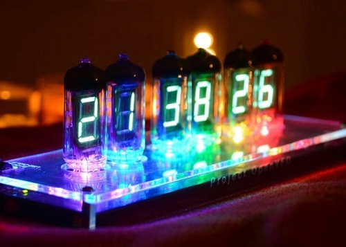
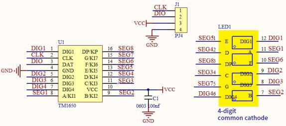
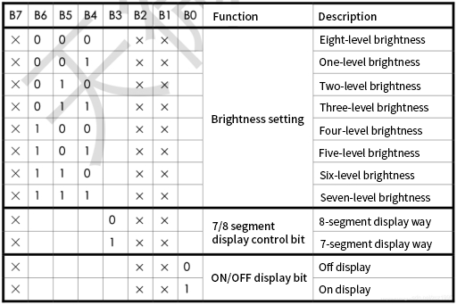
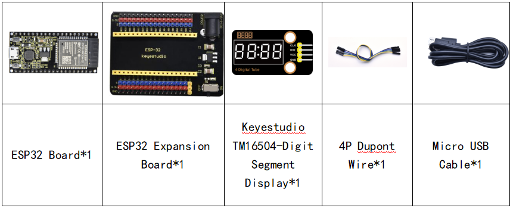
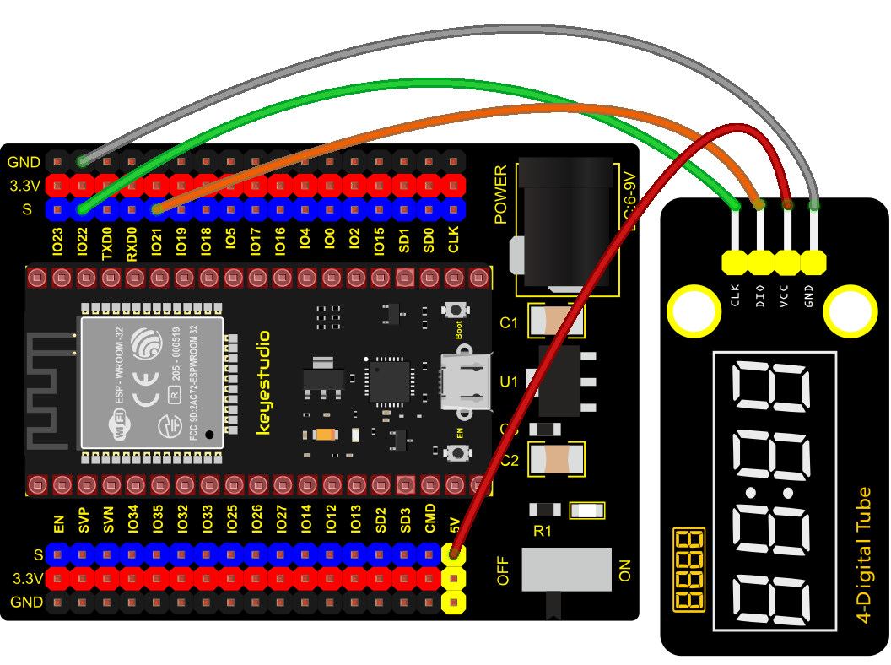

### Project 25: TM1650 4-Digit Tube Display



**1. Overview**

This module is mainly composed of a 0.36 inch red common cathode 4-digit digital tube, and its driver chip is TM1650. When using it, we only need two signal lines to make the single-chip microcomputer control a 4-bit digit tube, which greatly saves the IO port resources of the control board.

TM1650 is a special circuit for LED (light emitting diode display) drive control. It integrates MCU input and output control digital interface, data latch, LED drivers, keyboard scanning, brightness adjustment and other circuits.

TM1650 has stable performance, reliable quality and strong anti-interference ability.

It can be applied to the application of long-term continuous working for 24 hours.

TM1650 uses 2-wire serial transmission protocol for communication (note that this data transmission protocol is not a standard I2C protocol). The chip can drive the digital tube and save MCU pin resources through two pins and MCU communication.

**2. Working Principle**

TM1650 adopts IIC treaty, which uses DIO and CLK buses.



**Data command setting**: 0x48 means that we light up the digital tube, instead of enable the function of key scanning



**Command display setting:**

bit\[6:4\]：set the brightness of tube display, and 000 is brightest

bit\[3\]：set to show decimal points

bit\[0\]：start the display of the tube display

**3. Components**



**4. Connection Diagram**



**5. Test Code**


```Python
from machine import Pin
import time

# definitions for TM1650
ADDR_DIS = 0x48  #mode command
ADDR_KEY = 0x49  #read key value command

# definitions for brightness
BRIGHT_DARKEST = 0
BRIGHT_TYPICAL = 2
BRIGHTEST      = 7

on  = 1
off = 0

# number:0~9
NUM = [0x3f,0x06,0x5b,0x4f,0x66,0x6d,0x7d,0x07,0x7f,0x6f] 
# DIG = [0x68,0x6a,0x6c,0x6e]
DIG = [0x6e,0x6c,0x6a,0x68]
DOT = [0,0,0,0]

clkPin = 22
dioPin = 21
clk = Pin(clkPin, Pin.OUT)
dio = Pin(dioPin, Pin.OUT)

DisplayCommand = 0

def writeByte(wr_data):
    global clk,dio
    for i in range(8):
        if(wr_data & 0x80 == 0x80):
            dio.value(1)
        else:
            dio.value(0)
        clk.value(0)
        time.sleep(0.0001)
        clk.value(1)
        time.sleep(0.0001)
        clk.value(0)
        wr_data <<= 1
    return

def start():
    global clk,dio
    dio.value(1)
    clk.value(1)
    time.sleep(0.0001)
    dio.value(0)
    return
    
def ack():
    global clk,dio
    dy = 0
    clk.value(0)
    time.sleep(0.0001)
    dio = Pin(dioPin, Pin.IN)
    while(dio.value() == 1):
        time.sleep(0.0001)
        dy += 1
        if(dy>5000):
            break
    clk.value(1)
    time.sleep(0.0001)
    clk.value(0)
    dio = Pin(dioPin, Pin.OUT)
    return 
    
def stop():
    global clk,dio
    dio.value(0)
    clk.value(1)
    time.sleep(0.0001)
    dio.value(1)
    return
    
def displayBit(bit, num):
    global ADDR_DIS
    if(num > 9 and bit > 4):
        return
    start()
    writeByte(ADDR_DIS)
    ack()
    writeByte(DisplayCommand)
    ack()
    stop()
    start()
    writeByte(DIG[bit-1])
    ack()
    if(DOT[bit-1] == 1):
        writeByte(NUM[num] | 0x80)
    else:
        writeByte(NUM[num])
    ack()
    stop()
    return
    
def clearBit(bit):
    if(bit > 4):
        return
    start()
    writeByte(ADDR_DIS)
    ack()
    writeByte(DisplayCommand)
    ack()
    stop()
    start()
    writeByte(DIG[bit-1])
    ack()
    writeByte(0x00)
    ack()
    stop()
    return
    
    
def setBrightness(b = BRIGHT_TYPICAL):
    global DisplayCommand,brightness
    DisplayCommand = (DisplayCommand & 0x0f)+(b<<4)
    return

def setMode(segment = 0):
    global DisplayCommand
    DisplayCommand = (DisplayCommand & 0xf7)+(segment<<3)
    return
    
def displayOnOFF(OnOff = 1):
    global DisplayCommand
    DisplayCommand = (DisplayCommand & 0xfe)+OnOff
    return

def displayDot(bit, OnOff):
    if(bit > 4):
        return
    if(OnOff == 1): 
        DOT[bit-1] = 1;
    else:
        DOT[bit-1] = 0;
    return
        
def InitDigitalTube():
    setBrightness(2)
    setMode(0)
    displayOnOFF(1)
    for _ in range(4):
        clearBit(_)
    return

def ShowNum(num): #0~9999
    displayBit(1,num%10)
    if(num < 10):
        clearBit(2)
        clearBit(3)
        clearBit(4)
    if(num > 9 and num < 100):
        displayBit(2,num//10%10)
        clearBit(3)
        clearBit(4)
    if(num > 99 and num < 1000):
        displayBit(2,num//10%10)
        displayBit(3,num//100%10)
        clearBit(4)
    if(num > 999 and num < 10000):
        displayBit(2,num//10%10)
        displayBit(3,num//100%10)
        displayBit(4,num//1000)

InitDigitalTube()

while True:
    #displayDot(1,on)     # on or off, DigitalTube.Display(bit,number); bit=1---4  number=0---9
    for i in range(0,9999):
        ShowNum(i)
        time.sleep(0.01)
```


**6. Code Explanation**

**clkPin = 22、dioPin = 21is pin number**，CLK is connected to GPIO22，DIO is connected to GPIO21. We can set any two pins at random.

**displayBit(bit, num):** show numbers at bit(1\~4) bit num(0\~9)

**clearBit(bit): clear up** bit(1\~4)

**setBrightness():** brightness setting

**displayOnOFF():** 0 means OFF, 1 means ON

**displayDot(bit, OnOff):** shows dots，0 means OFF, 1 means ON

**ShowNum(num):** show integer num，in the range of 0\~9999

**7. Test Result**

Connect the wires according to the experimental wiring diagram and power on. Click “Run current script”, the code starts executing. The 4-digit tube display will show integer from 0 to 99999, an increase of 1 for each 10ms, then start from 0 once reaching 99999. Press “Ctrl+C”or click “Stop/Restart backend”to exit the program.