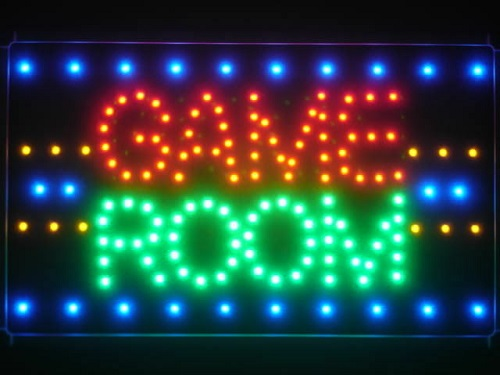
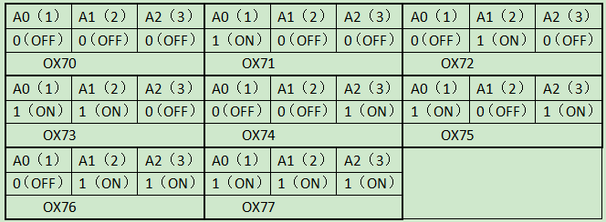
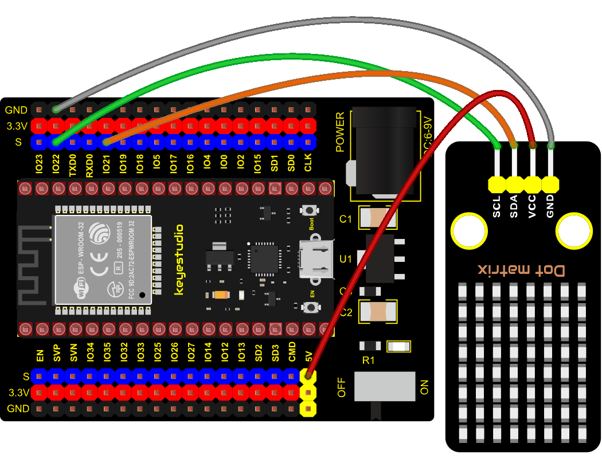
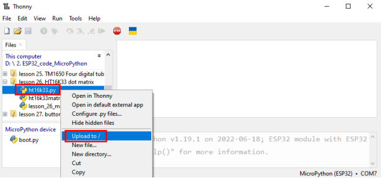
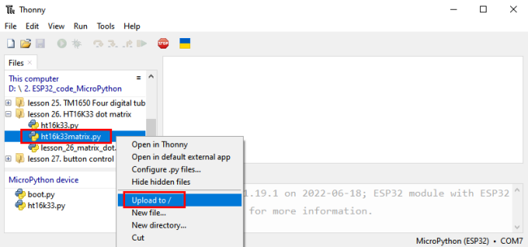

### Project 26: HT16K33\_8X8 Dot Matrix Module



**1. Overview**

What is the dot matrix display?

If we apply the previous circuit, there will be must one IO port to control only one LED. When more LED need to be controlled, we may adopt a dot matrix.
The 8X8 dot matrix is composed of 64 light-emitting diodes, and each light-emitting diode is placed at the intersection of the row line and the column line. 
Refer to the experimental schematic diagram below, when the corresponding column is set to a high level and a certain row to low, the corresponding diode will light up. For instance, set pin 13 to a high level and pin 9 to low, and then the first LED will light up.
In the experiment, we display icons via this dot matrix.

**2. Working Principle**

As the schematic diagram shown, to light up the LED at the first row and column, we only need to set C1 to high level and R1 to low level. To turn on LEDs at the first row, we set R1 to low level and C1-C8 to high level.

16 IO ports are needed, which will highly waste the MCU resources.

Therefore, we designed this module, using the HT16K33 chip to drive an 8\*8 dot matrix, which greatly saves the resources of the single-chip microcomputer.

There are three DIP switches on the module, all of which are set to I2C communication address. The setting method is shown below. A0，A1 and A2 are grounded, that is, the address is 0x70.



**3. Components**


**4. Connection Diagram**



**5. Add Library**

Open“Thonny”, click“This computer”→“D:”→“2. ESP32\_code\_MicroPython”→“lesson 38. HT16K33 dot matrix”.
Select“<span style="color: rgb(255, 76, 65);">ht16k33.py</span>”and“<span style="color: rgb(255, 76, 65);">ht16k33matrix.py</span>”，right-click and select“<span style="color: rgb(255, 76, 65);">Upload to /</span>”，waiting for the “<span style="color: rgb(255, 76, 65);">ht16k33.py</span>”and“<span style="color: rgb(255, 76, 65);">ht16k33matrix.py</span>”to be uploaded to the ESP32.





**6. Test Code**


```Python
# IMPORTS
import utime as time
from machine import I2C, Pin, RTC
from ht16k33matrix import HT16K33Matrix

# CONSTANTS
DELAY = 0.01
PAUSE = 3

# START
if __name__ == '__main__':
    i2c = I2C(scl=Pin(22), sda=Pin(21))
    display = HT16K33Matrix(i2c)
    display.set_brightness(2)

    # Draw a custom icon on the LED
    icon = b"\x00\x66\x00\x00\x18\x42\x3c\x00"
    display.set_icon(icon).draw()
    # Rotate the icon
    display.set_angle(0).draw()
    time.sleep(PAUSE)
```


**7. Test Result**

Connect the wires according to the experimental wiring diagram and power on. Click “Run current script”, the code starts executing. The dot matrix displays a“ smile ”pattern. Press “Ctrl+C”or click “Stop/Restart backend”to exit the program.