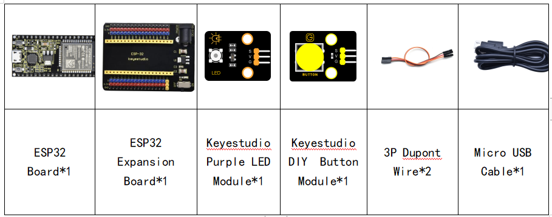

### Project 27: Button-controlled LED


**1. Overview**

In this lesson, we will make an extension experiment with a button and an LED. When the button is pressed and low levels are output, the LED will light up; when the button is released, the LED will go off. Then we can control a module with another module.

**2. Components**



**3. Connection Diagram**


**4. Test Code**

```Python
from machine import Pin
import time

led = Pin(4, Pin.OUT) # create LED object from Pin 4,Set Pin 4 to output                   
button = Pin(15, Pin.IN, Pin.PULL_UP) #Create button object from Pin15,Set GP15 to input

#Customize a function and name it reverseGPIO(),which reverses the output level of the LED
def reverseGPIO():
    if led.value():
        led.value(0)     #Set led turn off
    else:
        led.value(1)     #Set led turn on

try:
    while True:
        if not button.value():
            time.sleep_ms(20)
            if not button.value():
                reverseGPIO()
                while not button.value():
                    time.sleep_ms(20)
except:
    pass
```


**5. Test Result**

Connect the wires according to the experimental wiring diagram and power on. Click “Run current script”, the code starts executing. When the button is pressed, the LED will light up, when pressed again, the LED will go off, cycle this operation. Press “Ctrl+C”or “Stop/Restart backend”to exit the program.