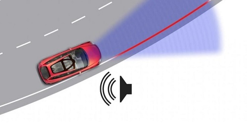
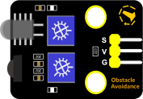
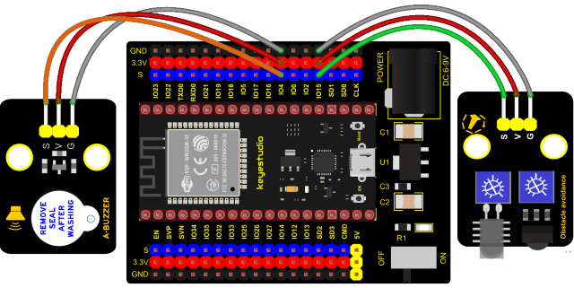

### Project 28: Alarm Experiment



**1. Overview**

In the previous experiment, we control an output module though an input module. In this lesson, we will make an experiment that the active buzzer will emit sounds once an obstacle appears.

**2. Components**

<table class="colwidths-auto docutils align-default">
<tbody>
<tr class="odd">
<td>


</td>
<td>

</td>
<td>

</td>
<td>

</td>
<td>

</td>
<td>

</td>
</tr>
<tr class="even">
<td>ESP32 Board*1</td>
<td>ESP32 Expansion Board*1</td>
<td>Keyestudio Obstacle Avoidance Sensor*1</td>
<td>Keyestudio Active Buzzer*1</td>
<td>3P Dupont Wire*2</td>
<td>Micro USB Cable*1</td>
</tr>
</tbody>
</table>

**3. Connection Diagram**



**4. Test Code**

```Python
from machine import Pin
import time

buzzer = Pin(4, Pin.OUT)
sensor = Pin(15, Pin.IN)
while True:
    buzzer.value(not(sensor.value()))
    time.sleep(0.01)
```


**5. Code Explanation**

When an obstacle is detected, sensor.value() will return a low level signal. So when an obstacle is detected, the GPIO4 connected to the buzzer pin will output a high level signal, the buzzer will emit sounds.

**6. Test Result**

Connect the wires according to the experimental wiring diagram and power on. Click “Run current script”, the code starts executing. The active buzzer will emit sound if detecting obstacles; otherwise, it won’t emit sound. Press “Ctrl+C”or click “Stop/Restart backend”to exit the program.