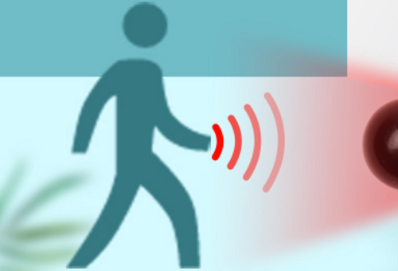
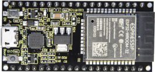
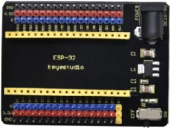
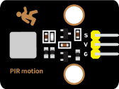
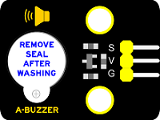
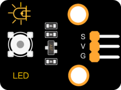
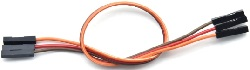
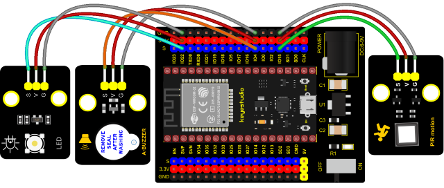
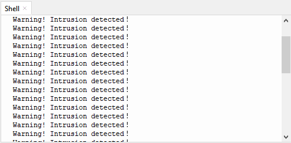

### Project 29: Intrusion Detection



**1. Description**

In this experiment, we use a PIR motion sensor to control an active buzzer to emit sounds and the onboard LED to flash rapidly.

**2. Required Components**

<table class="colwidths-auto docutils align-default">
<tbody>
<tr class="odd">
<td>


</td>
<td>

</td>
<td>

</td>
<td>

</td>
</tr>
<tr class="even">
<td>ESP32 Board*1</td>
<td>ESP32 Expansion Board*1</td>
<td>Keyestudio DIY PIR Motion Sensor*1</td>
<td>Keyestudio DIY Active Buzzer*1</td>
</tr>
<tr class="odd">
<td>

</td>
<td>

</td>
<td>

</td>
<td></td>
</tr>
<tr class="even">
<td>Keyestudio White LED Module*1</td>
<td>3P Dupont Wire*3</td>
<td>Micro USB Cable*1</td>
<td></td>
</tr>
</tbody>
</table>

**3. Connection Diagram**



**4. Test Code**


```Python
# Import Pin and time modules.
from machine import Pin 
import time 

# Define the pins of the Human infrared sensor,led and Active buzzer. 
sensor_pir = Pin(15, Pin.IN)
led = Pin(22, Pin.OUT)
buzzer = Pin(4, Pin.OUT)

while True: 
      if sensor_pir.value():
          print("Warning! Intrusion detected！")
          buzzer.value(1)
          led.value(1)
          time.sleep(0.2)
          buzzer.value(0)
          led.value(0)
          time.sleep(0.2)         
      else:
          buzzer.value(0)
          led.value(0)
```

**5. Test Result**

Connect the wires according to the experimental wiring diagram and power on. Click“Run current script”, the code starts executing. If the PIR Motion sensor detects someone moving nearby, the buzzer will emit an alarm , and the LED will flash continuously. At the same time, the “shell” will display“Warning\! Intrusion detected！”.

Press “Ctrl+C”or click “Stop/Restart backend”to exit the program.

