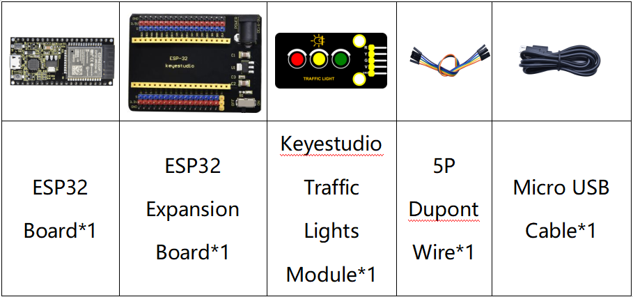
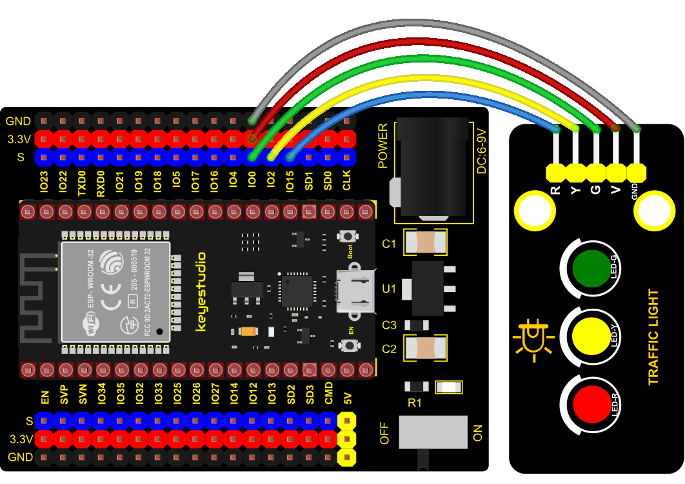

### Project 3: Traffic Lights Module


**1. Overview**

In this lesson, we will learn how to control multiple LED lights and simulate the operation of traffic lights.

Traffic lights are signal devices positioned at road intersections, pedestrian crossings, and other locations to control flows of traffic.

In this kit, we will use the traffic light module to simulate the traffic light.

**2. Working Principle**

In previous lesson, we already know how to control an LED. In this part, we only need to control three separated LEDs. Input high levels to the signal R(3.3V), then the red LED will be on.


**3. Components**



**4. Wiring Diagram**
    


**5. Test Code**

```Python
import machine
import time

led_red = machine.Pin(15, machine.Pin.OUT)
led_yellow = machine.Pin(2, machine.Pin.OUT)
led_green = machine.Pin(0, machine.Pin.OUT)

while True:
    led_green.value(1) # green light turn on
    time.sleep(5) # delay 5s
    led_green.value(0) # green light turn off
    for i in range(3): # yellow light blinks 3 times
        led_yellow.value(1)
        time.sleep(0.5)
        led_yellow.value(0)
        time.sleep(0.5)
    led_red.value(1) # red light turn on
    time.sleep(5) # delay 5s
    led_red.value(0) #red light turn off
```

**6. Code Explanation**

Create pins, set pins mode and delayed functions.

We use the **for** loop.

The simplest form is **for i in range()**.

In the code, we used range(3), which means the variable i starts from 0, increase 1 for each time, to 2.

**7. Test Result**

Connect the wires according to the experimental wiring diagram and power on. Click “Run current script”, the code starts executing, we will see that the green LED will be on for 5s then off, the yellow LED will flash for 3s then go off and the red one will be on for 5s then off. Press “Ctrl+C”or click“Stop/Restart backend”to exit the program.