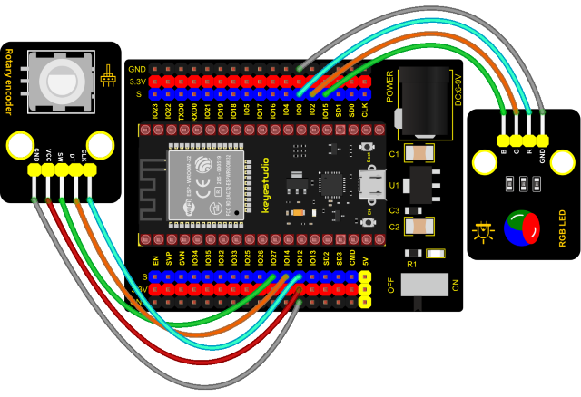
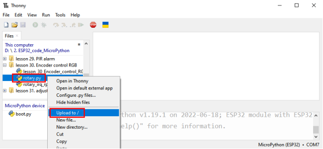
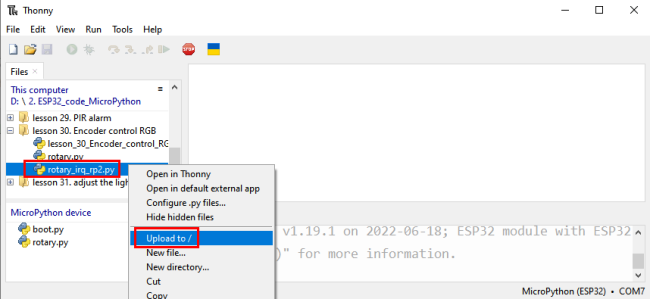

### Project 30: Rotary Encoder control RGB


**1. Introduction**

In this lesson, we will control the LED on the RGB module to show different colors through a rotary encoder.

When designing the code, we need to divide the obtained values by 3 to get the remainders. The remainder is 0 and the LED will become red. The remainder is 1, the LED will become green. The remainder is 2, the LED will turn blue.

**2. Components**


**3. Connection Diagram**




**4. Add Library**

Open“Thonny”, click“This computer”→“D:”→“2.ESP32\_code\_MicroPython”→“lesson 44. Encoder control RGB”.
Select“<span style="color: rgb(255, 76, 65);">rotary\.py</span>”and“<span style="color: rgb(255, 76, 65);">rotary\_irq\_rp2.py</span>”，right-click and select“<span style="color: rgb(255, 76, 65);">**Upload to /**</span>”，waiting for the “<span style="color: rgb(255, 76, 65);">rotary\.py</span>”and“<span style="color: rgb(255, 76, 65);">rotary\_irq\_rp2.py</span>”to be uploaded to the ESP32.





**5. Test Code**


```Python
import time
from rotary_irq_rp2 import RotaryIRQ
from machine import Pin, PWM

pwm_r = PWM(Pin(0)) 
pwm_g = PWM(Pin(2))
pwm_b = PWM(Pin(15))

pwm_r.freq(1000)
pwm_g.freq(1000)
pwm_b.freq(1000)

def light(red, green, blue):
    pwm_r.duty(red)
    pwm_g.duty(green)
    pwm_b.duty(blue)

SW=Pin(27,Pin.IN,Pin.PULL_UP)
r = RotaryIRQ(pin_num_clk=12,
              pin_num_dt=14,
              min_val=0,
              reverse=False,
              range_mode=RotaryIRQ.RANGE_UNBOUNDED)

while True:
    val = r.value()
    print(val%3)
    if val%3 == 0:
        light(4950, 0, 0)
    elif val%3 == 1:
        light(0, 4950, 0)
    elif val%3 == 2:
        light(0, 0, 4950)
    time.sleep(0.1)
```


**6. Code Explanation**

In the experiment, we set the val to the remainder of Encoder\_Count divided by 3. Encoder\_Count is the value of the encoder. Then we can set pin GPIO0 (red), GPIO2 (green) and GPIO15 (blue) according to remainders.

Colors of the LEDs can be controlled by remainders.

**7. Test Result**

Connect the wires according to the experimental wiring diagram and power on. Click “Run current script”, the code starts executing. Rotate the knob of the rotary encoder to display the reminders, which can control colors of LED(red green blue). Press
“Ctrl+C”or click “Stop/Restart backend”to exit the program.

