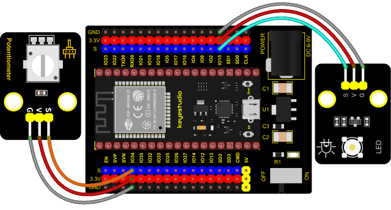

### Project 31: Rotary Potentiometer


**1. Introduction**

In the previous courses, we did experiments of breathing light and controlling LED with button. In this course, we do these two experiments by controlling the brightness of LED through an adjustable potentiometer. The brightness of LED is controlled by PWM values, and the range of analog values is 0 to 4095 and the PWM value range is 0-255.

After the code is set successfully, we can control the brightness of the LED on the module by rotating the potentiometer.

**2. Required Components**


**3. Connection Diagram**



**4. Test Code**


```Python
from machine import Pin,PWM,ADC
import time

pwm =PWM(Pin(15,Pin.OUT),1000)
adc=ADC(Pin(34))
adc.atten(ADC.ATTN_11DB)
adc.width(ADC.WIDTH_10BIT)

try:
    while True:
        adcValue=adc.read()
        pwm.duty(adcValue)
        print(adc.read())
        time.sleep_ms(100)
except:
    pwm.deinit()
```


**5. Code Explanation**

It is easy to control the brightness of the LED light by a potentiometer. Here we can find that MicroPython unifies the value range
of the ADC between 0 and 1023, and assigns values directly, which is simple and convenient.

**6. Test Result**

Connect the wires according to the experimental wiring diagram and power on. Click “Run current script”, the code starts executing. Rotating the potentiometer on the module can adjust the brightness of the LED on the LED module. Press “Ctrl+C”or click“Stop/Restart backend”to exit the program.