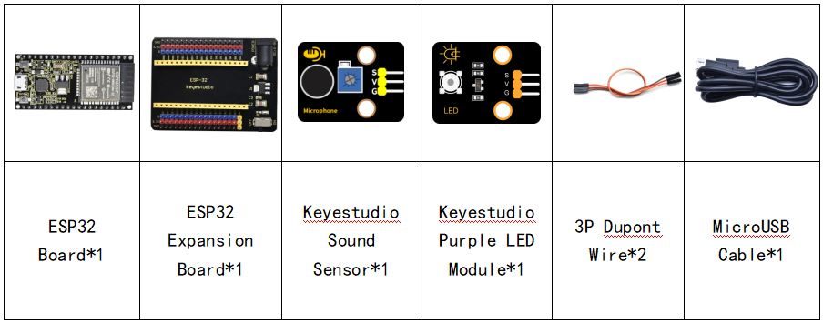
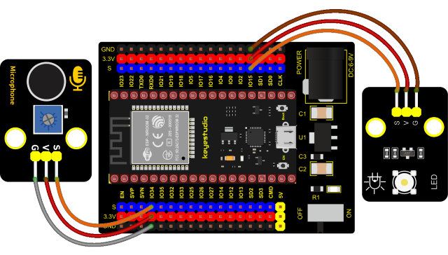
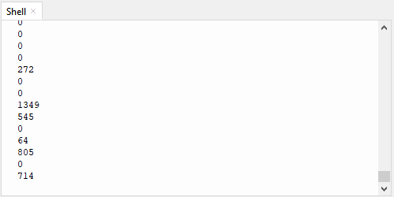

### Project 32: Sound Activated Light


**1. Introduction**

In this lesson, we will make a smart sound activated light using a sound sensor and an LED module. When we make a sound, the light will automatically turn on; when there is no sound, the lights will automatically turn off. How it works? Because the sound-controlled light is equipped with a sound sensor, and this sensor converts the intensity of external sound into a corresponding value. Then set a threshold, when the threshold is exceeded, the light will turn on, and when it is not exceeded, the light will go out.

**2. Components**



**3. Connection Diagram**



**4. Test Code**

```Python
from machine import ADC, Pin
import time
 
# Turn on and configure the ADC with the range of 0-3.3V 
adc=ADC(Pin(34))
adc.atten(ADC.ATTN_11DB)
adc.width(ADC.WIDTH_12BIT)

led = Pin(15,Pin.OUT)

while True:
    adcVal=adc.read()
    print(adcVal)
    if adcVal > 600:
        led.value(1)
        time.sleep(3)
    else:
        led.value(0)
    time.sleep(0.1)
```


**5. Code Explanation**

We set the ADC threshold value to 600. If more than 600, LED will be on 3s; on the contrary, it will be off.

**6. Test Result**

Connect the wires according to the experimental wiring diagram and power on. Click “Run current script”, the code starts executing. The shell monitor displays the corresponding volume ADC value. When the analog value of sound is greater than 600, the LED on the LED module will light up 3s, otherwise it will go off. Press “Ctrl+C”or click “Stop/Restart backend”to exit the program.

